---
## Author
author:
  name: Зевакина Екатерина Романовна
  faculty: Факультет физико-математических и естественных наук
  department: Кафедра прикладной информатики и теории вероятностей
  study group: НКАбд-02-25
  student ID card: 1032253564
  email: 1032253564@rudn.ru
  affiliation:
    - name: Российский университет дружбы народов
      country: Российская Федерация
      postal-code: 117198
      city: Москва
      address: ул. Миклухо-Маклая, д. 6

## Title
title: "Jтчёт по лабораторной работе №1"
subtitle: "Архитектура компьютеров: "Операционные системы""
license: "CC BY"
---

# Цель работы

  Целью данной работы является приобретение практических навыков установки операционной системы на виртуальную машину, настройки минимально необходимых для дальнейшей работы сервисов.

# Задание

Основная задача - установить Linux на VirtualBox и выполнить базовые настройки.

Задание по пунктам:
- Установить на VirtualBox
- Установить операционную систему
- Установить обновления и автоматические обновления
- Отключить SELinux
- Настроить раскладку клавиатуры
- Установить имя пользователя и название хоста
- Установит TEXlive

# Теоретическое введение

## Введение в GNU Linux
  
  Операционная система (ОС) — это комплекс взаимосвязанных программ, предназначенных для управления ресурсами компьютера и организации взаимодействия с пользователем.
  GNU Linux — семейство переносимых, многозадачных и многопользовательских операционных систем, на базе ядра Linux, включающих тот или иной набор утилит и программ проекта GNU, и, в некоторых случаях, другие компоненты. Системы на основе ядра Linux, как правило, создаются и распространяются в соответствии с моделью разработки свободного и открытого программного обеспечения (OpenSource Software).
  Дистрибутив GNU Linux — общее определение ОС, использующих ядро Linux и набор библиотек и утилит, выпускаемых в рамках проекта GNU, а также графическую оконную подсистему X Window System.
  Виртуальная машина (ВМ, VM) — термин, который означает программную среду, запущенную на физическом сервере или компьютере, которая полностью эмулирует работу реального устройства. Простыми словами, специальная программа создаёт виртуальное устройство, которое работает как физическое и использует физические ресурсы: CPU, место в хранилище и др.
  VirtualBox (Oracle VM VirtualBox) — программный продукт виртуализации, который позволяет создавать виртуальные машины — цифровые аналоги физического компьютера. С его помощью можно запускать одну операционную систему (ОС) внутри другой без внесения изменений в основную ОС.
  Sway — тайлинговый оконный менеджер для Wayland, который позиционируется как замена i3wm.

## Введение в командную строку GNU Linux

  Работу ОС GNU Linux можно представить в виде функционирования множества взаимосвязанных процессов. При загрузке системы сначала запускается ядро, которое запускает оболочку ОС (от англ. shell «оболочка»). Взаимодействие пользователя с системой Linux происходит в интерактивном режиме посредством командного языка. Оболочка операционной системы — интерпретирует вводимые пользователем команды, запускает соответствующие программы, формирует и выводит ответные сообщения. На языке командной оболочки можно писать программы для выполнения ряда последовательных операций с файлами и содержащимися в них данными — сценарии(скрипты).
  В качестве предустановленной командной оболочки GNU Linux используется bash (Bourne again shell). В GNU Linux доступ пользователя к командной оболочке обеспечивается через терминал (или консоль). Интерфейс командной оболочки состоит из приглашения командной строки, которое несёт в себе информацию об имени пользователя, имени компьютера и текущем каталоге, в котором находится пользователь.
  Команды могут быть использованы с ключами (или опциями) — указаниями, модифицирующими поведение команды. Ключи обычно начинаются с символа (-) или (--) и часто состоят из одной буквы. Кроме ключей после команды могут быть использованы аргументы (параметры) — названия объектов, для которых нужно выполнить команду.
  Ввод команды завершается нажатием клавиши Enter, после чего команда передаётся оболочке на исполнение.
  Если имена программ и команд в GNU Linux слишком длинные,
bash может завершать имена при их вводе в терминале. Нажав клавишу Tab, можно завершить имя команды, программы или каталога.

## Файловая структура GNU Linux: каталоги и файлы

  Файловая система определяет способ организации, хранения и именования данных на носителях информации в компьютерах и представляет собой иерархическую структуру в виде вложенных друг в друга каталогов (директорий), содержащих все файлы. В ОС Linux каталог, который содержит все остальные каталоги и файлы, называется корневым каталогом и обозначается символом /.
  В большинстве Linux-систем поддерживается стандарт иерархии файловой системы (Filesystem Hierarchy Standard, FHS), унифицирующий местонахождение файлов и каталогов. Это означает, что в корневом каталоге находятся только подкаталоги со стандартными именами и типами данных, которые могут попасть в тот или иной каталог

В [табл. @tbl-std-dir] приведено краткое описание стандартных каталогов Unix.

| Имя каталога | Описание каталога                                                                                                          |
|--------------|----------------------------------------------------------------------------------------------------------------------------|
| `/`          | Корневая директория, содержащая всю файловую                                                                               |
| `/bin `      | Основные системные утилиты, необходимые как в однопользовательском режиме, так и при обычной работе всем пользователям     |
| `/etc`       | Общесистемные конфигурационные файлы и файлы конфигурации установленных программ                                           |
| `/home`      | Содержит домашние директории пользователей, которые, в свою очередь, содержат персональные настройки и данные пользователя |
| `/media`     | Точки монтирования для сменных носителей                                                                                   |
| `/root`      | Домашняя директория пользователя  `root`                                                                                   |
| `/tmp`       | Временные файлы                                                                                                            |
| `/usr`       | Вторичная иерархия для данных пользователя                                                                                 |

: Описание некоторых каталогов файловой системы GNU Linux {#tbl-std-dir}

Существует несколько видов путей к файлу:
- полный или абсолютный путь — начинается от корня (/), образуется перечислением всех каталогов, разделённых прямым слешем (/), и завершается именем файла.
- относительный путь — так же как и полный путь, строится перечислением через (/) всех каталогов, но начинается от текущего каталога.
  В Linux любой пользователь имеет домашний каталог, который имеет имя пользователя. В домашних каталогах хранятся документы и настройки пользователя. Для обозначения домашнего каталога используется знак тильды (~). При переходе из домашнего каталога знак тильды будет заменён на имя нового текущего каталога.

## Базовые команды bash

  В операционной системе GNU Linux взаимодействие пользователя с системой обычно осуществляется с помощью командной строки посредством построчного ввода команд. Общий формат команд можно представить следующим образом: <имя_команды><разделитель><аргументы>

В [табл. @tbl-bs-bash] приведено краткое описание основных команд взаимодействия пользователя с файловой системой.

| Команда | Описание                                                                                                                   |
|---------|----------------------------------------------------------------------------------------------------------------------------|
| `pwd`   | Определение текущего каталога                                                                                              |
| `cd `   | Смена каталога                                                                                                             |
| `ls`    | Вывод списка файлов                                                                                                        |
| `mkdir` | Создание пустых каталогов                                                                                                  | 
| `touch` | Создание пустых файлов                                                                                                     |                                                                             
| `rm`    | Удаление файлов или каталогов                                                                                              |                                                                      
| `mv`    | Перемещение файлов и каталогов                                                                                             |                                                                     
| `cp`    | Копирование файлов и каталогов                                                                                             |                                                                     
| `cat`   | Вывод содержимого файлов                                                                                                   |                                                                           
: Основные команды взаимодействия пользователя с файловой системой {#tbl-bs-bash}

# Выполнение лабораторной работы

Во-первых, я создала вм в нужной папке на своём ноутбуке ([рис. @Л1С1]).

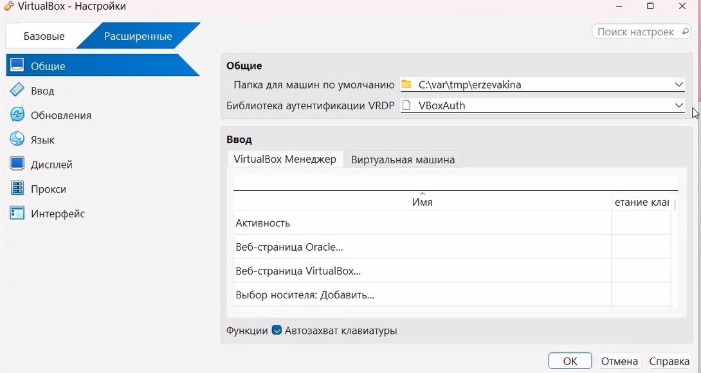{#Л1С1 width=70%}

Вручную подключила оптический диск ([рис. @Л1С26]).

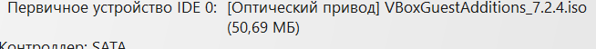{#Л1С26 width=70%}

Далее я загрузила все необходимые библиотеки для выполнения лабораторной работы и настройки ВМ. ([рис. @Л1С2] - [рис. @Л1С6])

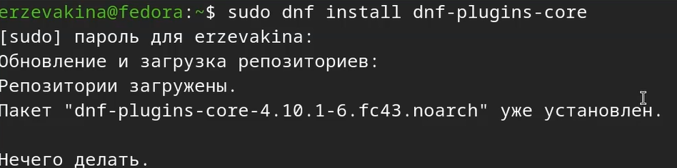{#Л1С2 width=70%}
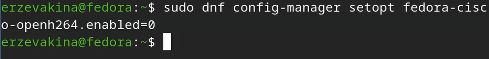{#Л1С3 width=70%}
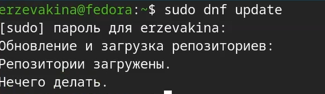{#Л1С4 width=70%}
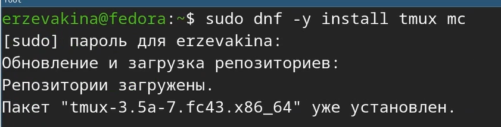{#Л1С5 width=70%}
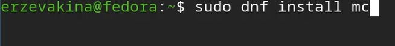{#Л1С6 width=70%}

После установила автоматическое обновление для пакетов ВМ([рис. @Л1С7],([рис. @Л1С8])

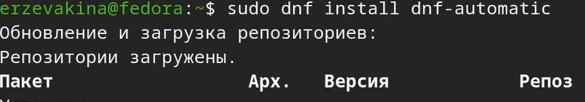{#Л1С7 width=70%}
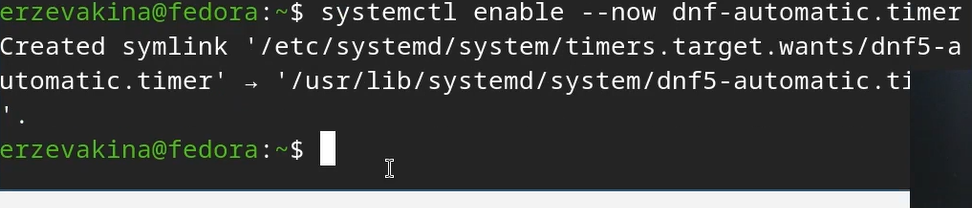{#Л1С8 width=70%}

Далее занимаюсь драйверами. Скачиваю пакет dkms ([рис. @Л1С9])

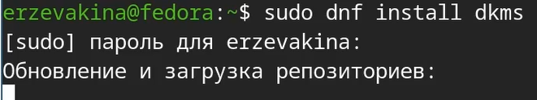{#Л1С9 width=70%}

После монтирую диск и запускаю драйвера. После запуска обязательно перезагрушаю машину с командой reboot( образ диска дополнений гостевой ОС я подключила выше, в первом пункте.)([рис. @Л1С10])

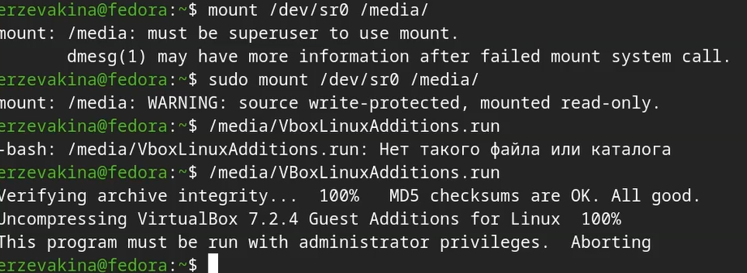{#Л1С10 width=70%}

Потом мои неудачные попытки настроить переключение раскладки. ([рис. @Л1С11]) и ([рис. @Л1С14])

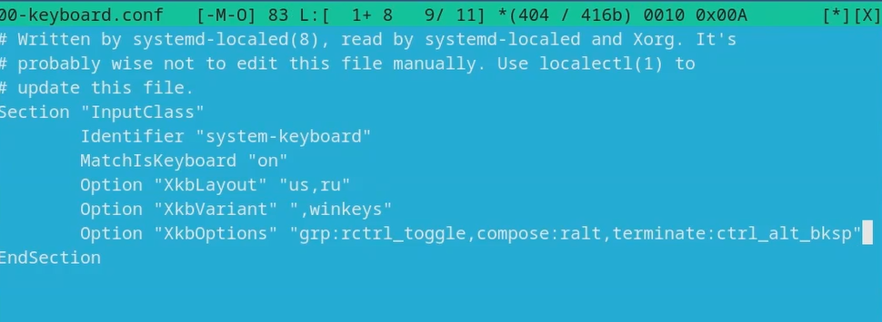{#Л1С11 width=70%}
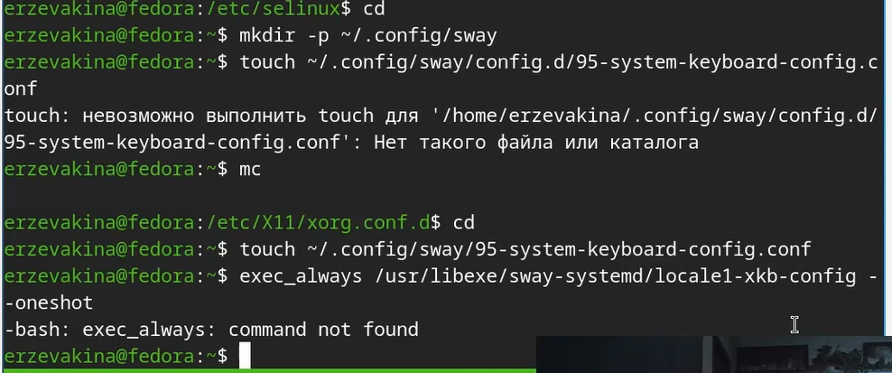{#Л1С12 width=70%}

Установила средства разработки([рис. @Л1С13])

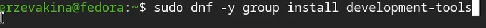{#Л1С12 width=70%}

Далее я отключила SELinux([рис. @Л1С15])

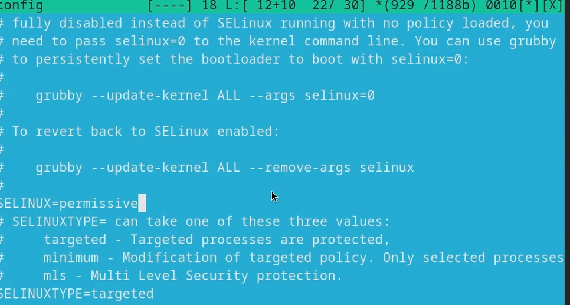

Потом я доделала своб учётную запись. ([рис. @Л1С12]) и ([рис. @Л1С16])

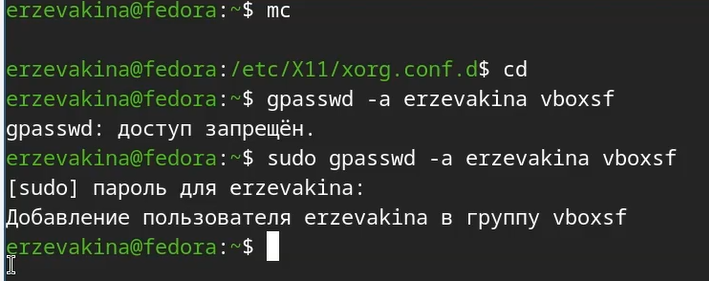
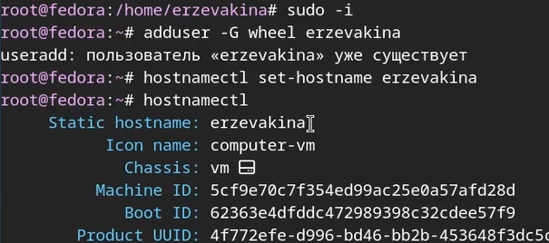

Поставила пакет pandoc ([рис. @Л1С17])

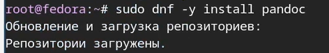

И в завершении лаборатоной работы установила расширенный пакет texlive([рис. @Л1С18])

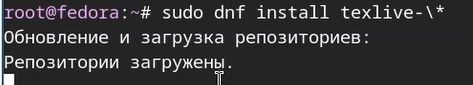

# Контрольные вопросы

1. Какую информацию содержит учётная запись пользователя?

Ответ: Имя пользователя (логин), пароль, UID (User ID), GID (Group ID), Домашний каталог, Командная оболочка (Shell), Информация о пользователе (GECOS).

2. Команды терминала и их примеры

Ответ:
  Получение справки о команде: man или --help (man ls - показать руководство по ls, ls --help - краткая инвормация о ls);
  Перемещение по файловой системе: cd (cd /home/user - перейти в папку user, cd .. - подняться на уровень вверх);
  Просмотр содержимого каталога: ls (ls -l - подробный список, ls -a - показать скрытые файлы);
  Определение объёма каталога: du (du -sh /home/user - общий размер папки в удобном формате);
  Создание каталогов: mkdir (mkdir new_folder - создание пустой папки new_folder);
  Создание файлов: touch (touch file.txt - создание пустого файла);
  Удаление каталогов: rmkdir (удаление пустых папок);
  Удаление файлов и непустых каталогов: rm (rm file.txt, rm -rf folder - рекурсивно удалить папку с содержимым)

3. Что такое файловая система? Приведите примеры с краткой характеристикой.

Ответ: Файловая система — это способ организации, хранения и именования данных на носителях информации (жестких дисках, SSD, флешках). Она определяет структуру каталогов, правила именования файлов и методы доступа к ним.

Примеры файловых систем:

ext4 (Fourth Extended Filesystem): Стандартная файловая система для большинства дистрибутивов Linux. Надежная, поддерживает журналирование (защита от сбоев), большие файлы и разделы.

NTFS (New Technology File System): Основная файловая система для Windows. Поддерживает журналирование, разграничение прав доступа, сжатие и шифрование. Linux может читать и писать на NTFS (обычно через драйвер ntfs-3g).

FAT32 (File Allocation Table): Устаревшая, но очень совместимая файловая система. Поддерживается всеми ОС и устройствами (камерами, ТВ). Главный недостаток — ограничение на размер файла в 4 ГБ.

btrfs (B-tree FS): Современная файловая система для Linux с расширенными возможностями: встроенное создание "снимков" (snapshots), проверка целостности данных (checksum), поддержка больших массивов хранения.

APFS (Apple File System): Файловая система, используемая на Mac под управлением macOS High Sierra и новее. Оптимизирована для SSD-накопителей, поддерживает шифрование и снимки.

4. Как посмотреть, какие файловые системы подмонтированы в ОС?

Ответ: Для просмотра списка подключенных (смонтированных) файловых систем используется команда mount — базовая команда, которая без параметров выводит список всех смонтированных файловых систем.

5. Как удалить зависящий процесс?

Ответ: Нужно использовать несколько команд:
1. Найти PID (Process ID) зависшего процесса:
  ps aux \| grep имя_процесса

2. Завершить процесс по PID:
kill -9 <PID> — отправляет сигнал KILL. Ядро ОС принудительно завершает процесс.

# Домашнее задание

Использовать поиск с помощью grep:

dmesg | grep -i "то, что ищем"

И найти:

1. Версия ядра Linux (Linux version). ([рис. @Л1С19])
  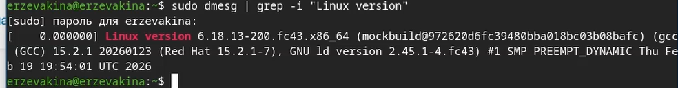{#Л1С19 width=70%}
2. Частота процессора (Detected Mhz processor). ([рис. @Л1С20])
  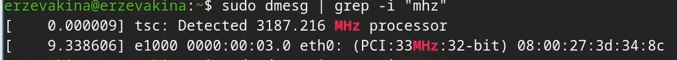{#Л1С20 width=70%}
3. Модель процессора (CPU0).([рис. @Л1С21])
  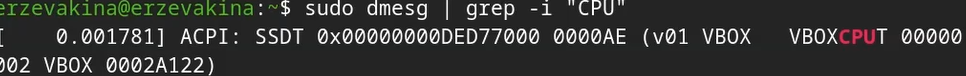{#Л1С21 width=70%}
4. Объём доступной оперативной памяти (Memory available).([рис. @Л1С22])
  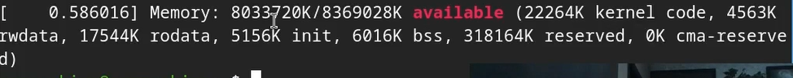{#Л1С22 width=70%}
5. Тип обнаруженного гипервизора (Hypervisor detected).([рис. @Л1С23])
  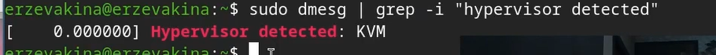{#Л1С23 width=70%}
6. Тип файловой системы корневого раздела.([рис. @Л1С24])
  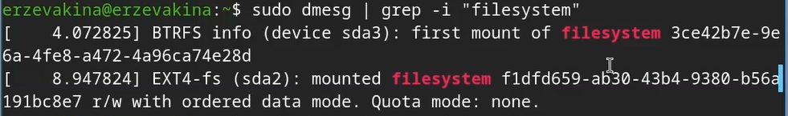{#Л1С24 width=70%}
7. Последовательность монтирования файловых систем.([рис. @Л1С25])
  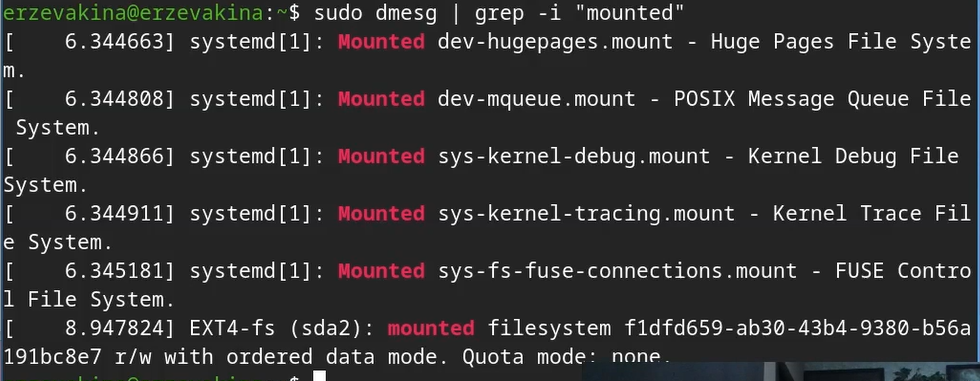{#Л1С25 width=70%}

# Выводы

  Я смогла успешно установить Linux Fedora Sway на VirtualBox и сделать базовые настройки хоста. К сожалению, у меня так и не получилось решить проблемы с переключением раскладки, но в остальном лабораторная работа выполнена успешно, задачи закрыты.

# Список литературы{.unnumbered}

::: 
1. Dash, P. Getting Started with Oracle VM VirtualBox / P. Dash. – Packt Publishing Ltd, 2013. – 86 сс.
2. Colvin, H. VirtualBox: An Ultimate Guide Book on Virtualization with VirtualBox. VirtualBox / H. Colvin. – CreateSpace Independent Publishing Platform, 2015. – 70 сс.
3. Vugt, S. van. Red Hat RHCSA/RHCE 7 cert guide : Red Hat Enterprise Linux 7 (EX200 and EX300) : Certification Guide. Red Hat RHCSA/RHCE 7 cert guide / S. van Vugt. – Pearson IT Certification, 2016. – 1008 сс.
4. Робачевский, А. Операционная система UNIX / А. Робачевский, С. Немнюгин, О. Стесик. – 2-е изд. – Санкт-Петербург : БХВ-Петербург, 2010. – 656 сс.
5. Немет, Э. Unix и Linux: руководство системного администратора. Unix и Linux / Э. Немет, Г. Снайдер, Т.Р. Хейн, Б. Уэйли. – 4-е изд. – Вильямс, 2014. – 1312 сс.
6. Колисниченко, Д.Н. Самоучитель системного администратора Linux : Системный администратор / Д.Н. Колисниченко. – Санкт-Петербург : БХВ-Петербург, 2011. – 544 сс.
7. Robbins, A. Bash Pocket Reference / A. Robbins. – O’Reilly Media, 2016. – 156 сс.
:::
