## Author
author:
name: Зевакина Екатерина Романовна
faculty: Факультет физико-математических и естественных наук
department: Кафедра прикладной информатики и теории вероятностей
study group: НКАбд-02-25
student ID card: 1032253564
email: 1032253564@rudn.ru
affiliation:
name: Российский университет дружбы народов
country: Российская Федерация
postal-code: 117198
city: Москва
address: ул. Миклухо-Маклая, д. 6

## Title
title: "Отчёт по лабораторной работе №2"
subtitle: "Дисциплина: Архитектура компьютеров: Операционные системы"
license: "CC BY"

# Цель работы

Изучить идеологию и применение средств контроля версий и освоить умения по работе с git.

# Задание

* Создать базовую конфигурацию для работы с git.
* Создать ключ SSH.
* Создать ключ PGP.
* Настроить подписи git.
* Зарегистрироваться на Github.
* Создать локальный каталог для выполнения заданий по предмету.

# Теоретическое введение

Системы контроля версий. Общие понятия
Системы контроля версий (Version Control System, VCS) применяются при работе нескольких человек над одним проектом. Обычно основное дерево проекта хранится в локальном или удалённом репозитории, к которому настроен доступ для участников проекта. При внесении изменений в содержание проекта система контроля версий позволяет их фиксировать, совмещать изменения, произведённые разными участниками проекта, производить откат к любой более ранней версии проекта, если это требуется.

В классических системах контроля версий используется централизованная модель, предполагающая наличие единого репозитория для хранения файлов. Выполнение большинства функций по управлению версиями осуществляется специальным сервером. Участник проекта (пользователь) перед началом работы посредством определённых команд получает нужную ему версию файлов. После внесения изменений, пользователь размещает новую версию в хранилище. При этом предыдущие версии не удаляются из центрального хранилища и к ним можно вернуться в любой момент. Сервер может сохранять не полную версию изменённых файлов, а производить так называемую дельта-компрессию — сохранять только изменения между последовательными версиями, что позволяет уменьшить объём хранимых данных.

Системы контроля версий поддерживают возможность отслеживания и разрешения конфликтов, которые могут возникнуть при работе нескольких человек над одним файлом. Можно объединить (слить) изменения, сделанные разными участниками (автоматически или вручную), вручную выбрать нужную версию, отменить изменения вовсе или заблокировать файлы для изменения. В зависимости от настроек блокировка не позволяет другим пользователям получить рабочую копию или препятствует изменению рабочей копии файла средствами файловой системы ОС, обеспечивая таким образом, привилегированный доступ только одному пользователю, работающему с файлом.

Системы контроля версий также могут обеспечивать дополнительные, более гибкие функциональные возможности. Например, они могут поддерживать работу с несколькими версиями одного файла, сохраняя общую историю изменений до точки ветвления версий и собственные истории изменений каждой ветви. Кроме того, обычно доступна информация о том, кто из участников, когда и какие изменения вносил. Обычно такого рода информация хранится в журнале изменений, доступ к которому можно ограничить.

В отличие от классических, в распределённых системах контроля версий центральный репозиторий не является обязательным.

Среди классических VCS наиболее известны CVS, Subversion, а среди распределённых — Git, Bazaar, Mercurial. Принципы их работы схожи, отличаются они в основном синтаксисом используемых в работе команд.

Примеры использования git
Система контроля версий Git представляет собой набор программ командной строки. Доступ к ним можно получить из терминала посредством ввода команды git с различными опциями.
Благодаря тому, что Git является распределённой системой контроля версий, резервную копию локального хранилища можно сделать простым копированием или архивацией.

Основные команды git
Перечислим наиболее часто используемые команды git.

Создание основного дерева репозитория:

git init
Получение обновлений (изменений) текущего дерева из центрального репозитория:

git pull
Отправка всех произведённых изменений локального дерева в центральный репозиторий:

git push
Просмотр списка изменённых файлов в текущей директории:

git status
Просмотр текущих изменений:

git diff
Сохранение текущих изменений:

добавить все изменённые и/или созданные файлы и/или каталоги:

git add .
добавить конкретные изменённые и/или созданные файлы и/или каталоги:

git add имена_файлов
удалить файл и/или каталог из индекса репозитория (при этом файл и/или каталог остаётся в локальной директории):

git rm имена_файлов
Сохранение добавленных изменений:

сохранить все добавленные изменения и все изменённые файлы:

git commit -am 'Описание коммита'
сохранить добавленные изменения с внесением комментария через встроенный редактор:

git commit
создание новой ветки, базирующейся на текущей:

git checkout -b имя_ветки
переключение на некоторую ветку:

git checkout имя_ветки
(при переключении на ветку, которой ещё нет в локальном репозитории, она будет создана и связана с удалённой)
отправка изменений конкретной ветки в центральный репозиторий:

git push origin имя_ветки
слияние ветки с текущим деревом:

git merge --no-ff имя_ветки
Удаление ветки:

удаление локальной уже слитой с основным деревом ветки:

git branch -d имя_ветки
принудительное удаление локальной ветки:

git branch -D имя_ветки
удаление ветки с центрального репозитория:

git push origin :имя_ветки

Стандартные процедуры работы при наличии центрального репозитория
Работа пользователя со своей веткой начинается с проверки и получения изменений из центрального репозитория (при этом в локальное дерево до начала этой процедуры не должно было вноситься изменений):

git checkout master
git pull
git checkout -b имя_ветки
Затем можно вносить изменения в локальном дереве и/или ветке.

После завершения внесения какого-то изменения в файлы и/или каталоги проекта необходимо разместить их в центральном репозитории. Для этого необходимо проверить, какие файлы изменились к текущему моменту:

git status
При необходимости удаляем лишние файлы, которые не хотим отправлять в центральный репозиторий.

Затем полезно просмотреть текст изменений на предмет соответствия правилам ведения чистых коммитов:

git diff
Если какие-либо файлы не должны попасть в коммит, то помечаем только те файлы, изменения которых нужно сохранить. Для этого используем команды добавления и/или удаления с нужными опциями:

git add …  
git rm …
Если нужно сохранить все изменения в текущем каталоге, то используем:

git add .
Затем сохраняем изменения, поясняя, что было сделано:

git commit -am "Some commit message"
Отправляем изменения в центральный репозиторий:

git push origin имя_ветки
или

git push

Работа с локальным репозиторием
Создадим локальный репозиторий.
Сначала сделаем предварительную конфигурацию, указав имя и email владельца репозитория:

git config --global user.name "Имя Фамилия"
git config --global  user.email "work@mail"
Настроим utf-8 в выводе сообщений git:

git config --global quotepath false
Для инициализации локального репозитория, расположенного, например, в каталоге ~/tutorial, необходимо ввести в командной строке:

cd 
mkdir tutorial
cd tutorial
git init
После это в каталоге tutorial появится каталог .git, в котором будет храниться история изменений.
Создадим тестовый текстовый файл hello.txt и добавим его в локальный репозиторий:

echo 'hello world' > hello.txt
git add hello.txt
git commit -am 'Новый файл'
Воспользуемся командой status для просмотра изменений в рабочем каталоге, сделанных с момента последней ревизии:

git status
Во время работы над проектом так или иначе могут создаваться файлы, которые не требуется добавлять в последствии в репозиторий. Например, временные файлы, создаваемые редакторами, или объектные файлы, создаваемые компиляторами. Можно прописать шаблоны игнорируемых при добавлении в репозиторий типов файлов в файл .gitignore с помощью сервисов. Для этого сначала нужно получить список имеющихся шаблонов:

curl -L -s https://www.gitignore.io/api/list
Затем скачать шаблон, например, для C и C++

curl -L -s https://www.gitignore.io/api/c >> .gitignore
curl -L -s https://www.gitignore.io/api/c++ >> .gitignore

Работа с сервером репозиториев
Для последующей идентификации пользователя на сервере репозиториев необходимо сгенерировать пару ключей (приватный и открытый):

ssh-keygen -C "Имя Фамилия <work@mail>"
Ключи сохраняться в каталоге ~/.ssh/.
Существует несколько доступных серверов репозиториев с возможностью бесплатного размещения данных. Например, https://github.com/.
Для работы с ним необходимо сначала завести на сайте https://github.com/ учётную запись. Затем необходимо загрузить сгенерённый нами ранее открытый ключ.
Для этого зайти на сайт https://github.com/ под своей учётной записью и перейти в меню GitHub setting.
После этого выбрать в боковом меню GitHub setting>SSH-ключи и нажать кнопку Добавить ключ. Скопировав из локальной консоли ключ в буфер обмена:

cat ~/.ssh/id_rsa.pub | xclip -sel clip
Вставляем ключ в появившееся на сайте поле.

После этого можно создать на сайте репозиторий, выбрав в меню , дать ему название и сделать общедоступным (публичным).

Для загрузки репозитория из локального каталога на сервер выполняем следующие команды:

git remote add origin 
  ssh://git@github.com/<username>/<reponame>.git
git push -u origin master
Далее на локальном компьютере можно выполнять стандартные процедуры для работы с git при наличии центрального репозитория.

Базовая настройка git

Первичная настройка параметров git
Зададим имя и email владельца репозитория:

git config --global user.name "Name Surname"
git config --global user.email "work@mail"
Настроим utf-8 в выводе сообщений git:

git config --global core.quotepath false
Настройте верификацию и подписание коммитов git.
Зададим имя начальной ветки (будем называть её master):

git config --global init.defaultBranch master

Учёт переносов строк
В разных операционных системах приняты разные символы для перевода строк:
Windows: \r\n (CR и LF);
Unix: \n (LF);
Mac: \r (CR).
Посмотреть значения переносов строк в репозитории можно командой:

git ls-files --eol
Параметр autocrlf

Настройка core.autocrlf предназначена для того, чтобы в главном репозитории все переводы строк текстовых файлах были одинаковы.
Настройка core.autocrlf с параметрами true и input делает все переводы строк текстовых файлов в главном репозитории одинаковыми.
core.autocrlf true: конвертация CRLF->LF при коммите и обратно LF->CRLF при выгрузке кода из репозитория на файловую систему (обычно используется в Windows).
core.autocrlf input: конвертация CRLF->LF только при коммитах (используются в MacOS/Linux).
Варианты конвертации

В [табл. @tbl-c-atf] Варианты конвертации для разных значений параметра core.autocrlf.

| core.autocrlf |     false    |     input    |  true                                                                                             |
|---------------|--------------|--------------|---------------------------------------------------------------------------------------------------|
| git commit    |    LF-> LF   |   LF-> LF    | LF-> CRLF                                                                                         |
|               |   CR -> CR   |  CR -> CR    | CR -> CR                                                                                          |
|               | CRLF -> CRLF | CRLF -> LF   | CRLF -> CRLF                                                                                      |
| git checkout  |    LF-> LF   |   LF-> LF    | LF-> CRLF                                                                                         |
|               |   CR -> CR   |  CR -> CR    | CR -> CR                                                                                          |
|               | CRLF -> CRLF | CRLF -> CRLF | CRLF -> CRLF                                                                                      |                                            
: Варианты конвертации для разных значений параметра core.autocrlf {#tbl-c-atf}

Установка параметра:

Для Windows

git config --global core.autocrlf true
Для Linux

git config --global core.autocrlf input
Параметр safecrlf

Настройка core.safecrlf предназначена для проверки, является ли окончаний строк обратимым для текущей настройки core.autocrlf.
core.safecrlf true: запрещается необратимое преобразование lf<->crlf. Полезно, когда существуют бинарные файлы, похожие на текстовые файлы.
core.safecrlf warn: печать предупреждения, но коммиты с необратимым переходом принимаются.
Установка параметра:

git config --global core.safecrlf warn

Создание ключа ssh

Общая информация
Алгоритмы шифрования ssh

Аутентификация

В SSH поддерживается четыре алгоритма аутентификации по открытым ключам:

DSA:
размер ключей DSA не может превышать 1024, его следует отключить;
RSA:
следует создавать ключ большого размера: 4096 бит;
ECDSA:
ECDSA завязан на технологиях NIST, его следует отключить;
Ed25519:
используется пока не везде.
Симметричные шифры

Из 15 поддерживаемых в SSH алгоритмов симметричного шифрования, безопасными можно считать:
chacha20-poly1305;
aes*-ctr;
aes*-gcm.
Шифры 3des-cbc и arcfour потенциально уязвимы в силу использования DES и RC4.
Шифр cast128-cbc применяет слишком короткий размер блока (64 бит).
Обмен ключами

Применяемые в SSH методы обмена ключей DH (Diffie-Hellman) и ECDH (Elliptic Curve Diffie-Hellman) можно считать безопасными.
Из 8 поддерживаемых в SSH протоколов обмена ключами вызывают подозрения три, основанные на рекомендациях NIST:
ecdh-sha2-nistp256;
ecdh-sha2-nistp384;
ecdh-sha2-nistp521.
Не стоит использовать протоколы, основанные на SHA1.
Файлы ssh-ключей

По умолчанию пользовательские ssh-ключи сохраняются в каталоге ~/.ssh в домашнем каталоге пользователя.
Убедитесь, что у вас ещё нет ключа.
Файлы закрытых ключей имеют названия типа id_<алгоритм> (например, id_dsa, id_rsa).

По умолчанию закрытые ключи имеют имена:

id_dsa
id_ecdsa
id_ed25519
id_rsa
Открытые ключи имеют дополнительные расширения .pub.

По умолчанию публичные ключи имеют имена:

id_dsa.pub
id_ecdsa.pub
id_ed25519.pub
id_rsa.pub
При создании ключа команда попросит ввести любую ключевую фразу для более надёжной защиты вашего пароля. Можно пропустить этот этап, нажав Enter.
Сменить пароль на ключ можно с помощью команды:

ssh-keygen -p

Создание ключа ssh
Ключ ssh создаётся командой:

ssh-keygen -t <алгоритм>
Создайте ключи:

по алгоритму rsa с ключём размером 4096 бит:

ssh-keygen -t rsa -b 4096
по алгоритму ed25519:

ssh-keygen -t ed25519
При создании ключа команда попросит ввести любую ключевую фразу для более надёжной защиты вашего пароля. Можно пропустить этот этап, нажав Enter.
Сменить пароль на ключ можно с помощью команды:

ssh-keygen -p

Добавление SSH-ключа в учётную запись GitHub
Скопируйте созданный SSH-ключ в буфер обмена командой:

xclip -i < ~/.ssh/id_ed25519.pub
Откройте настройки своего аккаунта на GitHub и перейдем в раздел SSH and GPC keys.
Нажмите кнопку ew SSH key.
Добавьте в поле Title название этого ключа, например, ed25519@hostname.
Вставьте из буфера обмена в поле Key ключ.
Нажмите кнопку Add SSH key.

Верификация коммитов с помощью PGP
Как настроить PGP-подпись коммитов с помощью gpg.

Общая информация
Коммиты имеют следующие свойства:
author (автор) — контрибьютор, выполнивший работу (указывается для справки);
committer (коммитер) — пользователь, который закоммитил изменения.
Эти свойства можно переопределить при совершении коммита.
Авторство коммита можно подделать.
В git есть функция подписи коммитов.
Для подписывания коммитов используется технология PGP (см. Работа с PGP).
Подпись коммита позволяет удостовериться в том, кто является коммитером. Авторство не проверяется.

Создание ключа
Генерируем ключ

gpg --full-generate-key
Из предложенных опций выбираем:

тип RSA and RSA;
размер 4096;
выберите срок действия; значение по умолчанию — 0 (срок действия не истекает никогда).
GPG запросит личную информацию, которая сохранится в ключе:
Имя (не менее 5 символов).
Адрес электронной почты.
При вводе email убедитесь, что он соответствует адресу, используемому на GitHub.
Комментарий. Можно ввести что угодно или нажать клавишу ввода, чтобы оставить это поле пустым.

Экспорт ключа
Выводим список ключей и копируем отпечаток приватного ключа:

gpg --list-secret-keys --keyid-format LONG
Отпечаток ключа — это последовательность байтов, используемая для идентификации более длинного, по сравнению с самим отпечатком ключа.
Формат строки:

sec   Алгоритм/Отпечаток_ключа Дата_создания [Флаги] [Годен_до]
      ID_ключа
Экспортируем ключ в формате ASCII по его отпечатку:

gpg --armor --export <PGP Fingerprint>

Добавление PGP ключа в GitHub
Копируем ключ и добавляем его в настройках профиля на GitHub (или GitLab).
Cкопируйте ваш сгенерированный PGP ключ в буфер обмена:

gpg --armor --export <PGP Fingerprint> | xclip -sel clip
Перейдите в настройки GitHub (https://github.com/settings/keys), нажмите на кнопку New GPG key и вставьте полученный ключ в поле ввода.

Подписывание коммитов git
Подпись коммитов при работе через терминал:

git commit -a -S -m 'your commit message'
Флаг -S означает создание подписанного коммита. При этом может потребоваться ввод кодовой фразы, заданной при генерации GPG-ключа.

Настройка автоматических подписей коммитов git
Используя введёный email, укажите Git применять его при подписи коммитов:

git config --global user.signingkey <PGP Fingerprint>
git config --global commit.gpgsign true
git config --global gpg.program $(which gpg2)

Проверка коммитов в Git
GitHub и GitLab будут показывать значок Verified рядом с вашими новыми коммитами.

Режим бдительности (vigilant mode)
На GitHub есть настройка vigilant mode.
Все неподписанные коммиты будут явно помечены как Unverified.
Включается это в настройках в разделе SSH and GPG keys. Установите метку на Flag unsigned commits as unverified.

# Выполнение лабораторной работы

Установка программного обеспечения ([рис. @fig-001]).

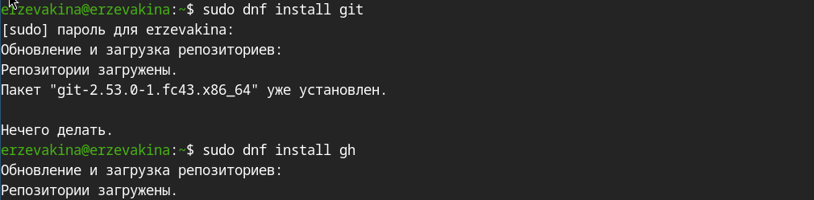{#fig-001 width=70%}

Базовая настройка git ([рис. @fig-002]).

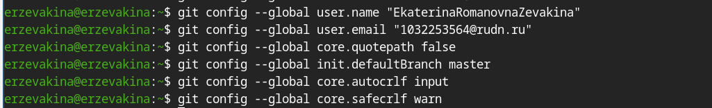{#fig-002 width=70%}

Создание ключей ssh ([рис. @fig-003]) и ([рис. @fig-004])

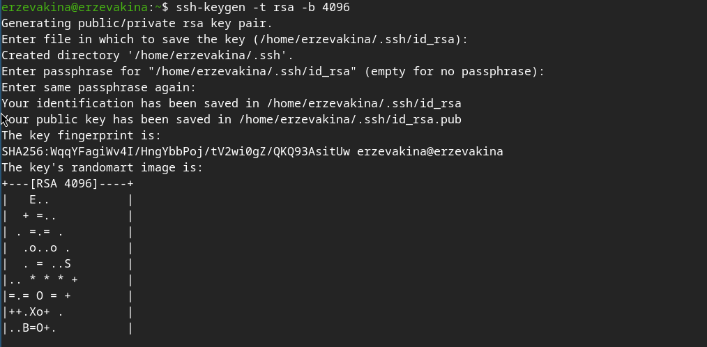{#fig-003 width=70%}

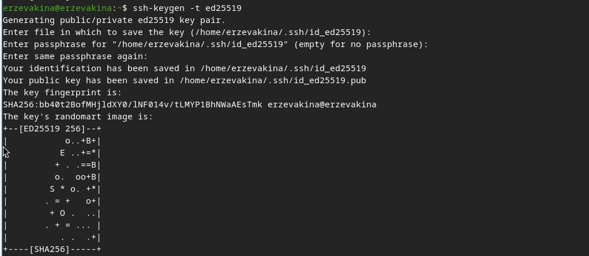{#fig-004 width=70%}

Создание ключа pgp ([рис. @fig-005])

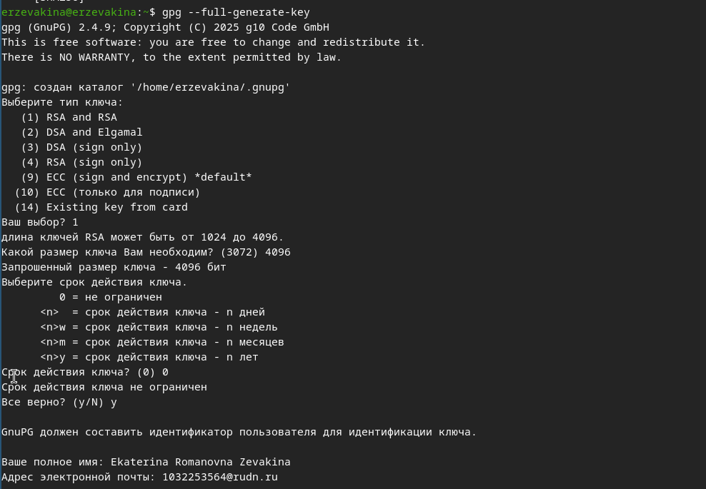{#fig-005 width=70%}

Добавление PGP ключа в GitHub([рис. @fig-006])

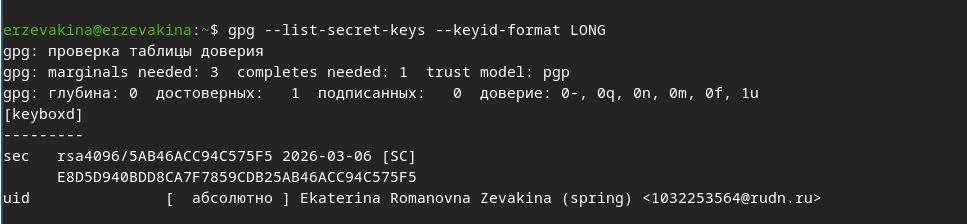{#fig-006 width=70%}

Ошибка из-за xclip([рис. @fig-007])

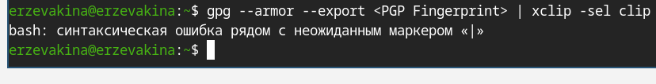{#fig-007 width=70%}

Иду обходными путями. Вывожу ключ pgp полностью, копирую на ctrl+shift+c и вставляю в открывшееся на win+d окно браузера([рис. @fig-008])

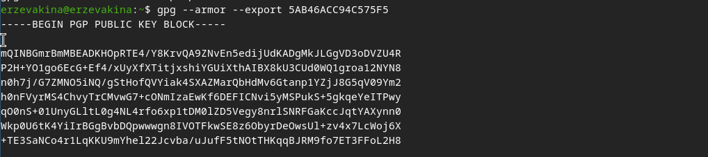{#fig-008 width=70%}

Настраиваю автоматические подписи коммитов git([рис. @fig-009])

{#fig-009 width=70%}

Настроаиваю gh([рис. @fig-010])

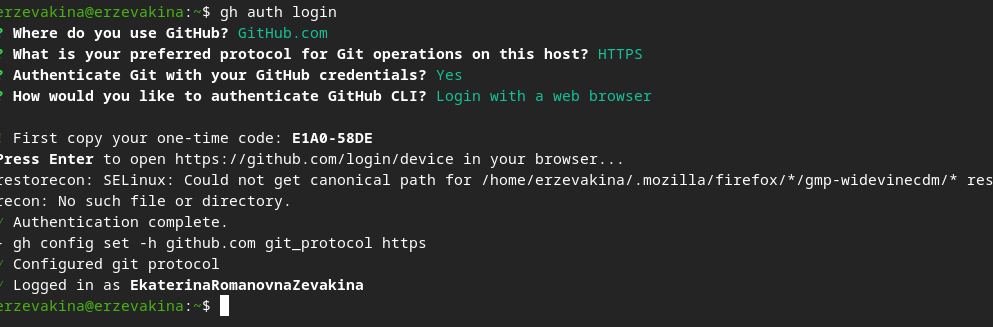{#fig-010 width=70%}

Прикрепляю ключ ssh и делаю копию репозитория по шаблону([рис. @fig-011])

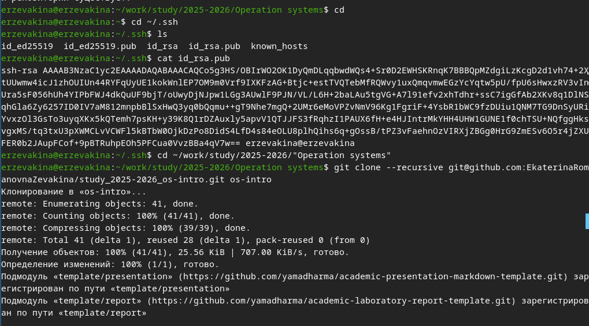{#fig-011 width=70%}

Настраиваю кталог курса([рис. @fig-012]) и ([рис. @fig-013])

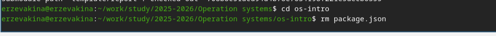{#fig-011 width=70%}

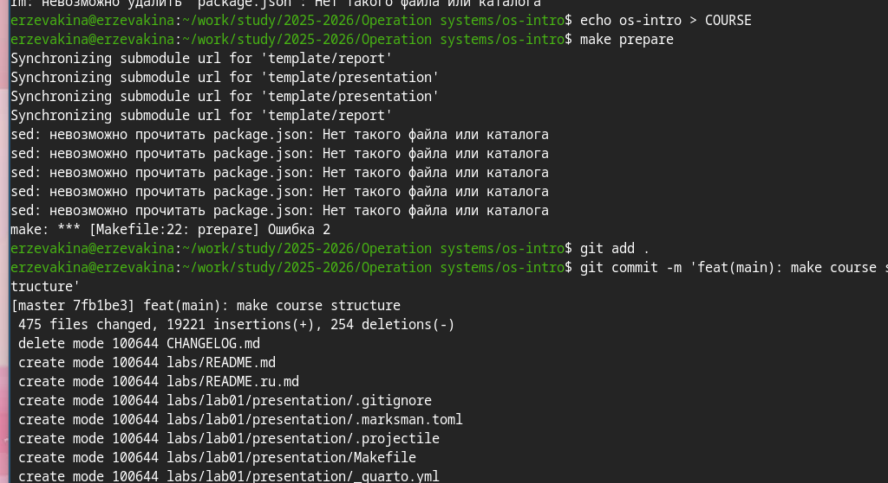{#fig-011 width=70%}

Отправляю файлы на github([рис. @fig-014])

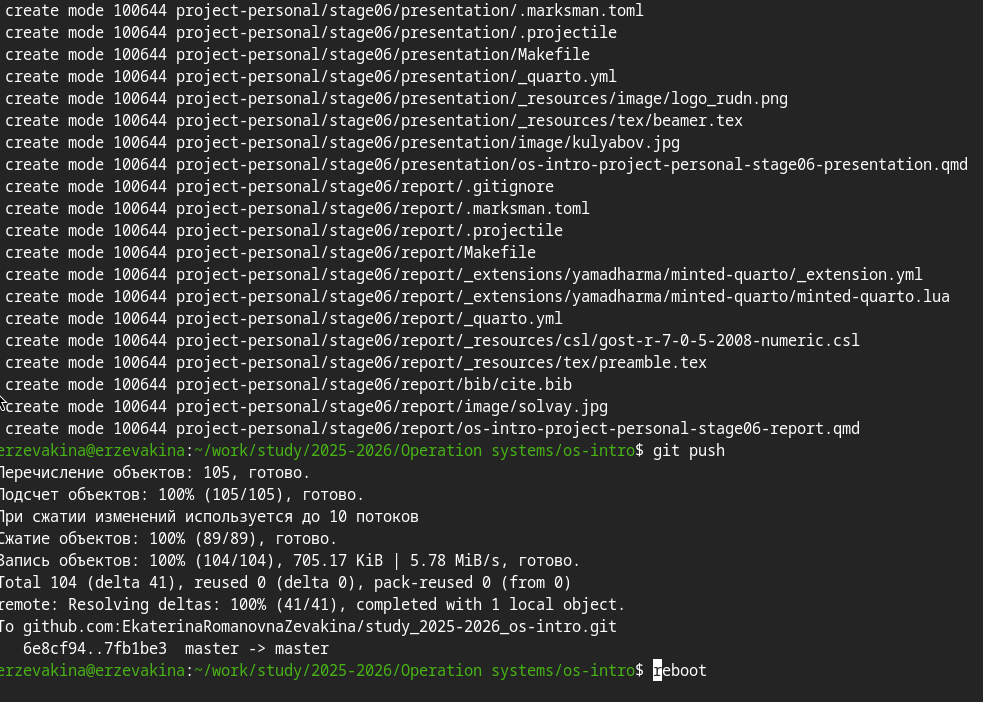{#fig-011 width=70%}

# Выводы

Я смогла освоить github, связать его с моей ВМ и научилась работать с ними "всвязке". Я изучила идеологию и применение средств контроля версий, освоила умения по работе с git.

# Контрольные вопросы

1. Что такое системы контроля версий (VCS) и для решения каких задач они предназначаются?

Ответ: Система контроля версий (VCS) — это программное обеспечение, которое помогает отслеживать изменения в файлах, хранить разные версии документов и управлять доступом к ним.
Основные задачи VCS: отслеживание истории изменений, возможность отката, совместная работа, разрешение конфликтов, резервное копирование

2. Объясните следующие понятия VCS и их отношения: хранилище, commit, история, рабочая копия.

Ответ:

* Хранилище (репозиторий): Место, где VCS хранит все файлы проекта и всю историю их изменений (все коммиты). Может находиться локально (на компьютере разработчика) или на удалённом сервере.

* Commit (фиксация): Снимок состояния файлов в определённый момент времени. Каждый коммит содержит описание изменений (сообщение), информацию об авторе и времени, а также уникальный идентификатор.

* История: Последовательная цепочка коммитов, отражающая весь процесс разработки проекта от начала до текущего момента.

* Рабочая копия: Текущая версия файлов проекта, с которой непосредственно работает пользователь в своей файловой системе. Именно здесь вносятся изменения перед тем, как они будут закоммичены в хранилище.

3. Что представляют собой и чем отличаются централизованные и децентрализованные VCS? Приведите примеры VCS каждого вида.

Ответ:
Централизованные:
* Имеют одно главное (центральное) хранилище, в котором хранится вся история версий.
* Разработчики получают рабочие копии файлов с сервера, а коммитят изменения обратно на сервер.
* Для большинства операций (просмотр истории, сравнение версий) требуется подключение к серверу.
* Примеры: CVS, Subversion (SVN), Perforce.
Децентрализованные (распределённые) VCS (DVCS):
* Каждый разработчик имеет полную копию всего репозитория (включая всю историю) на своём локальном компьютере.
* Большинство операций (коммиты, просмотр истории, создание веток) выполняются локально, без подключения к сети.
* Сервер используется для синхронизации изменений между разработчиками.
* Примеры: Git, Mercurial, Bazaar.

4. Опишите действия с VCS при единоличной работе с хранилищем.

Ответ: 1. Инициализация репозитория: git init — создание нового пустого хранилища в текущей папке.
       2. Создание/изменение файлов: Работа в рабочей копии (написание кода, создание документов).
       3. Добавление файлов под контроль версий: git add <файл> — добавление конкретных файлов в "индекс" (область подготовленных изменений) для следующего коммита.
       4. Фиксация изменений (коммит): git commit -m "описание изменений" — сохранение снимка состояния добавленных файлов в историю репозитория.
       5. Просмотр истории: git log — просмотр сделанных коммитов.
       6. Возврат к предыдущим версиям: git checkout <хэш_коммита> — просмотр состояния проекта на момент указанного коммита.

5. Опишите порядок работы с общим хранилищем VCS.

Ответ:
1. Клонирование: git clone <url> — создание локальной копии удалённого репозитория (со всей историей) на своём компьютере.
2. Получение актуальных изменений: git pull — загрузка новых коммитов из удалённого репозитория и слияние их с вашей текущей локальной веткой (чтобы быть в курсе изменений коллег).
3. Внесение изменений: Работа в рабочей копии, добавление (git add) и коммит (git commit) изменений в локальный репозиторий.
4. Отправка изменений: git push — отправка ваших новых локальных коммитов в удалённый репозиторий, чтобы они стали доступны другим.
5. Разрешение конфликтов: Если git push не удаётся (потому что кто-то уже отправил изменения), нужно сначала сделать git pull, вручную разрешить возможные конфликты (в файлах, где изменения пересеклись), сделать коммит слияния и затем снова git push.

6. Каковы основные задачи, решаемые инструментальным средством git?

Ответ:
* Отслеживание истории изменений любого набора файлов.
* Обеспечение совместной работы над проектом для нескольких разработчиков.
* Управление ветвлением (branching) и слиянием (merging) кода, что позволяет разрабатывать новые функции параллельно и изолированно.
* Синхронизация изменений между локальными и удалёнными репозиториями.
* Контроль целостности всех данных (каждое изменение подписывается хэшем SHA-1).
* Возможность отката к любому предыдущему состоянию проекта.

7. Назовите и дайте краткую характеристику командам git.

Ответ:
* git init -	Создаёт новый пустой локальный репозиторий в текущей папке.
* git clone <url>	- Копирует существующий удалённый репозиторий на локальную машину.
* git add <файл> -	Добавляет изменения из рабочей копии в область подготовленных файлов (индекс) для следующего коммита.
* git commit -m "..." -	Фиксирует изменения из индекса в репозиторий, создавая новый коммит с описанием.
* git status -	Показывает текущее состояние рабочей копии и индекса (какие файлы изменены, добавлены и т.д.).
* git log	- Выводит историю коммитов текущей ветки.
* git push	- Отправляет новые коммиты из локального репозитория в удалённый.
* git pull	- Загружает изменения из удалённого репозитория и сливает их с текущей локальной веткой.
* git branch	- Показывает список веток или создаёт новую ветку.
* git checkout	- Переключает на другую ветку или коммит.
* git merge	- Сливает изменения из одной ветки в другую.
* git diff	- Показывает разницу между файлами (рабочей копией и индексом, коммитами и т.д.).

8. Приведите примеры использования при работе с локальным и удалённым репозиториями.

Ответ:
Локальный репозиторий:
git init my-project       # 1. Создать репозиторий
cd my-project
echo "print('Hello')" > main.py # 2. Создать файл
git add main.py           # 3. Добавить под контроль
git commit -m "Начальный коммит" # 4. Закоммитить
git log                   # 5. Посмотреть историю

Удалённый репозиторий:
git clone https://github.com/username/project.git # Скопировать репозиторий с GitHub
cd project   # Внести изменения и отправить их обратно
echo "# Новый заголовок" >> README.md
git add README.md
git commit -m "Обновил README"
git push origin main

9. Что такое и зачем могут быть нужны ветви (branches)?

Ответ: ветка (branch) в Git — это подвижный указатель на один из коммитов. По сути, это отдельная линия разработки, которая позволяет вести работу независимо от основной линии.
Зачем нужны ветки:
* Разработка новых функций (feature branches): Для каждой новой функциональности создаётся отдельная ветка, чтобы не нарушать работу стабильного основного кода (обычно ветки main или master).
* Исправление ошибок (hotfix branches): Срочное исправление бага можно сделать в отдельной ветке, пока основная разработка новых функций продолжается.
* Эксперименты: В ветке можно безопасно пробовать новые идеи, не боясь сломать рабочий код. Если эксперимент удался, ветку можно влить в основную, если нет — просто удалить.
* Параллельная работа: Несколько разработчиков могут одновременно работать над разными задачами в своих ветках, не мешая друг другу.

10. Как и зачем можно игнорировать некоторые файлы при commit?

Ответ: для игнорирования файлов используется специальный файл .gitignore, который помещается в корень репозитория. В файле .gitignore перечисляются шаблоны имён файлов и папок, которые Git должен игнорировать.

Какие файлы игнорируют:
* Сгенерированные файлы: Результаты компиляции (*.class, *.o), скомпилированные пакеты, папки build/ или dist/. Их не нужно хранить в VCS, так как они всегда могут быть созданы заново из исходного кода.
* Файлы с конфиденциальными данными: Файлы с паролями, ключами API, локальными настройками (например, .env).
* Временные файлы: Файлы, создаваемые редакторами (*.swp, *~), системные файлы (.DS_Store на macOS), логи.
* Зависимости: Папки с установленными библиотеками (node_modules/, vendor/), если принято решение не хранить их в репозитории (обычно они устанавливаются через менеджеры пакетов).
