---
## Front matter
title: "Отчёт по лабораторной работе №5"
subtitle: "Архитектура компьютеров: Операционные системы"
author:
  name: Зевакина Екатерина Романовна
  faculty: Факультет физико-математических и естественных наук
  department: Кафедра прикладной информатики и теории вероятностей
  study group: НКАБД-02-25
  student ID card: 1032253564
  email: 1032253564@rudn.ru
  affiliation:
    name: Российский университет дружбы народов
    country: Российская Федерация
    name: Российский университет дружбы народов
    country: Российская Федерация
    postal-code: 117198
    city: Москва
    address: ул. Миклухо-Маклая, д. 6

## Generic options
lang: ru-RU
toc-title: "Содержание"

## Bibliography
bibliography: bib/cite.bib
csl: pandoc/csl/gost-r-7-0-5-2008-numeric.csl

## Fonts
mainfont: IBM Plex Serif
romanfont: IBM Plex Serif
sansfont: IBM Plex Sans
monofont: IBM Plex Mono
mathfont: STIX Two Math
mainfontoptions: Ligatures=Common,Ligatures=TeX,Scale=0.94
romanfontoptions: Ligatures=Common,Ligatures=TeX,Scale=0.94
sansfontoptions: Ligatures=Common,Ligatures=TeX,Scale=MatchLowercase,Scale=0.94
monofontoptions: Scale=MatchLowercase,Scale=0.94,FakeStretch=0.9
mathfontoptions:

## Biblatex
biblatex: true
biblio-style: "gost-numeric"
biblatexoptions:
  - parentracker=true
  - backend=biber
  - hyperref=auto
  - language=auto
  - autolang=other*
  - citestyle=gost-numeric

## Pandoc-crossref LaTeX customization
figureTitle: "Рис."
tableTitle: "Таблица"
listingTitle: "Листинг"
lofTitle: "Список иллюстраций"
lotTitle: "Список таблиц"
lolTitle: "Листинги"

---

# Цель работы

Настроить рабочую среду: настроить менеджер паролей `pass` с GPG-шифрованием и синхронизацией через git и настроить управление конфигурационными файлами домашнего каталога с помощью утилиты `chezmoi`.

# Задание

1. Установить и настроить менеджер паролей `pass` и `gopass`.
2. Настроить синхронизацию хранилища паролей с репозиторием на GitHub.
3. Настроить интерфейс взаимодействия с браузером (`browserpass`).
4. Установить дополнительное программное обеспечение и шрифты.
5. Установить `chezmoi` и создать репозиторий `dotfiles`.
6. Подключить репозиторий к системе и освоить ежедневные операции с `chezmoi`.

# Теоретическое введение

## Менеджер паролей pass
- Менеджер паролей pass — программа, сделанная в рамках идеологии Unix.
- Также носит название стандартного менеджера паролей для Unix (The standard Unix password manager).

### Основные свойства
- Данные хранятся в файловой системе в виде каталогов и файлов.
- Файлы шифруются с помощью GPG-ключа.

### Структура базы паролей
- Структура базы может быть произвольной, если Вы собираетесь использовать её напрямую, без промежуточного программного обеспечения. Тогда семантику структуры базы данных Вы держите в своей голове.
- Если же необходимо использовать дополнительное программное обеспечение, необходимо семантику заложить в структуру базы паролей.

### Семантическая структура базы паролей
- Рассмотрим пользователя user в домене example.com, порт 22.
- Отсутствие имени пользователя или порта в имени файла означает, что любое имя пользователя и порт будут совпадать:

```
example.com.pgp
```

- Соответствующее имя пользователя может быть именем файла внутри каталога, имя которого совпадает с хостом. Это полезно, если в базе есть пароли для нескольких пользователей на одном хосте:

```
example.com/user.pgp
```
- Имя пользователя также может быть записано в виде префикса, отделенного от хоста знаком @:

```
user@example.com.pgp
```
- Соответствующий порт может быть указан после хоста, отделённый двоеточием (:):
```
example.com:22.pgp
example.com:22/user.pgp
user@example.com:22.pgp
```
- Эти все записи могут быть расположены в произвольных каталогах, задающих Вашу собственную иерархию.

## Реализации

### Утилиты командной строки
- На данный момент существует 2 основных реализации:
  - pass — классическая реализация в виде shell-скриптов (https://www.passwordstore.org/);
  - gopass — реализация на go с дополнительными интегрированными функциями (https://www.gopass.pw/).
- Дальше в тексте будет использоваться программа pass, но всё то же самое можно сделать с помощью программы gopass.

### Графические интерфейсы
1. qtpass
   - qtpass — может работать как графический интерфейс к pass, так и как самостоятельная программа. В настройках можно переключаться между использованием pass и gnupg.
2. gopass-ui
   - gopass-ui — интерфейс к gopass.
3. webpass
   - Репозиторий: https://github.com/emersion/webpass
   - Веб-интерфейс к pass.
   - Написано на golang.

### Приложения для Android
1. Password Store
   - URL: https://play.google.com/store/apps/details?id=dev.msfjarvis.aps
   - Репозиторий с кодом: https://github.com/android-password-store/Android-Password-Store
   - Документация: https://android-password-store.github.io/docs/
   - Для синхронизации с git необходимо импортировать ssh-ключи.
   - Поддерживает разблокировку по биометрическим данным.
   - Для работы требует наличия OpenKeychain: Easy PGP.
2. OpenKeychain: Easy PGP
   - URL: https://play.google.com/store/apps/details?id=org.sufficientlysecure.keychain
   - Операции с ключами pgp.
   - Необходимо будет импортировать pgp-ключи.
   - Не поддерживает разблокировку по биометрическим данным. Необходимо набирать пароль ключа.

### Пакеты для Emacs
1. pass
   - Основной режим для управления хранилищем и редактирования записей.
   - Emacs. Пакет pass
   - Репозиторий: https://github.com/NicolasPetton/pass
   - Позволяет редактировать базу данных паролей.
   - Запуск:
```
M-x pass
```

2. helm-pass
   - Интерфейс helm для pass.
   - Репозиторий: https://github.com/emacs-helm/helm-pass
   - Запуск:
```
M-x helm-pass
```
   - Выдаёт в минибуфере список записей из базы паролей. При нажатии Enter копирует пароль в буфер.
3. ivy-pass
   - Интерфейс ivy для pass.
   - Репозиторий: https://github.com/ecraven/ivy-pass

### Управление файлами конфигурации
- Использование chezmoi для управления файлами конфигурации домашнего каталога пользователя.

## Общая информация
- Сайт: https://www.chezmoi.io/
- Репозиторий: https://github.com/twpayne/chezmoi

## Конфигурация chezmoi

### Рабочие файлы
- Состояние файлов конфигурации сохраняется в каталоге
```
~/.local/share/chezmoi
```
- Он является клоном вашего репозитория dotfiles.
- Файл конфигурации ~/.config/chezmoi/chezmoi.toml (можно использовать также JSON или YAML) специфичен для локальной машины.
- Файлы, содержимое которых одинаково на всех ваших машинах, дословно копируются из исходного каталога.
- Файлы, которые варьируются от машины к машине, выполняются как шаблоны, обычно с использованием данных из файла конфигурации локальной машины для настройки конечного содержимого, специфичного для локальной машины.
- При запуске
```
chezmoi apply
```
вычисляется желаемое содержимое и разрешения для каждого файла, а затем вносит необходимые изменения, чтобы ваши файлы соответствовали этому состоянию.

- По умолчанию chezmoi изменяет файлы только в рабочей копии.

### Автоматически создавать файл конфигурации на новой машине
- При выполнении chezmoi init также может автоматически создать файл конфигурации, если он еще не существует.
- Если ваш репозиторий содержит файл с именем .chezmoi.$FORMAT.tmpl, где $FORMAT есть один из поддерживаемых форматов файла конфигурации (json, toml, или yaml), то chezmoi init выполнит этот шаблон для создания исходного файла конфигурации.
- Например, пусть ~/.local/share/chezmoi/.chezmoi.toml.tmpl выглядит так:
```
{{- $email := promptStringOnce . "email" "Email address" -}}

[data]
    email = {{ $email | quote }}
```
  - При выполнении chezmoi init будет создан конфигурационный файл ~/.config/chezmoi/chezmoi.toml.
  - promptStringOnce — это специальная функция, которая запрашивает у пользователя значение, если оно еще не установлено в разделе data конфигурационного файла.
- Чтобы протестировать этот шаблон, используйте chezmoi execute-template с флагами --init и --promptString, например:
```
chezmoi execute-template --init --promptString email=me@home.org < ~/.local/share/chezmoi/.chezmoi.toml.tmpl
```

### Пересоздание файл конфигурации
- Если вы измените шаблон файла конфигурации, chezmoi предупредит вас, если ваш текущий файл конфигурации не был сгенерирован из этого шаблона.
- Вы можете повторно сгенерировать файл конфигурации, запустив:
```
chezmoi init
```

## Шаблоны

### Общая информация
- Шаблоны используются для изменения содержимого файла в зависимости от среды.
- Используется синтаксис шаблонов Go.
- Файл интерпретируется как шаблон, если выполняется одно из следующих условий:
  - имя файла имеет суффикс .tmpl;
  - файл находится в каталоге .chezmoitemplates.

### Данные шаблона
- Полный список переменных шаблона:
```
chezmoi data
```
- Источники переменных:
  - файлы .chezmoi, например, .chezmoi.os;
  - файлы конфигурации .chezmoidata.$FORMAT. Форматы (json, jsonc, toml, yaml) читаются в алфавитном порядке;
  - раздел data конфигурационного файла.

### Способы создания файла шаблона
- При первом добавлении файла передайте аргумент --template:
```
chezmoi add --template ~/.zshrc
```
- Если файл уже контролируется chezmoi, но не является шаблоном, можно сделать его шаблоном:
```
chezmoi chattr +template ~/.zshrc
```
- Можно создать шаблон вручную в исходном каталоге, присвоив ему расширение .tmpl:
```
chezmoi cd
$EDITOR dot_zshrc.tmpl
```
- Шаблоны в каталоге .chezmoitemplates должны создаваться вручную:
```
chezmoi cd
mkdir -p .chezmoitemplates
cd .chezmoitemplates
$EDITOR mytemplate
```

### Редактирование файла шаблона
- Используйте chezmoi edit:
```
chezmoi edit ~/.zshrc
```
- Чтобы сделанные вами изменения сразу же применялись после выхода из редактора, используйте опцию --apply:
```
chezmoi edit --apply ~/.zshrc
```

### Тестирование шаблонов
- Тестирование с помощью команды chezmoi execute-template.
- Тестирование небольших фрагментов шаблонов:
```
chezmoi execute-template '{{ .chezmoi.hostname }}'
```
- Тестирование целых файлов:
```
chezmoi cd
chezmoi execute-template < dot_zshrc.tmpl
```

### Синтаксис шаблона
- Действия шаблона записываются внутри двойных фигурных скобок, {{ }}.
- Действия могут быть переменными, конвейерами или операторами управления.
- Текст вне действий копируется буквально.
- Переменные записываются буквально:
```
{{ .chezmoi.hostname }}
```
- Условные выражения могут быть записаны с использованием if, else if, else, end:
```
{{ if eq .chezmoi.os "darwin" }}
```

### darwin
```
{{ else if eq .chezmoi.os "linux" }}
```

### linux
```
{{ else }}
```

### other operating system
```
{{ end }}
```

1. Удаление пробелов
   - Для удаления проблем в шаблоне разместите знак минус и пробела рядом со скобками:
  ```
  HOSTNAME={{- .chezmoi.hostname }}
  ```
    - В результате получим:
  ```
  HOSTNAME=myhostname
  ```

2. Отладка шаблона

    - Используется подкоманда execute-template:
```
chezmoi execute-template '{{ .chezmoi.os }}/{{ .chezmoi.arch }}'
```
    - Интерпретируются любые данные, поступающие со стандартного ввода или в конце команды.
    - Можно передать содержимое файла этой команде:
```
cat foo.txt | chezmoi execute-template
```
3. Логические операции
   - Возможно выполнение логических операций.
   - Если имя хоста машины равно work-laptop, текст между if и end будет включён в результат:
```
# common config
export EDITOR=vi

# machine-specific configuration
{{- if eq .chezmoi.hostname "work-laptop" }}
# this will only be included in ~/.bashrc on work-laptop
{{- end }}
```

1. Логические функции
   - eq: возвращает true, если первый аргумент равен любому из остальных аргументов, может принимать несколько аргументов;
   - not: возвращает логическое отрицание своего единственного аргумента;
   - and: возвращает логическое И своих аргументов, может принимать несколько аргументов;
   - or: возвращает логическое ИЛИ своих аргументов, может принимать несколько аргументов.
2. Целочисленные функции
   - len: возвращает целочисленную длину своего аргумента;
   - eq: возвращает логическую истину arg1 == arg2;
   - ne: возвращает логическое значение arg1 != arg2;
   - lt: возвращает логическую истину arg1 < arg2;
   - le: возвращает логическую истину arg1 <= arg2;
   - gt: возвращает логическую истину arg1 > arg2;
   - ge: возвращает логическую истину arg1 >= arg2.

### Переменные шаблона
- Чтобы просмотреть переменные, доступные в вашей системе, выполните:
```
chezmoi data
```
- Чтобы получить доступ к переменной chezmoi.kernel.osrelease в шаблоне, используйте:
```
{{ .chezmoi.kernel.osrelease }}
```

# Выполнение лабораторной работы

## Менеджер паролей pass

### Установка

Установлены пакеты `pass`, `pass-otp` для работы с менеджером паролей, а также `gopass` — реализация менеджера паролей на Go с дополнительными функциями (рис. -@fig:001, -@fig:002).

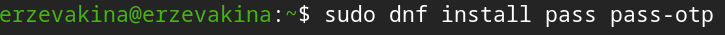

{#fig:001 width=70%}

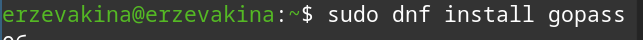

{#fig:002 width=70%}

### Настройка

Выполнена проверка наличия GPG-ключей и создан новый ключ для шифрования хранилища паролей (рис. -@fig:003).

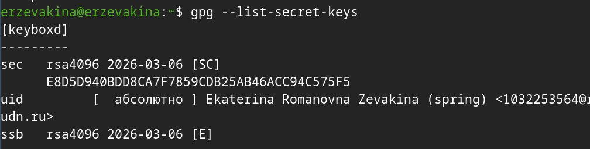

{#fig:003 width=70%}

Инициализировано хранилище паролей с использованием GPG-ключа (рис. -@fig:004)

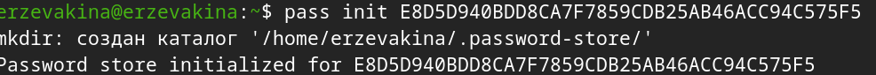

{#fig:004 width=70%}

Создана git-структура (рис. -@fig:005).

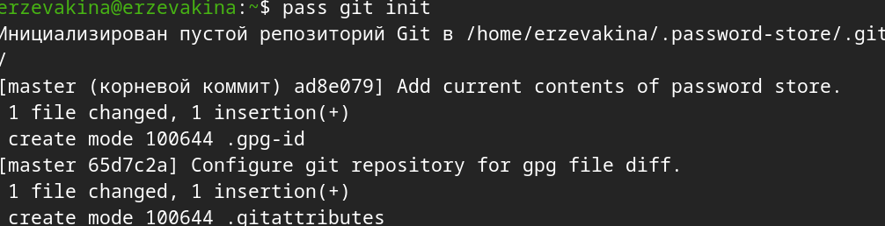

{#fig:005 width=70%}

Задан адрес репозитория на хостинге (рис. -@fig:006)

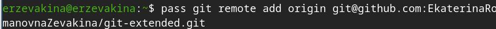

{#fig:006 width=70%}

Выполнена синхронизация (рис. -@fig:007) и (рис. -@fig:008)

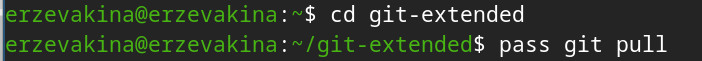

{#fig:007 width=70%}

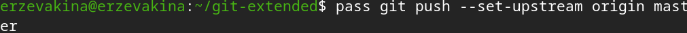

{#fig:008 width=70%}

Выполнены прямые изменения (рис. -@fig:009)

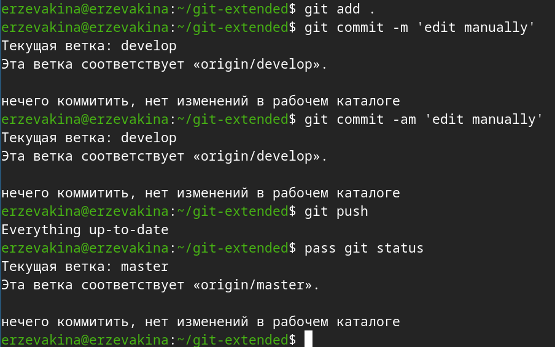

{#fig:009 width=70%}

### Настройка интерфейса с броузером

Установлен интерфейс для взаимодействия с броузером (native messaging) (рис. -@fig:010) и (рис. -@fig:011)

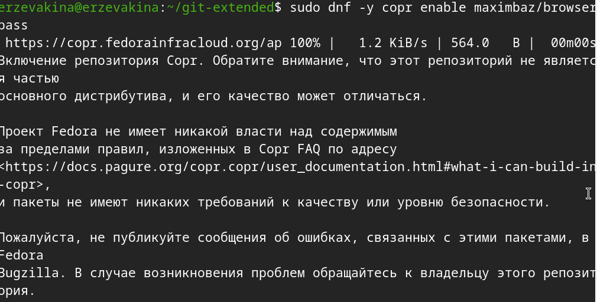

{#fig:010 width=70%} 

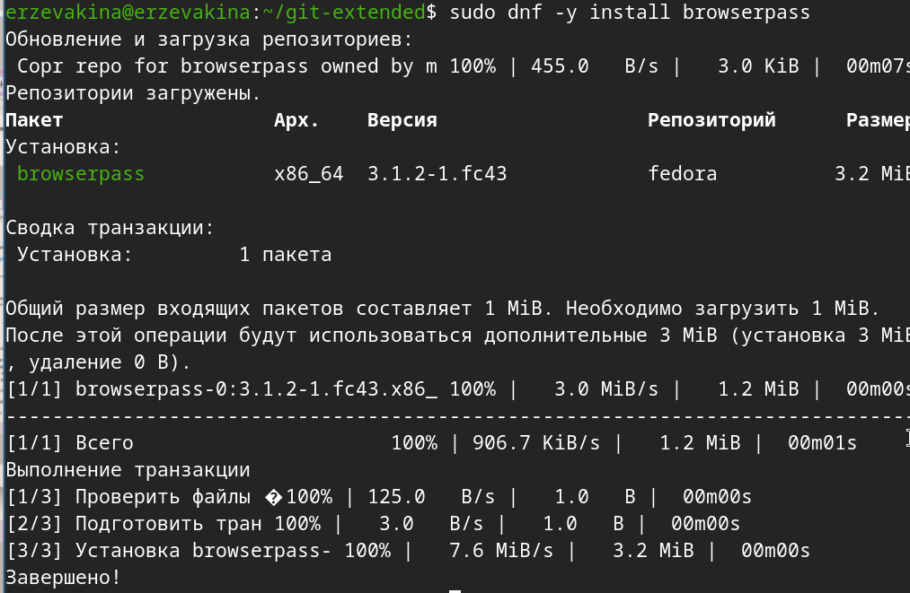

{#fig:011 width=70%}

### Сохранение пароля

Добавлен новый пароль (рис. -@fig:012)

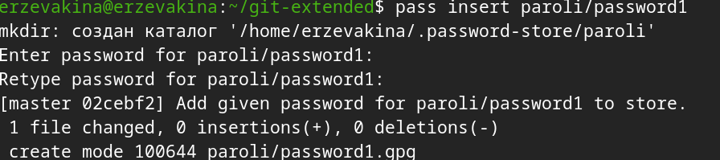

{#fig:012 width=70%}

Отображен установленный пароль (рис. -@fig:013)

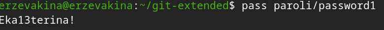

{#fig:013 width=70%}

Заменен существующий пароль (рис. -@fig:014)

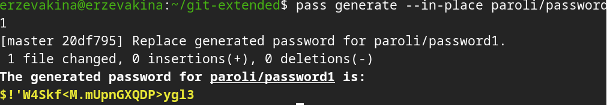

{#fig:014 width=70%}

## Управление файлами конфигурации

## Дополнительное программное обеспечение

Установлено дополнительное программное обеспечение (рис. -@fig:015)

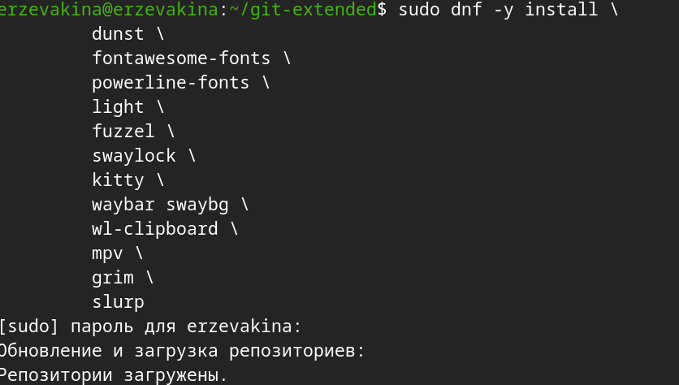

{#fig:015 width=70%}

Установлены шрифты (рис. -@fig:016), (рис. -@fig:017) и (рис. -@fig:018)

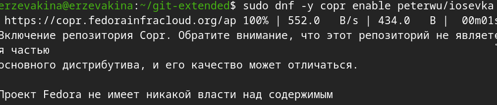

{#fig:015 width=70%}

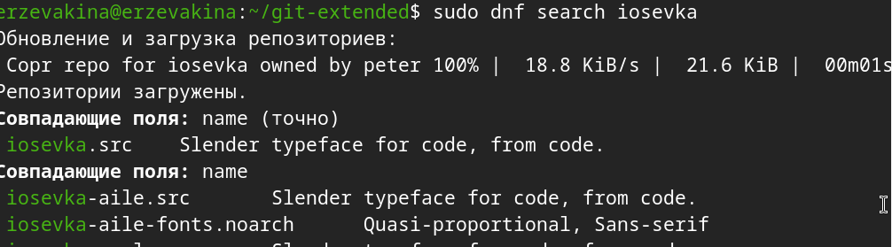

{#fig:015 width=70%}

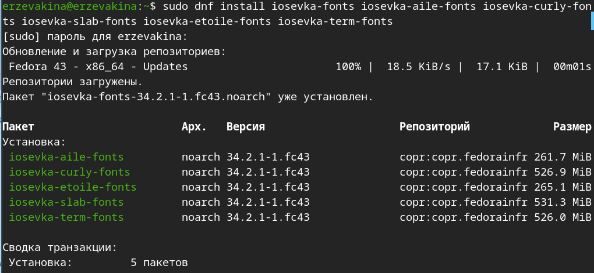

{#fig:015 width=70%}

### Установка

Установка бинарного файла (рис. -@fig:023)

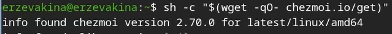

{#fig:023 width=70%}

### Создание собственного репозитория с помощью утилит

Создание своего репозитория для конфигурационных файлов на основе шаблона (рис. -@fig:024)

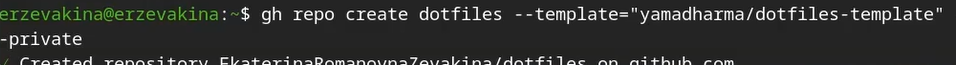

{#fig:024 width=70%}

### Подключение репозитория к своей системе

Инициализация chezmoi с моим репозиторием dotfile (рис. -@fig:025)

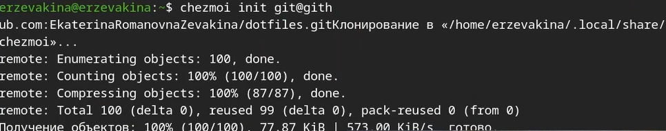

{#fig:025 width=70%}

Проверка, какие изменения внесёт chezmoi в домашний каталог (рис. -@fig:026)

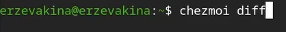

{#fig:026 width=70%}

Меня устроили все изменения, поэтому запустила (рис. -@fig:027):

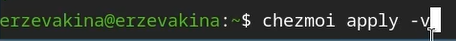

{#fig:027 width=70%}

### Использование chezmoi на нескольких машинах

Настройка новой машины с помощью одной команды (рис. -@fig:019)


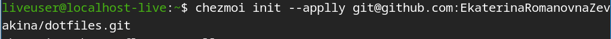

{#fig:019 width=70%}

### Ежедневные операции c chezmoi

Ежедневные операции c chezmoi (рис. -@fig:020)

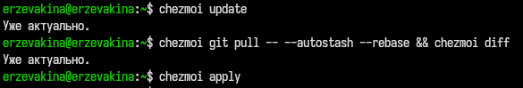

{#fig:020 width=70%}

Включение функции, которая  автоматически фиксирует и отправляет изменения в исходный каталог в репозиторий (рис. -@fig:021) и (рис. -@fig:022)


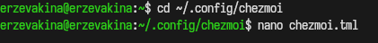

{#fig:020 width=70%}


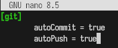

{#fig:020 width=70%}

# Контрольные вопросы

**1. Что такое менеджер паролей pass?**
Pass — стандартный менеджер паролей для Unix, реализованный в виде shell-скриптов. Данные хранятся в файловой системе в виде каталогов и файлов, каждый из которых зашифрован с помощью GPG-ключа. Поддерживает синхронизацию через git и взаимодействие с браузером через native messaging.

**2. Что такое chezmoi?**
Chezmoi — инструмент для управления файлами конфигурации домашнего каталога пользователя между несколькими машинами. Использует git-репозиторий (`dotfiles`) для хранения состояния конфигурационных файлов. Поддерживает шаблоны на синтаксисе Go для создания конфигураций, специфичных для конкретной машины.

**3. Что хранится в файле конфигурации `~/.config/chezmoi/chezmoi.toml`?**
В этом файле хранятся локальные настройки chezmoi, специфичные для конкретной машины: данные шаблонов (раздел `data`), настройки git (автокоммит, автопуш), а также другие параметры, которые не должны быть одинаковыми на всех машинах.

**4. Для чего нужен параметр `autoPush` в конфигурации chezmoi?**
Параметр `autoPush = true` включает автоматическую отправку изменений в удалённый репозиторий каждый раз, когда chezmoi фиксирует изменения в исходном каталоге. Используется совместно с `autoCommit = true`. Следует соблюдать осторожность при использовании с публичными репозиториями, чтобы не отправить секреты в открытый доступ.

**5. Как можно протестировать шаблон chezmoi без его применения?**
Для тестирования шаблонов используется подкоманда `execute-template`. Небольшие фрагменты проверяются непосредственно в командной строке, а целые файлы — через перенаправление стандартного ввода:

```bash
chezmoi execute-template '{{ .chezmoi.hostname }}'
chezmoi cd
chezmoi execute-template < dot_zshrc.tmpl
```

**6. Что такое файлы шаблонов в chezmoi и как они создаются?**
Шаблоны — это файлы конфигурации, содержимое которых изменяется в зависимости от среды (имя хоста, ОС, пользовательские данные). Используется синтаксис шаблонов Go. Файл становится шаблоном, если имеет суффикс `.tmpl` или находится в каталоге `.chezmoitemplates`. Создать шаблон можно при добавлении файла (`chezmoi add --template`), конвертацией существующего файла (`chezmoi chattr +template`) или вручную в исходном каталоге.

# Выводы

В ходе выполнения лабораторной работы был установлен и настроен менеджер паролей `pass` с GPG-шифрованием и синхронизацией через git-репозиторий на GitHub. Настроен интерфейс взаимодействия с браузером через `browserpass`. Установлено дополнительное программное обеспечение и шрифты Iosevka. Освоена работа с утилитой `chezmoi` для управления конфигурационными файлами: создан репозиторий `dotfiles`, выполнено подключение к системе и настроены ежедневные операции по синхронизации конфигурации между машинами.

# Список литературы{.unnumbered}

::: {#refs}
:::
