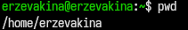
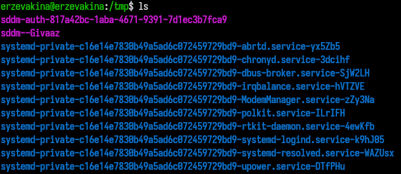
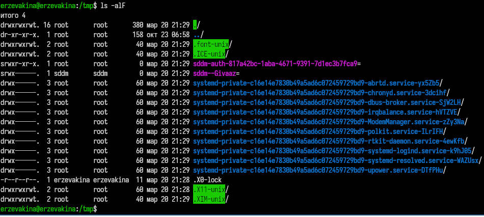
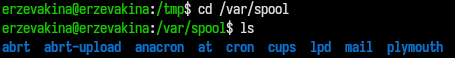
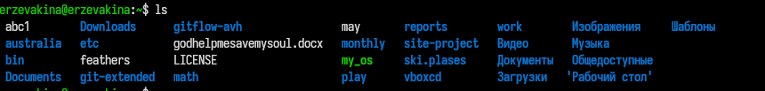
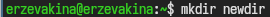
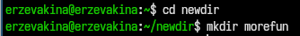
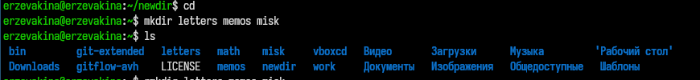
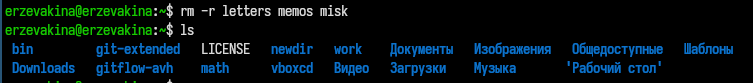

---
## Front matter
title: "Отчёт по лабораторной работе №6"
subtitle: "Архитектура компьютеров: Операционные системы"
author:
  name: Зевакина Екатерина Романовна
  faculty: Факультет физико-математических и естественных наук
  department: Кафедра прикладной информатики и теории вероятностей
  study group: НКАБД-02-25
  student ID card: 1032253564
  email: 1032253564@rudn.ru
  affiliation:
    name: Российский университет дружбы народов
    country: Российская Федерация
    name: Российский университет дружбы народов
    country: Российская Федерация
    postal-code: 117198
    city: Москва
    address: ул. Миклухо-Маклая, д. 6

## Generic options
lang: ru-RU
toc-title: "Содержание"

## Bibliography
bibliography: bib/cite.bib
csl: pandoc/csl/gost-r-7-0-5-2008-numeric.csl

## Fonts
mainfont: IBM Plex Serif
romanfont: IBM Plex Serif
sansfont: IBM Plex Sans
monofont: IBM Plex Mono
mathfont: STIX Two Math
mainfontoptions: Ligatures=Common,Ligatures=TeX,Scale=0.94
romanfontoptions: Ligatures=Common,Ligatures=TeX,Scale=0.94
sansfontoptions: Ligatures=Common,Ligatures=TeX,Scale=MatchLowercase,Scale=0.94
monofontoptions: Scale=MatchLowercase,Scale=0.94,FakeStretch=0.9
mathfontoptions:

## Biblatex
biblatex: true
biblio-style: "gost-numeric"
biblatexoptions:
  - parentracker=true
  - backend=biber
  - hyperref=auto
  - language=auto
  - autolang=other*
  - citestyle=gost-numeric

## Pandoc-crossref LaTeX customization
figureTitle: "Рис."
tableTitle: "Таблица"
listingTitle: "Листинг"
lofTitle: "Список иллюстраций"
lotTitle: "Список таблиц"
lolTitle: "Листинги"

---

# Цель работы

Приобретение практических навыков взаимодействия пользователя с системой посредством командной строки.

# Задание

1. Определите полное имя вашего домашнего каталога. Далее относительно этого каталога будут выполняться последующие упражнения.
2. Выполните следующие действия:
   - Перейдите в каталог /tmp.
   - Выведите на экран содержимое каталога /tmp. Для этого используйте команду ls с различными опциями. Поясните разницу в выводимой на экран информации.
   - Определите, есть ли в каталоге /var/spool подкаталог с именем cron?
   - Перейдите в Ваш домашний каталог и выведите на экран его содержимое. Определите, кто является владельцем файлов и подкаталогов?
3. Выполните следующие действия:
   - В домашнем каталоге создайте новый каталог с именем newdir.
   - В каталоге ~/newdir создайте новый каталог с именем morefun.
   - В домашнем каталоге создайте одной командой три новых каталога с именами letters, memos, misk. Затем удалите эти каталоги одной командой.
   - Попробуйте удалить ранее созданный каталог ~/newdir командой rm. Проверьте,
был ли каталог удалён.
   - Удалите каталог ~/newdir/morefun из домашнего каталога. Проверьте, был ли каталог удалён.
4. С помощью команды man определите, какую опцию команды ls нужно использовать для просмотра содержимое не только указанного каталога, но и подкаталогов,
входящих в него.
5. С помощью команды man определите набор опций команды ls, позволяющий отсортировать по времени последнего изменения выводимый список содержимого каталога
с развёрнутым описанием файлов.
6. Используйте команду man для просмотра описания следующих команд: cd, pwd, mkdir,
rmdir, rm. Поясните основные опции этих команд.
7. Используя информацию, полученную при помощи команды history, выполните модификацию и исполнение нескольких команд из буфера команд

# Теоретическое введение

В операционной системе типа Linux взаимодействие пользователя с системой обычно
осуществляется с помощью командной строки посредством построчного ввода команд. При этом обычно используется командные интерпретаторы языка shell: /bin/sh;
/bin/csh; /bin/ksh.

**Формат команды.** Командой в операционной системе называется записанный по
специальным правилам текст (возможно с аргументами), представляющий собой указание на выполнение какой-либо функций (или действий) в операционной системе.
Обычно первым словом идёт имя команды, остальной текст — аргументы или опции,
конкретизирующие действие.
Общий формат команд можно представить следующим образом:
<имя_команды><разделитель><аргументы>

**Команда man.** Команда man используется для просмотра (оперативная помощь) в диалоговом режиме руководства (manual) по основным командам операционной системы
типа Linux.
Формат команды:
man <команда>

**Команда cd.** Команда cd используется для перемещения по файловой системе операционной системы типа Linux.
**Замечание 1.** Файловая система ОС типа Linux — иерархическая система каталогов,
подкаталогов и файлов, которые обычно организованы и сгруппированы по функциональному признаку. Самый верхний каталог в иерархии называется корневым
и обозначается символом /. Корневой каталог содержит системные файлы и другие
каталоги.
Формат команды:
cd [путь_к_каталогу]
Для перехода в домашний каталог пользователя следует использовать команду cd без
параметров или cd ~.

**Команда pwd.** Для определения абсолютного пути к текущему каталогу используется
команда pwd (print working directory).

**Сокращения имён файлов.** В работе с командами, в качестве аргументов которых
выступает путь к какому-либо каталогу или файлу, можно использовать сокращённую
запись пути. Символы сокращения приведены в [табл. @4.1].

| Символ       | Значение                                                                                                                   |
|--------------|----------------------------------------------------------------------------------------------------------------------------|
| ~            | Домашний каталог                                                                                                           |
| .            | Текущий каталог                                                                                                            |
| ..           | Родительский каталог                                                                                                       |


: Символы сокращения имён файлов {#6.1}

**Команда ls.** Команда ls используется для просмотра содержимого каталога.
Формат команды:
ls [-опции] [путь]

Некоторые файлы в операционной системе скрыты от просмотра и обычно используются для настройки рабочей среды. Имена таких файлов начинаются с точки. Для
того, чтобы отобразить имена скрытых файлов, необходимо использовать команду ls
с опцией a:

```
ls -a
```

Можно также получить информацию о типах файлов (каталог, исполняемый файл,
ссылка), для чего используется опция F. При использовании этой опции в поле имени
выводится символ, который определяет тип файла  [табл. @4.2]

| Тип файла         | Символ                                                                                                                |
|-------------------|-----------------------------------------------------------------------------------------------------------------------|
| Каталог           | Домашний каталог                                                                                                      |
| Исполняемый файл  | *                                                                                                                     |
| Ссылка            | @                                                                                                                     |

: Символ, который определяет тип файла {#6.2}

Чтобы вывести на экран подробную информацию о файлах и каталогах, необходимо
использовать опцию l. При этом о каждом файле и каталоге будет выведена следующая
информация:
- тип файла,
- право доступа,
- число ссылок,
- владелец,
- размер,
- дата последней ревизии,
- имя файла или каталога.

**Команда mkdir.** Команда mkdir используется для создания каталогов.
Формат команды:
mkdir имя_каталога1 [имя_каталога2...]

**Замечание 2.** Для того чтобы создать каталог в определённом месте файловой системы,
должны быть правильно установлены права доступа
Интересны следующие опции:
- --mode (или -m) — установка атрибутов доступа;
- --parents (или -p)— создание каталога вместе с родительскими по отношению к нему
каталогами.
Атрибуты задаются в численной или символьной нотации.
Опция --parents (краткая форма -p) позволяет создавать иерархическую цепочку
подкаталогов, создавая все промежуточные каталоги

**Команда rm.** Команда rm используется для удаления файлов и/или каталогов.
Формат команды:
rm [-опции] [файл]
Если требуется, чтобы выдавался запрос подтверждения на удаление файла, то необходимо использовать опцию i.
Чтобы удалить каталог, содержащий файлы, нужно использовать опцию r. Без указания
этой опции команда не будет выполняться.
Если каталог пуст, то можно воспользоваться командой rmdir. Если удаляемый
каталог содержит файлы, то команда не будет выполнена — нужно использовать rm -
r имя_каталога.

**Команда history.** Для вывода на экран списка ранее выполненных команд используется команда history. Выводимые на экран команды в списке нумеруются. К любой
команде из выведенного на экран списка можно обратиться по её номеру в списке,
воспользовавшись конструкцией !<номер_команды>.
Можно модифицировать команду из выведенного на экран списка при помощи следующей конструкции:
!<номер_команды>:s/<что_меняем>/<на_что_меняем>

**Замечание 3.** Если в заданном контексте встречаются специальные символы (типа «.»,
«/», «*» и т.д.), надо перед ними поставить символ экранирования \ (обратный слэш).

**Использование символа «;».** Если требуется выполнить последовательно несколько
команд, записанный в одной строке, то для этого используется символ точка с запятой


# Выполнение лабораторной работы

## Задание 1
Определяю полное имя своего домашнего каталога ([рис. @fig-001]).

{#fig-001 width=70%}

## Задание 2
### №1

Перехожу в каталог /tmp([рис. @fig-002]).

{#fig-002 width=70%}

### №2

Вывожу на экран содержимое каталога /tmp, используя команду ls с различными опциями ([рис. @fig-003]), ([рис. @fig-004]). 

{#fig-003 width=70%}

{#fig-004 width=70%}

Пояснения: в первом случае я просто вывожу содержимое каталога, а во втором случая я вывожу скрытые файлы (а), подробную информацию о файлах и каталогах (l) и информацию о типах файлов (F).

### №3

Определяю, есть ли в каталоге /var/spool подкаталог с именем cron ([рис. @fig-005]).

{#fig-005 width=70%}

Ответ: да, есть.

### №4

Перехожу в мой домашний каталог и вывожу на экран его содержимое. Определите, кто является владельцем файлов и подкаталогов([рис. @fig-006]).

{#fig-006 width=70%}

{#fig-001 width=70%}

Ответ: из первого задания понятно, что хостом являюсь я, пользователь erzevakina => я являюсь владельцем файлов и подкаталогов.

## Задание 3

### №1

В домашнем каталоге создаю новый каталог с именем newdir([рис. @fig-007]).

{#fig-007 width=70%}

### №2

В каталоге ~/newdir создаю новый каталог с именем morefun([рис. @fig-008]).

{#fig-008 width=70%}

### №3

В домашнем каталоге создаю одной командой три новых каталога с именами letters, memos, misk. Затем я удаляю эти каталоги одной командой([рис. @fig-009]), ([рис. @fig-010])

{#fig-009 width=70%}

{#fig-010 width=70%}

### №4

 Попробуйте удалить ранее созданный каталог ~/newdir командой rm. Проверяю, был ли каталог удалён.


# Выводы

Здесь кратко описываются итоги проделанной работы.

# Список литературы{.unnumbered}

::: {#refs}
:::
