---
## Front matter
title: "Отчёт по лабораторной работе №6"
subtitle: "Архитектура компьютеров: Операционные системы"
author:
  name: Зевакина Екатерина Романовна
  faculty: Факультет физико-математических и естественных наук
  department: Кафедра прикладной информатики и теории вероятностей
  study group: НКАБД-02-25
  student ID card: 1032253564
  email: 1032253564@rudn.ru
  affiliation:
    name: Российский университет дружбы народов
    country: Российская Федерация
    name: Российский университет дружбы народов
    country: Российская Федерация
    postal-code: 117198
    city: Москва
    address: ул. Миклухо-Маклая, д. 6

## Generic options
lang: ru-RU
toc-title: "Содержание"

## Bibliography
bibliography: bib/cite.bib
csl: pandoc/csl/gost-r-7-0-5-2008-numeric.csl

## Fonts
mainfont: IBM Plex Serif
romanfont: IBM Plex Serif
sansfont: IBM Plex Sans
monofont: IBM Plex Mono
mathfont: STIX Two Math
mainfontoptions: Ligatures=Common,Ligatures=TeX,Scale=0.94
romanfontoptions: Ligatures=Common,Ligatures=TeX,Scale=0.94
sansfontoptions: Ligatures=Common,Ligatures=TeX,Scale=MatchLowercase,Scale=0.94
monofontoptions: Scale=MatchLowercase,Scale=0.94,FakeStretch=0.9
mathfontoptions:

## Biblatex
biblatex: true
biblio-style: "gost-numeric"
biblatexoptions:
  - parentracker=true
  - backend=biber
  - hyperref=auto
  - language=auto
  - autolang=other*
  - citestyle=gost-numeric

## Pandoc-crossref LaTeX customization
figureTitle: "Рис."
tableTitle: "Таблица"
listingTitle: "Листинг"
lofTitle: "Список иллюстраций"
lotTitle: "Список таблиц"
lolTitle: "Листинги"

---


# Цель работы

Ознакомиться с файловой системой Linux, её структурой, именами и содержанием каталогов. Приобрести практические навыкы по применению команд для работы
с файлами и каталогами, по управлению процессами (и работами), по проверке использования диска и обслуживанию файловой системы.

# Задание

1. Выполните все примеры, приведённые в первой части описания лабораторной работы.
2. Выполните действия, зафиксировав в отчёте по лабораторной работе используемые при этом команды и результаты их выполнения.
3. Определите опции команды chmod, необходимые для того, чтобы присвоить файлам выделенные права доступа.
4. Проделайте приведённые ниже упражнения, записывая в отчёт по лабораторной работе.
5. Прочитайте man по командам mount, fsck, mkfs, kill и кратко их охарактеризуйте, приведя примеры.

# Теоретическое введение

## 1. Команды для работы с файлами и каталогами

Для создания текстового файла можно использовать команду touch.
Формат команды:
```
touch имя-файла
```
Для просмотра файлов небольшого размера можно использовать команду cat.
Формат команды:
```
cat имя-файла
```
Для просмотра файлов постранично удобнее использовать команду less.
Формат команды:
```
less имя-файла
```
Следующие клавиши используются для управления процессом просмотра:
– Space — переход к следующей странице,
– ENTER — сдвиг вперёд на одну строку,
– b — возврат на предыдущую страницу,
– h — обращение за подсказкой,
– q — выход из режима просмотра файла.

Команда head выводит по умолчанию первые 10 строк файла.
Формат команды:
```
head [-n] имя-файла,
```
где n — количество выводимых строк.

Команда tail выводит умолчанию 10 последних строк файла.
Формат команды:
```
tail [-n] имя-файла,
```
где n — количество выводимых строк.

## 2. Копирование файлов и каталогов

Команда cp используется для копирования файлов и каталогов.
Формат команды:
```
cp [-опции] исходный_файл целевой_файл
```
Примеры:
1.  Копирование файла в текущем каталоге. Скопировать файл ~/abc1 в файл april и в файл may:
```
cd
touch abc1
cp abc1 april
cp abc1 may
```

2. Копирование нескольких файлов в каталог. Скопировать файлы april и may в каталог monthly:
```
mkdir monthly
cp april may monthly
```

3. Копирование файлов в произвольном каталоге.Скопировать файл monthly/may в файл с именем june:
```
cp monthly/may monthly/june
ls monthly
```

Опция i в команде cp выведет на экран запрос подтверждения о перезаписи файла. Для рекурсивного копирования каталогов, содержащих файлы, используется команда cp с опцией r.
Примеры:
1. Копирование каталогов в текущем каталоге. Скопировать каталог monthly в каталог
monthly.00:
```
mkdir monthly.00
cp -r monthly monthly.00
```

2. Копирование каталогов в произвольном каталоге. Скопировать каталог monthly.00 в каталог /tmp
```
cp -r monthly.00 /tmp
```

## 3. Перемещение и переименование файлов и каталогов

Команды mv и mvdir предназначены для перемещения и переименования файлов и каталогов.
Формат команды mv:
```
mv [-опции] старый_файл новый_файл
```
Примеры:
1. Переименование файлов в текущем каталоге. Изменить название файла april на july в домашнем каталоге:
```
cd
mv april july
```

2. Перемещение файлов в другой каталог. Переместить файл july в каталог monthly.00:
```
mv july monthly.00
ls monthly.00
```

Если необходим запрос подтверждения о перезаписи файла, то нужно использовать опцию i.

3. Переименование каталогов в текущем каталоге. Переименовать каталог monthly.00 в monthly.01
```
mv monthly.00 monthly.01
```

4. Перемещение каталога в другой каталог. Переместить каталог monthly.01в каталог reports:
```
mkdir reports
mv monthly.01 reports
```

5. Переименование каталога, не являющегося текущим. Переименовать каталог reports/monthly.01 в reports/monthly:
```
mv reports/monthly.01 reports/monthly
```

## 4. Права доступа

Каждый файл или каталог имеет права доступа (табл. 1).
В сведениях о файле или каталоге указываются:
– тип файла (символ (-) обозначает файл, а символ (d) — каталог);
– права для владельца файла (r — разрешено чтение, w — разрешена запись, x — разрешено выполнение, - — право доступа отсутствует);
– права для членов группы (r — разрешено чтение, w — разрешена запись, x — разрешено
выполнение, - — право доступа отсутствует);
– права для всех остальных (r — разрешено чтение, w — разрешена запись, x — разрешено
выполнение, - — право доступа отсутствует).
Примеры в [табл. @tbl-prava]:

|   Право    | Обозначение |                         Файл                          |                             Каталог                                      |
|------------|-------------|-------------------------------------------------------|--------------------------------------------------------------------------|
|   Чтение   |      r      |  Разрешены просмотр и копирование                     |  Разрешён просмотр списка входящих файлов                                |
|   Запись   |      w      |  Разрешены изменение и переименование                 |  Разрешены создание и удаление файлов                                    |
| Выполнение |      x      |  Разрешено выполнение файла (скриптов и/или программ) |  Разрешён доступ в каталог и есть возможность сделать его текущим |

: Описание  прав доступа {#tbl-prava}

## 5. Изменение прав доступа

Права доступа к файлу или каталогу можно изменить, воспользовавшись командой chmod. Сделать это может владелец файла (или каталога) или пользователь с правами администратора.
Формат команды:
```
chmod режим имя_файла
```

Режим (в формате команды) имеет следующие компоненты структуры и способ записи:
= установить право
- лишить права
+ дать право
r чтение
w запись
x выполнение
u (user) владелец файла
g (group) группа, к которой принадлежит владелец файла
o (others) все остальные

В работе с правами доступа можно использовать их цифровую запись (восьмеричное значение) вместо символьной [табл. @tbl-comads].

|   Двоичная   |  Восьмиричная  |  Символьная    |
|--------------|----------------|----------------|
|      111     |        7       |      rwx       |
|      110     |        6       |      rw-       | 
|      101     |        5       |      r-x       |
|      100     |        4       |      r--       |
|      011     |        3       |      -wx       | 
|      010     |        2       |      -w-       |
|      001     |        1       |      --x       |
|      000     |        0       |      ---       |

: Описание команд для прав доступа {#tbl-comads}

Примеры:
1. Требуется создать файл ~/may с правом выполнения для владельца:
```
cd
touch may
ls -l may
chmod u+x may
ls -l may
```

2. Требуется лишить владельца файла ~/may права на выполнение:
```
chmod u-x may
ls -l may
```

3. Требуется создать каталог monthly с запретом на чтение для членов группы и всех
остальных пользователей:
```
cd
mkdir monthly
chmod g-r, o-r monthly
```

4. Требуется создать файл ~/abc1 с правом записи для членов группы:
```
cd
touch abc1
chmod g+w abc1
```

## 6. Анализ файловой системы

Файловая система в Linux состоит из фалов и каталогов. Каждому физическому носителю соответствует своя файловая система.
Существует несколько типов файловых систем. Перечислим наиболее часто встречающиеся типы:
– ext2fs (second extended filesystem);
– ext2fs (third extended file system);
– ext4 (fourth extended file system);
– ReiserFS;
– xfs;
– fat (file allocation table);
– ntfs (new technology file system).
Для просмотра используемых в операционной системе файловых систем можно воспользоваться командой mount без параметров. В результате её применения можно получить примерно следующее:
```
mount

proc on /proc type proc (rw)
sysfs on /sys type sysfs (rw,nosuid,nodev,noexec)
udev on /dev type tmpfs (rw,nosuid)
devpts on /dev/pts type devpts (rw,nosuid,noexec)
/dev/sda1 on /mnt/a type ext3 (rw,noatime)
/dev/sdb2 on /mnt/docs type reiserfs (rw,noatime)
shm on /dev/shm type tmpfs (rw,noexec,nosuid,nodev)
usbfs on /proc/bus/usb type usbfs
(rw,noexec,nosuid,devmode=0664,devgid=85)
binfmt_misc on /proc/sys/fs/binfmt_misc type binfmt_misc
(rw,noexec,nosuid,nodev)
nfsd on /proc/fs/nfs type nfsd (rw,noexec,nosuid,nodev)
```

В данном случае указаны имена устройств, названия соответствующих им точек монтирования (путь), тип файловой системы и параметрами монтирования.
В контексте команды mount устройство — специальный файл устройства, с помощью
которого операционная система получает доступ к аппаратному устройству. Файлы
устройств обычно располагаются в каталоге /dev, имеют сокращённые имена (например,
sdaN, sdbN или hdaN, hdbN, где N — порядковый номер устройства, sd — устройства SCSI,
hd — устройства MFM/IDE).
Точка монтирования — каталог (путь к каталогу), к которому присоединяются файлы
устройств.
Другой способ определения смонтированных в операционной системе файловых систем — просмотр файла/etc/fstab. Сделать это можно например с помощью команды cat:
```
cat /etc/fstab

/dev/hda1 / ext2 defaults 1 1
/dev/hda5 /home ext2 defaults 1 2
/dev/hda6 swap swap defaults 0 0
/dev/hdc /mnt/cdrom auto umask=0,user,noauto,ro,exec,users 0 0
none /mnt/floppy supermount dev=/dev/fd0,fs=ext2:vfat,--,
sync,umask=0 0 0
none /proc proc defaults 0 0
none /dev/pts devpts mode=0622 0 0
```
В каждой строке этого файла указано:
– имя устройство;
– точка монтирования;
– тип файловой системы;
– опции монтирования;
– специальные флаги для утилиты dump;
– порядок проверки целостности файловой системы с помощью утилиты fsck.
Для определения объёма свободного пространства на файловой системе можно воспользоваться командой df, которая выведет на экран список всех файловых систем в соответствии с именами устройств, с указанием размера и точки монтирования. Например:
```
df

Filesystem 1024-blocks Used Available Capacity Mounted on
/dev/hda3 297635 169499 112764 60% /
```
С помощью команды fsck можно проверить (а в ряде случаев восстановить) целостность файловой системы:
Формат команды:
```
fsck имя_устройства
```
Пример:
```
fsck /dev/sda1
```

# Выполнение лабораторной работы

1. Выполняю все примеры, приведённые в первой части описания лабораторной работы ([рис. @fig-001], [рис. @fig-002], [рис. @fig-003], [рис. @fig-004], [рис. @fig-005], [рис. @fig-006], [рис. @fig-007], [рис. @fig-008], [рис. @fig-009]).

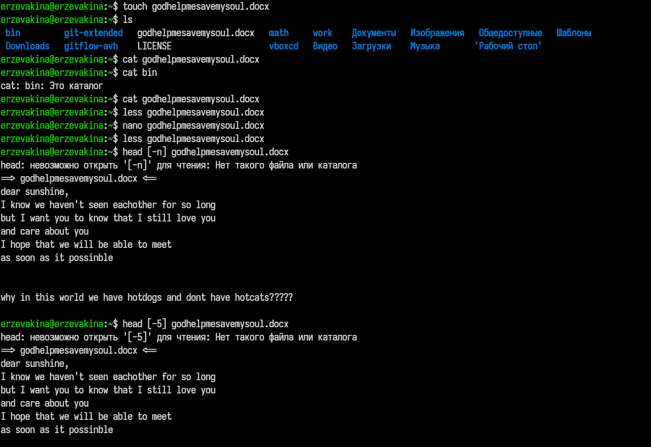{#fig-001 width=70%}

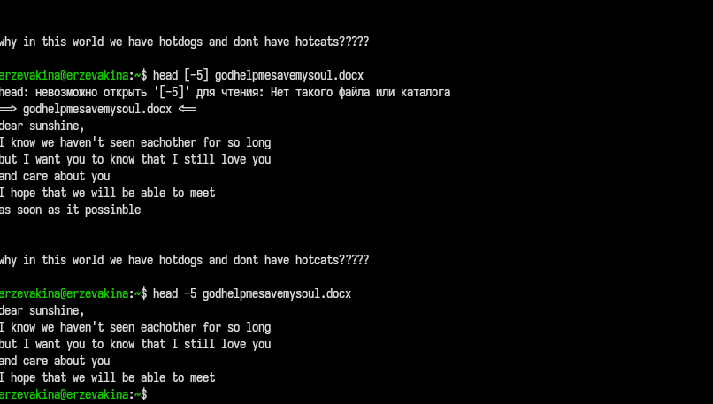{#fig-002 width=70%}

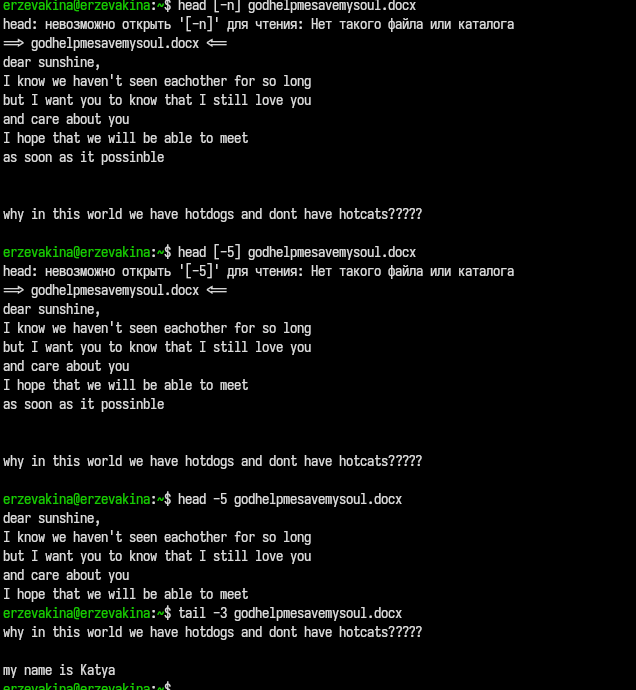{#fig-003 width=70%}

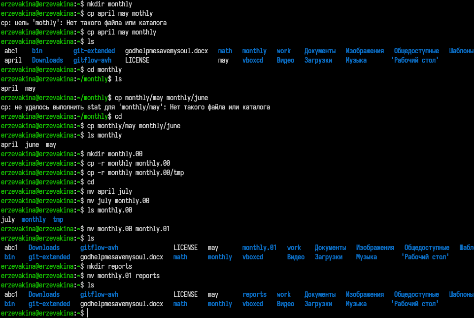{#fig-004 width=70%}

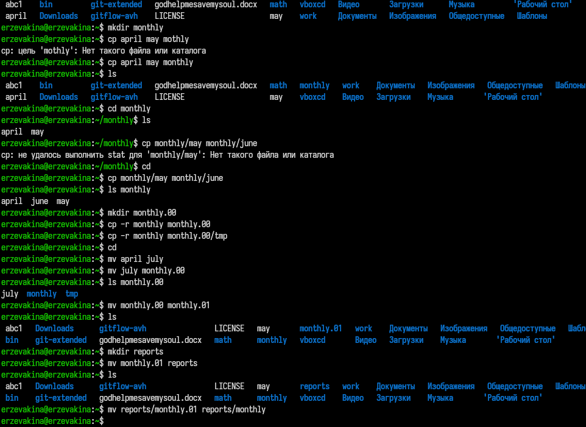{#fig-005 width=70%}

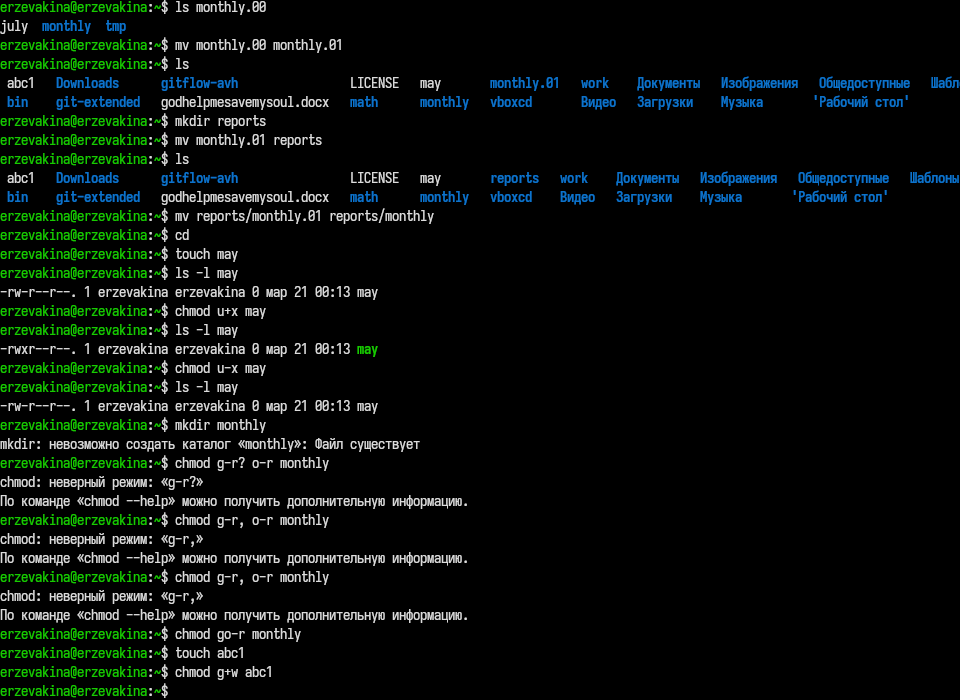{#fig-006 width=70%}

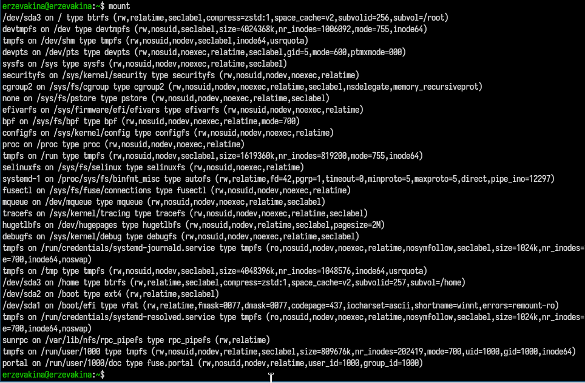{#fig-007 width=70%}

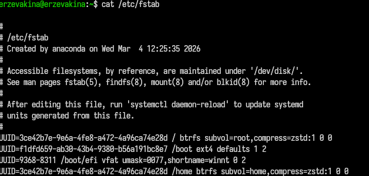{#fig-008 width=70%}

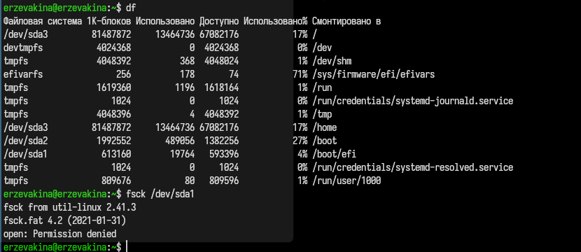{#fig-009 width=70%}

2. Выполняю следующие действия:
    - Копирую файл /usr/include/sys/io.h в домашний каталог и называю его equipment.
    - В домашнем каталоге создаю директорию ~/ski.plases.
    - Перемещаю файл equipment в каталог ~/ski.plases.
    - Переименовываю файл ~/ski.plases/equipment в ~/ski.plases/equiplist.
    - Создаю в домашнем каталоге файл abc1 и копирую его в каталог ~/ski.plases, называю его equiplist2.
    - Создаю каталог с именем equipment в каталоге ~/ski.plases.
    - Перемещаю файлы ~/ski.plases/equiplist и equiplist2 в каталог ~/ski.plases/equipment.
    - Создаю и перемещаю каталог ~/newdir в каталог ~/ski.plases и называю его plans.
Выполнение второго номера: [рис. @fig-010], [рис. @fig-012]

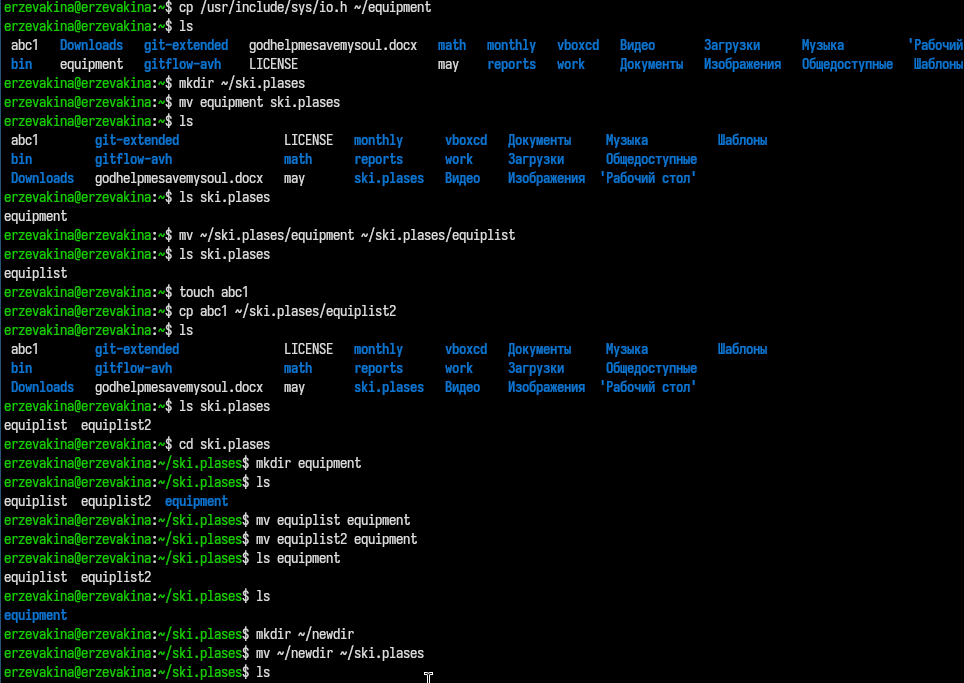{#fig-010 width=70%}

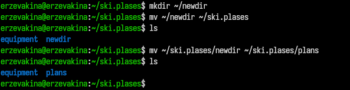{#fig-011 width=70%}

3.  Определяю опции команды chmod, необходимые для того, чтобы присвоить перечисленным ниже файлам выделенные права доступа, считая, что в начале таких прав нет:
   - drwxr--r-- ... australia
   - drwx--x--x ... play
   - -r-xr--r-- ... my_os
   - -rw-rw-r-- ... feathers
Выполнение третьего номера: [рис. @fig-012], [рис. @fig-013], [рис. @fig-014], [рис. @fig-015]

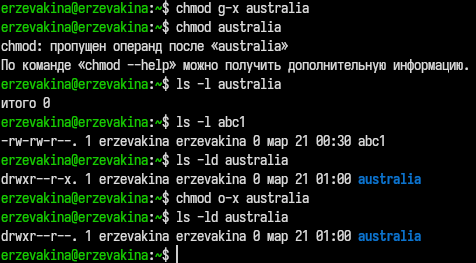{#fig-012 width=70%}

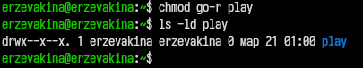{#fig-013 width=70%}

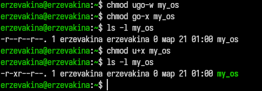{#fig-014 width=70%}

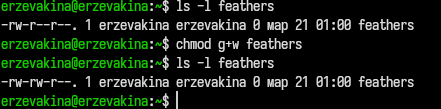{#fig-015 width=70%}

4. Выполняю следующие действия:
  - Просмамтриваю содержимое файла /etc/password.
  - Копирую файл ~/feathers в файл ~/file.old.
  - Перемещаю файл ~/file.old в каталог ~/play.
  - Копирую каталог ~/play в каталог ~/fun.
  - Перемещаю каталог ~/fun в каталог ~/play и называю его games.
  - Лишаю владельца файла ~/feathers права на чтение.
  - Узнаю, что произойдёт, если попытаться просмотреть файл ~/feathers командой cat?
  - Узнаю, что произойдёт, если попытаться скопировать файл ~/feathers?
  - Даю владельцу файла ~/feathers право на чтение.
  - Лишаю владельца каталога ~/play права на выполнение.
  - Перехожу в каталог ~/play. Произошла ошибка
  - Даю владельцу каталога ~/play право на выполнение   
Выполнение четвертого номера: [рис. @fig-016], [рис. @fig-017]

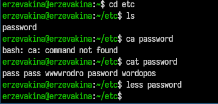{#fig-016 width=70%}

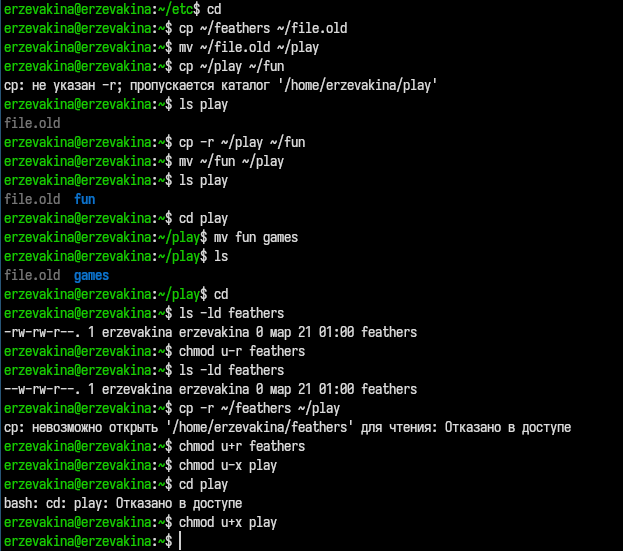{#fig-017 width=70%}

5. Читаю man по командам mount, fsck, mkfs, kill. [рис. @fig-018]

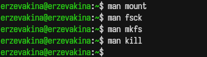{#fig-018 width=70%}

Пояснения:

1. mount — монтирование файловых систем
Характеристика:
Команда mount служит для подключения файловой системы с какого-либо устройства (например, жесткого диска, USB-накопителя) к основному дереву каталогов операционной системы в указанную точку монтирования . Без аргументов она выводит список всех смонтированных в данный момент файловых систем. Для выполнения этой команды обычно требуются права суперпользователя .

Пример:
Смонтировать устройство /dev/sdb1 с файловой системой ext4 в каталог /mnt/usb:
```
mount -t ext4 /dev/sdb1 /mnt/usb
```

Смонтировать устройство только для чтения:
```
mount -o ro /dev/sdb1 /mnt/usb
```

2. fsck — проверка и восстановление файловой системы
Характеристика:
Команда fsck (file system check) используется для проверки целостности и, при необходимости, автоматического или интерактивного исправления ошибок в файловой системе . Она является «обёрткой» для утилит, специфичных для конкретного типа файловой системы (например, fsck.ext4). Важно, что проверяемая файловая система обычно должна быть размонтирована, чтобы избежать повреждения данных. Код возврата команды представляет собой сумму условий, отражающих результат проверки (0 — ошибок нет, 1 — ошибки исправлены и т.д.) .

Пример:
Проверить файловую систему на устройстве /dev/sda1 и автоматически исправить найденные ошибки:
```
fsck -y /dev/sda1
```
Проверить устройство, но только вывести информацию об ошибках, ничего не исправляя:
```
fsck -n /dev/sda1
```

3. mkfs — создание файловой системы
Характеристика:
Команда mkfs (make filesystem) используется для создания новой файловой системы на устройстве (например, на отформатированном разделе диска) . Как и fsck, mkfs является интерфейсом для специализированных утилит вроде mkfs.ext4 или mkfs.vfat. Эта операция уничтожает все существующие данные на устройстве, поэтому требует осторожности. Если тип файловой системы не указан, часто по умолчанию используется ext2 .

Пример:
Создать на устройстве /dev/sdb1 файловую систему типа ext4:
```
mkfs -t ext4 /dev/sdb1
```
Создать файловую систему vfat (FAT32) на разделе /dev/sdc1:
```
mkfs -t vfat /dev/sdc1
```

4. kill — отправка сигналов процессам
Характеристика:
Команда kill предназначена для отправки сигналов процессам, идентифицируемым по их идентификатору (PID) . По умолчанию (без указания сигнала) отправляется сигнал TERM (terminate), который запрашивает корректное завершение работы процесса. С помощью этой команды можно также принудительно остановить процесс (сигнал KILL), приостановить его выполнение или отправить другие управляющие сигналы. Для отправки сигнала процессу, принадлежащему другому пользователю, обычно требуются права суперпользователя .

Пример:
Завершить процесс с идентификатором 1234 (отправить сигнал TERM по умолчанию):
```
kill 1234
```
Принудительно завершить процесс с PID 1234 (сигнал KILL):
```
kill -9 1234
```

# Контрольные вопросы

1. Дайте характеристику каждой файловой системе, существующей на жёстком диске компьютера, на котором вы выполняли лабораторную работу.
Ответ:
ext4 (Fourth Extended File System):
Характеристика: Это стандартная и наиболее распространённая журналируемая файловая система для Linux.
Особенности: Поддерживает огромные объёмы томов (до 1 эксабайта) и файлов (до 16 терабайт). Использует механизм журналирования (extents), который уменьшает фрагментацию и ускоряет проверку целостности после сбоев. Поддерживает «битовые карты» для ускорения выделения места.

swap:
Характеристика: Строго говоря, это не файловая система в классическом понимании, а область подкачки (раздел или файл).
Особенности: Используется для расширения оперативной памяти. Ядро Linux обращается к этому разделу напрямую, без организации структуры файлов и каталогов. Используется при нехватке RAM для выгрузки неактивных страниц памяти.

EFI System Partition (ESP) — vfat (FAT32):
Характеристика: Необходима для систем с UEFI (Unified Extensible Firmware Interface).
Особенности: Имеет тип FAT32. Содержит загрузчики операционных систем (например, GRUB, systemd-boot) и файлы ядра (vmlinuz, initrd). Требуется для корректной инициализации загрузки компьютера.

Дополнительно:
btrfs: Встречается в современных дистрибутивах (например, Fedora, OpenSUSE). Поддерживает снимки (snapshots), сжатие «на лету» и целостность данных (checksums).
xfs: Часто используется на серверах для работы с очень большими файлами. Характеризуется высокой производительностью при параллельной записи.

2. Приведите общую структуру файловой системы и дайте характеристику каждой директории первого уровня этой структуры.
Ответ: cтруктура подчиняется стандарту FHS (Filesystem Hierarchy Standard). Корнем иерархии является каталог /.

3. Какая операция должна быть выполнена, чтобы содержимое некоторой файловой системы было доступно операционной системе?
Ответ: должна быть выполнена операция монтирования (mount).

4. Назовите основные причины нарушения целостности файловой системы. Как устранить повреждения файловой системы?
Ответ:
Основные причины:

Внезапное отключение питания: Если компьютер теряет питание во время записи данных на диск, операция не завершается корректно, что приводит к несогласованности метаданных (журнала и структур).
Аппаратные сбои: Появление bad-блоков (сбойных секторов) на жёстком диске, проблемы с оперативной памятью, ошибки SATA-контроллера.
Ошибки программного обеспечения: Сбои ядра (kernel panic) во время записи, ошибки в драйверах файловых систем.
Некорректное отключение (hard reset): Принудительная перезагрузка без штатной остановки (shutdown/reboot).

Устранение повреждений:

Способ устранения зависит от типа файловой системы. Для стандартной ext2/ext3/ext4 используется утилита fsck (File System Consistency Check).
Важное условие: Файловая система должна быть размонтирована (unmounted) перед проверкой.
Автоматически: При загрузке системы, если система обнаруживает, что последний раз была выключена некорректно, она автоматически запускает fsck для корневой ФС (или указывает в /etc/fstab параметр проверки).
Вручную: Перейти в режим восстановления (или загрузиться с LiveCD/USB).
Выполнить: sudo fsck -f /dev/sda1 (где -f — принудительная проверка, даже если ФС кажется чистой).
Для систем с журналированием (ext3/ext4) часто помогает просто сброс журнала, который автоматически финализирует прерванные транзакции.

5. Как создаётся файловая система?
Ответ:
Создание файловой системы (форматирование) проходит в два основных этапа:

1. Разметка диска (создание разделов):
   - Используются утилиты: fdisk, gdisk (для GPT), parted.
   - На этом этапе на диске создается таблица разделов и выделяются области (например, /dev/sdb1).

2. Создание файловой системы (форматирование):
  - Используются утилиты семейства mkfs (make file system).
  - Синтаксис: mkfs -t тип_ФС /dev/имя_раздела
  - Примеры:
      - mkfs.ext4 /dev/sdb1 — создание ext4.
      - mkfs.xfs /dev/sdb1 — создание XFS.
      - mkfs.vfat /dev/sdb1 — создание FAT32.
В процессе создаются суперблок (метаинформация о ФС), таблицы inode (описатели файлов), корневой каталог и журнал (для журналируемых ФС).

6. Дайте характеристику командам для просмотра текстовых файлов.
Ответ: в Linux существует несколько команд для просмотра содержимого текстовых файлов, различающихся по функционалу [табл. @tbl-text]:

|  Команда  |                                     Характеристика                                                                                                                                                   |
|-----------|------------------------------------------------------------------------------------------------------------------------------------------------------------------------------------------------------|
|    cat    | (Concatenate) Выводит содержимое файла целиком в поток вывода (stdout). Используется для небольших файлов. Неудобен для больших файлов, так как «проматывает» весь текст за раз.                     |
|    less   |  Рекомендуемый просмотрщик. Позволяет пролистывать текст в обе стороны, осуществлять поиск (/), переходить к началу/концу. Загружает файл частями, что экономит память.                           |
|    more   |  Устаревшая версия просмотрщика. Позволяет листать только вперед (по страницам). Имеет меньше возможностей, чем less.                                                                                |
|    head   |  Выводит начало файла. По умолчанию — первые 10 строк. Полезно для просмотра заголовков логов или «шапки» данных.                                                                                    |
|    tail   |  Выводит конец файла. По умолчанию — последние 10 строк. Ключевая особенность — режим -f (follow), который позволяет в реальном времени отслеживать добавление строк в файл (например, для логов).   |

: Команды просмотра{#tbl-text}

7. Приведите основные возможности команды cp в Linux.
Ответ:
Команда cp (copy) предназначена для копирования файлов и каталогов. Её основные возможности:
1. Копирование файлов: cp source.txt dest.txt (создает копию файла; если dest существует — перезаписывает).
2. Копирование с сохранением атрибутов: cp -p file.txt /backup/ (сохраняет временные метки (atime/mtime), права доступа, владельца при копировании).
3. Рекурсивное копирование (каталогов): cp -r /home/user/dir1 /home/user/dir2 (копирует каталог со всем его содержимым).
4. Символические ссылки: cp -d (сохраняет ссылки как ссылки, а не копирует файлы, на которые они указывают). Часто используется в связке -a.
5. Архивный режим (резервное копирование): cp -a (сочетает опции -dR --preserve=all). Позволяет создать точную копию структуры каталогов с сохранением всех атрибутов, прав и ссылок.
6. Интерактивный режим: cp -i (перед перезаписью существующего файла запрашивает подтверждение у пользователя).
7. Режим обновления: cp -u (копирует файл только в том случае, если исходный файл новее, чем целевой, или если целевой файл отсутствует).
8. Создание жёстких ссылок: cp -l (вместо копирования данных создает жёсткую ссылку на файл).
9. Создание символических ссылок: cp -s (вместо копирования создает символическую ссылку).

8. Приведите основные возможности команды mv в Linux.
Ответ:
Команда mv (от англ. move) используется для перемещения и переименования файлов и каталогов. В отличие от cp, после перемещения исходный файл в старом расположении не сохраняется. Ниже приведены её ключевые возможности, основанные на актуальной документации.
Основное назначение
Переименование: Изменяет имя файла или каталога в пределах одного местоположения.
```
mv старое_имя.txt новое_имя.txt
```
Перемещение: Переносит файл или каталог в другую директорию.
```
mv файл.txt /путь/к/целевой/папке/
```
Основные опции (параметры)
Опции позволяют контролировать поведение команды в критических ситуациях, таких как перезапись файлов.
Важные особенности:
- Работа с каталогами: В отличие от cp, команде mv не нужен флаг -r (рекурсивность) для перемещения каталогов. Она обрабатывает их так же, как и обычные файлы.
- Скорость работы: Если перемещение происходит в пределах одной файловой системы (раздела диска), mv просто изменяет путь к файлу в метаданных (inode), не перемещая физически содержимое файла. Это происходит мгновенно. При перемещении между разными дисками (например, из /home в /mnt/usb) данные будут физически скопированы, а затем удалены из источника.

9. Что такое права доступа? Как они могут быть изменены?
Ответ:
Права доступа — это механизм, определяющий, какие действия (чтение, запись, выполнение) и для каких категорий пользователей разрешены для конкретного файла или каталога. Это основа безопасности в Linux, позволяющая разграничивать доступ между владельцем, группой и остальными пользователями.
Изменение прав доступа осуществляется командой chmod. Существует два основных способа задания режима: символьный и числовой (восьмеричный).
# Выводы

В ходе выполнения лабораторной работы, я ознакомилась с файловой системой, научилась базовым командам работы с ней через терминал. Также я приобрела практические навыкы по применению команд для работы с файлами и каталогами, по управлению процессами (и работами), по проверке использования диска и обслуживанию файловой системы.

# Список литературы{.unnumbered}

::: {#refs}
:::
