---
## Front matter
title: "Дополнительное задание со звёздочкой"
subtitle: "Символьные методы математического анализа"
author: "ст.билет: 1032253564, НКАбд-02-25, Зевакина Екатерина Романовна"

## Generic options
lang: ru-RU\
toc-title: "Содержание"

## Bibliography
bibliography: bib/cite.bib
csl: pandoc/csl/gost-r-7-0-5-2008-numeric.csl

## Pdf output format
toc: true # Table of contents
toc-depth: 2
lof: true # List of figures
lot: true # List of tables
fontsize: 12pt
linestretch: 1.5
papersize: a4
documentclass: scrreprt

## I18n polyglossia
polyglossia-lang:
  name: russian
  options:
  - spelling=modern
  - babelshorthands=true
polyglossia-otherlangs:
  name: english

## I18n babel
babel-lang: russian
babel-otherlangs: english

## Fonts
mainfont: IBM Plex Serif
romanfont: IBM Plex Serif
sansfont: IBM Plex Sans
monofont: IBM Plex Mono
mathfont: STIX Two Math
mainfontoptions: Ligatures=Common,Ligatures=TeX,Scale=0.94
romanfontoptions: Ligatures=Common,Ligatures=TeX,Scale=0.94
sansfontoptions: Ligatures=Common,Ligatures=TeX,Scale=MatchLowercase,Scale=0.94
monofontoptions: Scale=MatchLowercase,Scale=0.94,FakeStretch=0.9
mathfontoptions:

## Biblatex
biblatex: true
biblio-style: "gost-numeric"
biblatexoptions:
  - parentracker=true
  - backend=biber
  - hyperref=auto
  - language=auto
  - autolang=other*
  - citestyle=gost-numeric

## Pandoc-crossref LaTeX customization
figureTitle: "Рис."
tableTitle: "Таблица"
listingTitle: "Листинг"
lofTitle: "Список иллюстраций"
lotTitle: "Список таблиц"
lolTitle: "Листинги"

## Misc options
indent: true
header-includes:
  - \usepackage{indentfirst}
  - \usepackage{float} # keep figures where there are in the text
  - \floatplacement{figure}{H} # keep figures where there are in the text
---

# Формулировка задания №9:

(Сравнение моделей для √x). Сгенерируйте данные y = √x + ε, x ∈ [0.1, 1], M = 50. Восстановите зависимость тремя моделями:
- (а) линейной y = ax + b,
- (б)степенной y = αxβ (через линеаризацию),
- (в) квадратичной y = ax2 + bx + c.

Сравните значения F/M и сделайте вывод о выборе модели.

# Общий код

[рис. @fig-001]

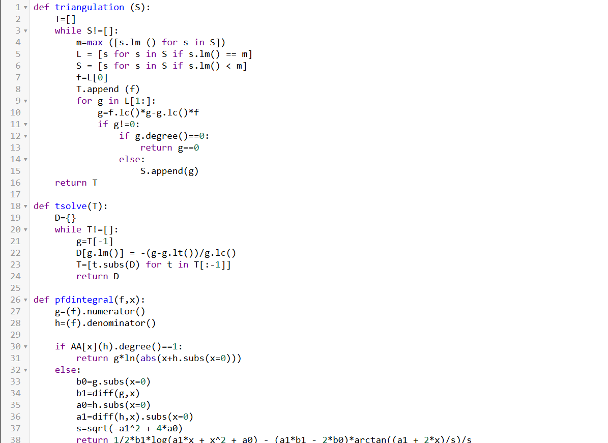{#fig-001 width=70%}

[рис. @fig-002]

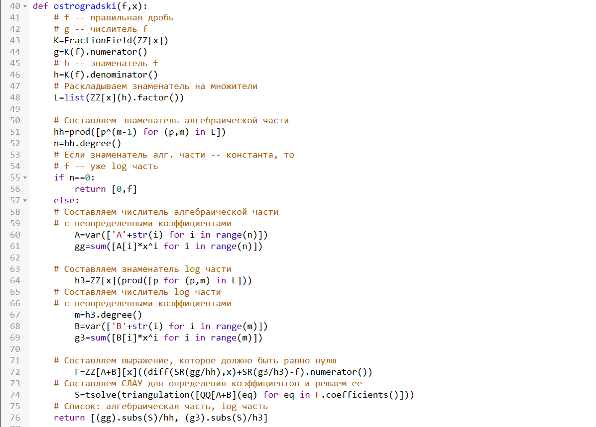{#fig-002 width=70%}

[рис. @fig-003]

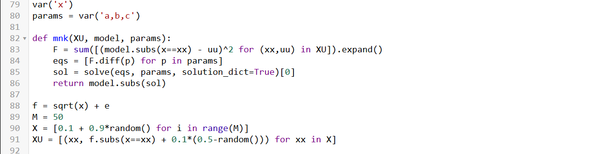{#fig-003 width=70%}

# Буква А

## Решение буквы А:

[рис. @fig-004]

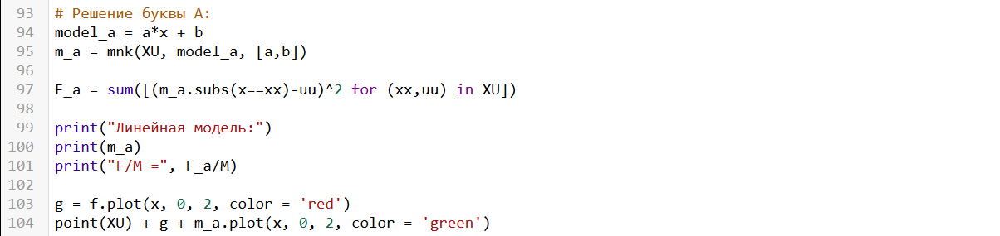{#fig-004 width=70%}

## Вывод буквы А:

[рис. @fig-005]

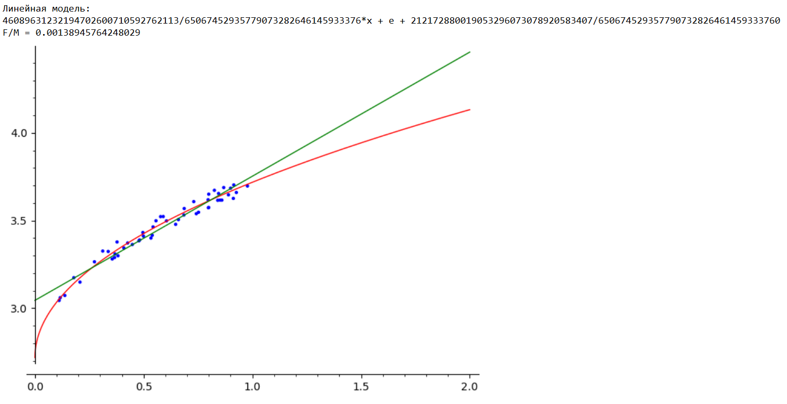{#fig-005 width=70%}

# Буква Б

## Решение буквы Б:

[рис. @fig-006]

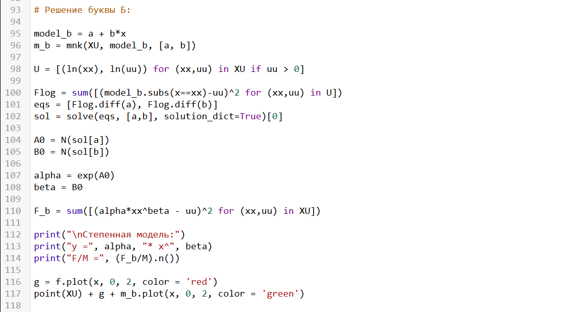{#fig-006 width=70%}

## Вывод буквы Б:

[рис. @fig-007]

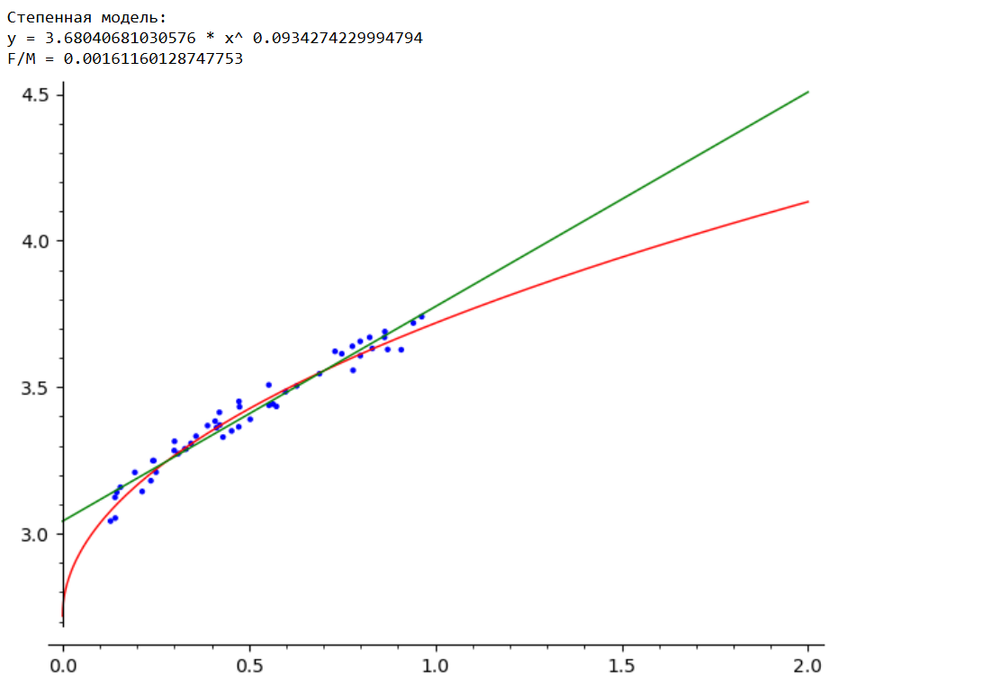{#fig-007 width=70%}

# Буква В

## Решение буквы В:

[рис. @fig-008]

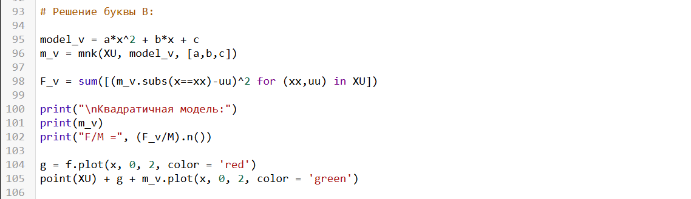{#fig-008 width=70%}

## Вывод буквы В:

[рис. @fig-009]

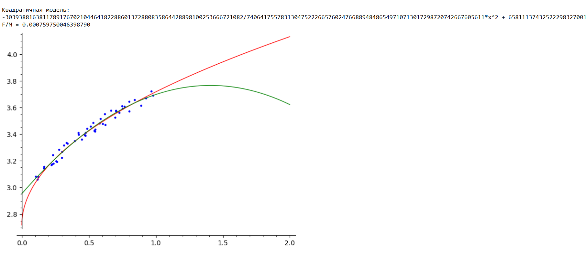{#fig-009 width=70%}

# Смешнявочки для настроения

## Шапочка

[рис. @fig-010]

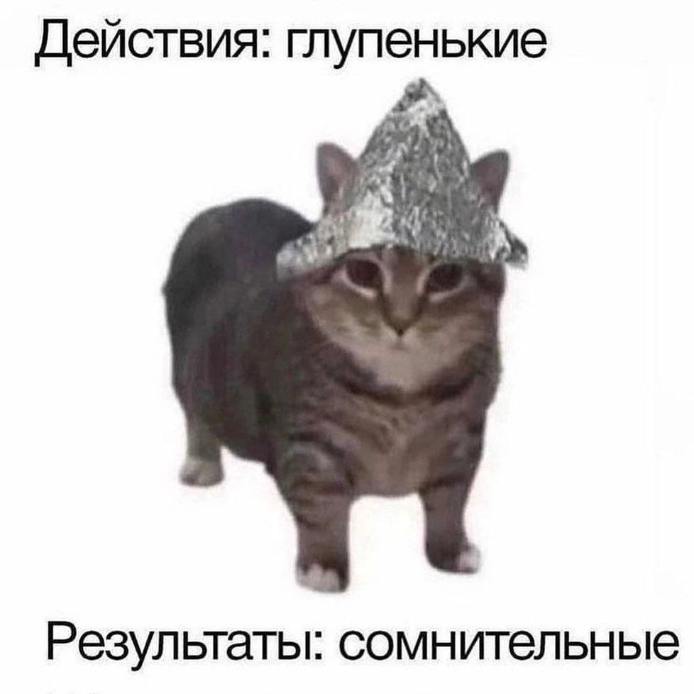{#fig-010 width=70%}

## Урал

[рис. @fig-011]

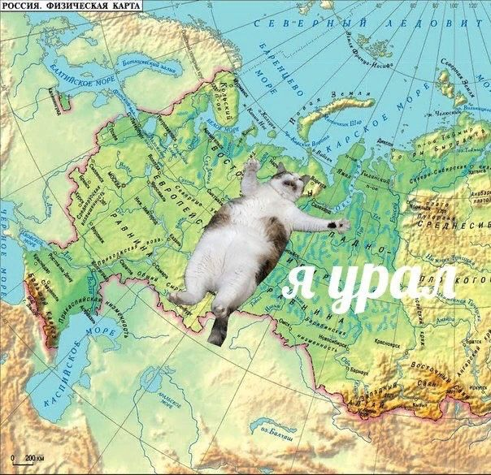{#fig-011 width=70%}

## Для Вас

[рис. @fig-012]

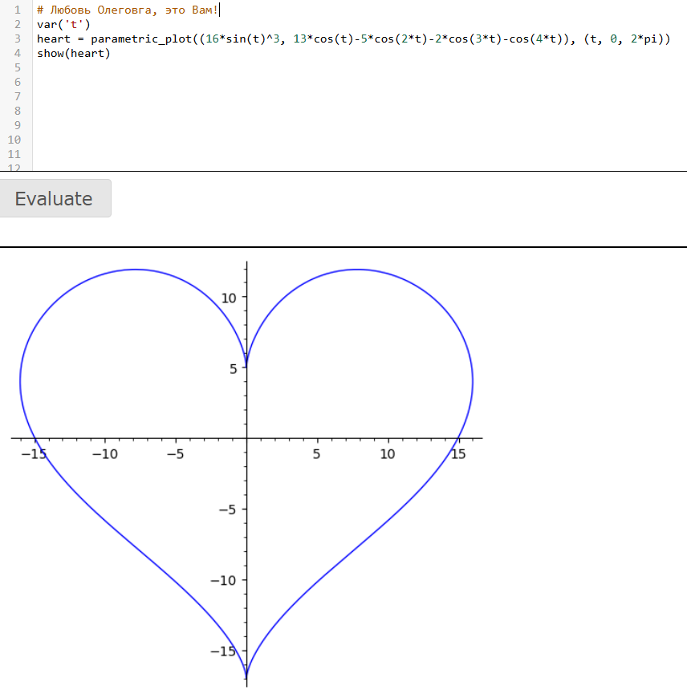{#fig-012 width=70%}

