---
# Front matter
title: "Выполнение внешнего курса stepik 'Введение в Linux'. Раздел №1"
subtitle: "Архитектура компьютеров и операционные системы. Раздел: Операционные системы"
author: "Зевакина Екатерина Романовна"

# Generic options
lang: ru-RU
toc-title: "Содержание"

# Bibliography
bibliography: bib/cite.bib
csl: pandoc/csl/gost-r-7-0-5-2008-numeric.csl

# Pdf output format
toc: true
toc-depth: 2
lof: true
lot: true
fontsize: 12pt
linestretch: 1.5
papersize: a4
documentclass: scrreprt

# I18n polyglossia
polyglossia-lang:
  name: russian
  options:
  - spelling=modern
  - babelshorthands=true
polyglossia-otherlangs:
  name: english

# I18n babel
babel-lang: russian
babel-otherlangs: english

# Fonts
mainfont: IBM Plex Serif
romanfont: IBM Plex Serif
sansfont: IBM Plex Sans
monofont: IBM Plex Mono
mathfont: STIX Two Math
mainfontoptions: Ligatures=Common,Ligatures=TeX,Scale=0.94
romanfontoptions: Ligatures=Common,Ligatures=TeX,Scale=0.94
sansfontoptions: Ligatures=Common,Ligatures=TeX,Scale=MatchLowercase,Scale=0.94
monofontoptions: Scale=MatchLowercase,Scale=0.94,FakeStretch=0.9
mathfontoptions:

# Biblatex
biblatex: true
biblio-style: "gost-numeric"
biblatexoptions:
  - parentracker=true
  - backend=biber
  - hyperref=auto
  - language=auto
  - autolang=other*
  - citestyle=gost-numeric

# Pandoc-crossref LaTeX customization
figureTitle: "Рис."
tableTitle: "Таблица"
listingTitle: "Листинг"
lofTitle: "Список иллюстраций"
lotTitle: "Список таблиц"
lolTitle: "Листинги"

# Misc options
indent: true
header-includes:
  - \usepackage{indentfirst}
  - \usepackage{float}
  - \floatplacement{figure}{H}
---

# Раздел 1.1

## Задание 1 в 1.1

[рис. @fig-001]

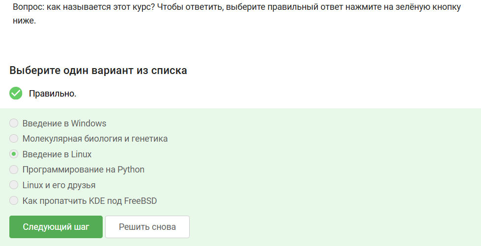{#fig-001 width=70%}

**Пояснения:** Я прочитала название курса и выбрала подходящий ответ.

## Задание 2 в 1.1

[рис. @fig-002]

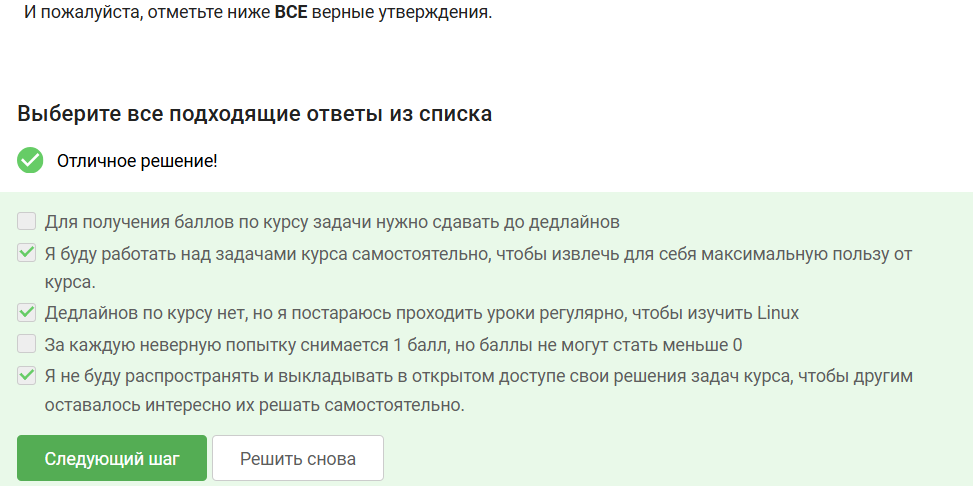{#fig-002 width=70%}

**Пояснения:** Я прочла текст задания и подобрала самые честные и правильные ответы.

# Раздел 1.2

## Задание 1 в 1.2

[рис. @fig-003]

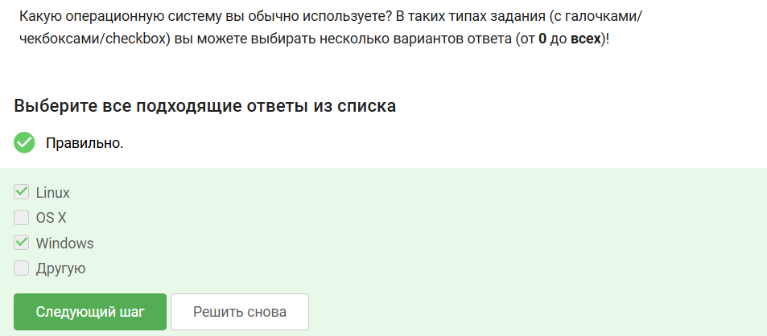{#fig-003 width=70%}

**Пояснения:** Я выбрала те ОС, которые я использую. Windows я использую ежедневно в бытовых вопросах, а на Linux выполняю лабораторные работы и индивидуальный проект для предмета "Архитектура компьютеров" каждую неделю.

## Задание 2 в 1.2

[рис. @fig-004]

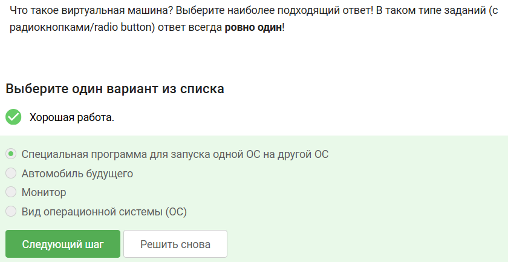{#fig-004 width=70%}

**Пояснения:** Мне приходится работать на виртуальной машине, а потому я имею представление, что это и как это назвать.

## Задание 3 в 1.2

[рис. @fig-005]

{#fig-005 width=70%}

**Пояснения:** У меня получилось запустить Fedora Linux на своей виртуальной машине.

# Раздел 1.3

## Задание 1 в 1.3

**Формулировка задания:** [рис. @fig-006]

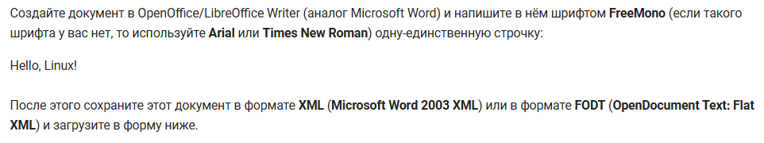{#fig-006 width=70%}

**Выполнение задания:** [рис. @fig-007]

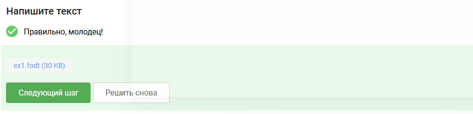{#fig-007 width=70%}

**Пояснения:** Я выполнила то, о чём меня просили, действуя по расписанной инструкции.

## Задание 2 в 1.3

[рис. @fig-008]

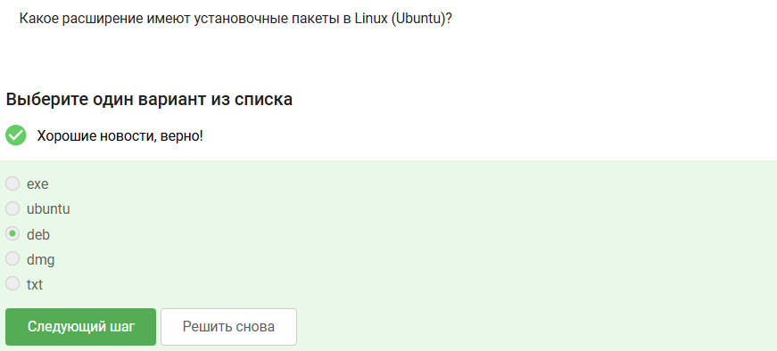{#fig-008 width=70%}

**Пояснения:** Установочные пакеты в Linux (Ubuntu) имеют расширение deb.

## Задание 3 в 1.3

[рис. @fig-009]

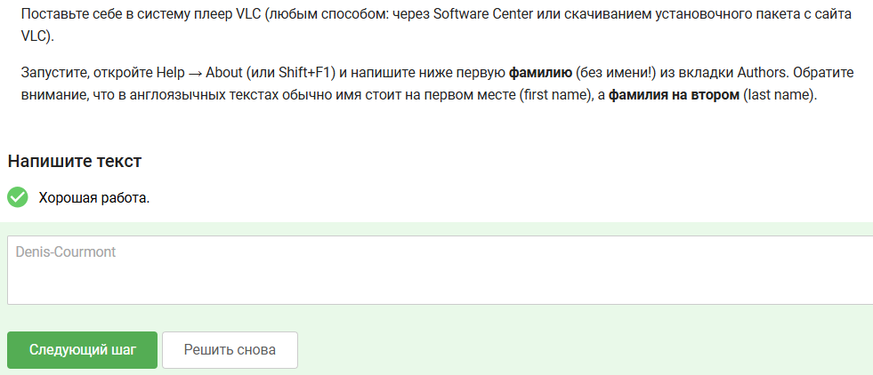{#fig-009 width=70%}

**Пояснения:** Выполнив все описанные действия, я увидела, какую фамилию надо вписать и вписала.

## Задание 4 в 1.3

[рис. @fig-010]

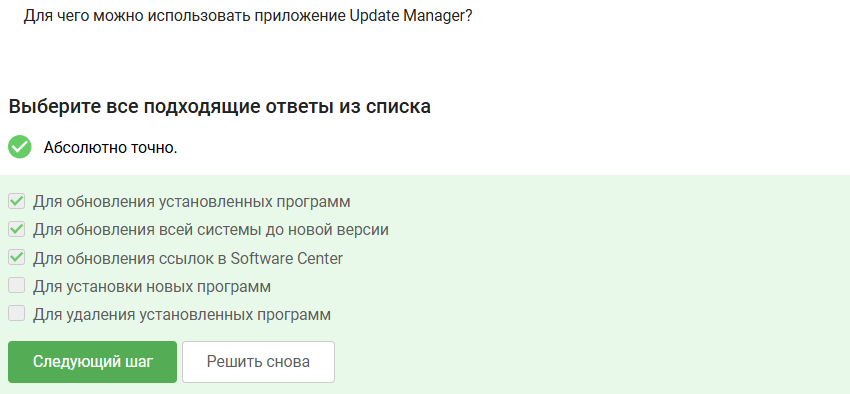{#fig-010 width=70%}

**Пояснения:** Приложение Update Manager не используется для установки новых программ и удаления установленных программ.

# Раздел 1.4

## Задание 1 в 1.4

[рис. @fig-011]

{#fig-011 width=70%}

**Пояснения:** Те́рмин(сущ.) - слово или словосочетание, призванное точно обозначить понятие и его соотношение с другими понятиями в пределах специальной сферы. Ассоль — редкое женское имя. К понятию терминала эти слова не относятся.

## Задание 2 в 1.4

[рис. @fig-012]

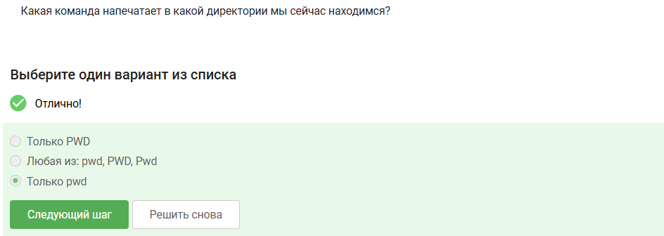{#fig-012 width=70%}

**Пояснения:** терминалу важен регистр, для него pwd и PWD - это разные вещи, где pwd - это встроенная команда, а PWD - неизвестное значение, которое может быть задано пользователем.

## Задание 3 в 1.4

**Формулировка задания:** [рис. @fig-013]

{#fig-013 width=70%}

**Выполнение задания:** [рис. @fig-014]

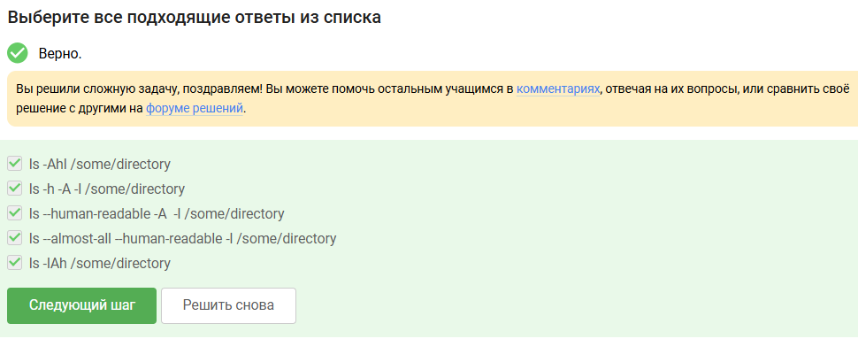{#fig-014 width=70%}

**Пояснения:** При выполнении данного задания я пользовалась следующими правилами:
- НЕВАЖНО, в какой последовательности будут записаны опции.
- ВАЖНО, в каком регистре будут записаны опции.
- ВАЖНО, из каких компонентов состоит команда.
- ВАЖНО наличие компонентов в команде.

## Задание 4 в 1.4

**Формулировка задания:** [рис. @fig-015]

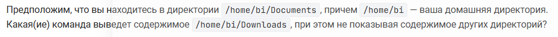{#fig-015 width=70%}

**Выполнение задания:** [рис. @fig-016]

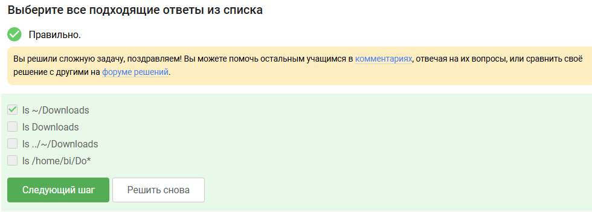{#fig-016 width=70%}

**Пояснения:** ls Downloads - выведет ошибку, т.к. ls требует полный путь к директории. ls ../~/Downloads - .. - поднятие на директорию выше, значит мы окажемся в /home/bi, а в домашней директории не может быть ещё одной домашней директории. ls /home/bi/Do* - нет ~ (указание на домашнюю директорию), ищет все файлы/папки в /home/bi, начинающиеся с Do, а нам нужно только Downloads.

## Задание 5 в 1.4

[рис. @fig-017]

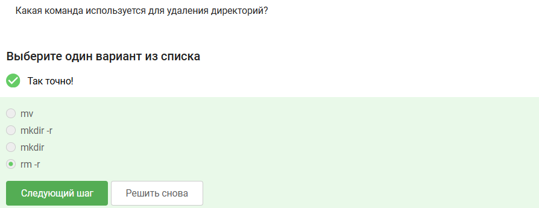{#fig-017 width=70%}

**Пояснения:** mv - команда перемещения файлов между двумя директориями, mkdir -r - несуществующая программа, т.к. у команды mkdir нет ключа -r, mkdir - создает директорию

# Раздел 1.5

## Задание 1 в 1.5

[рис. @fig-018]

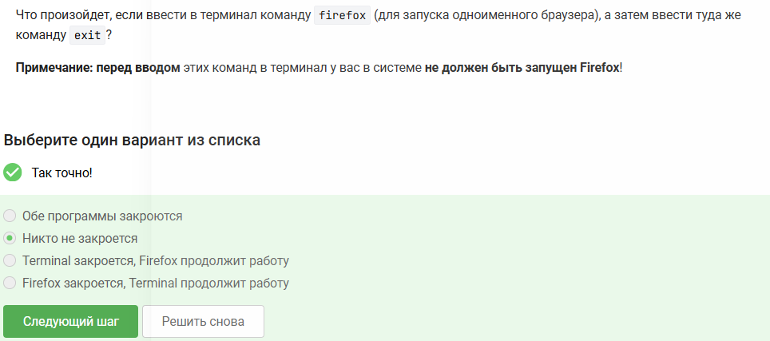{#fig-018 width=70%}

**Пояснения:** Ничего не закроется, потому что Firefox "отцепился" от терминала. Терминал завершает свою работу, а браузер продолжает работать как независимый процесс системы.

## Задание 2 в 1.5

[рис. @fig-019]

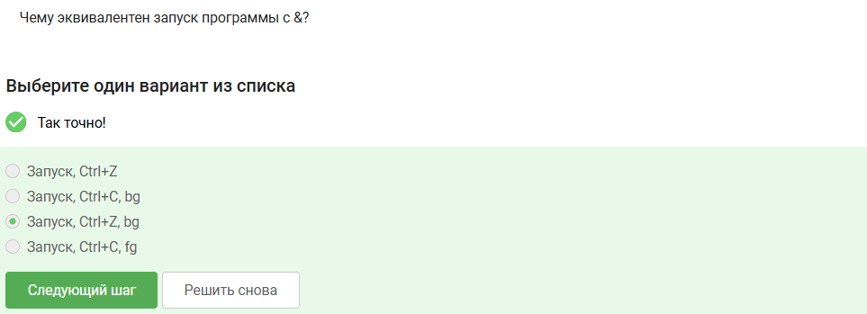{#fig-019 width=70%}

**Пояснения:** Запуск, Ctrl+Z - Программа запущена в foreground режиме; Запуск, Ctrl+C, bg - Процесс завершается; Запуск, Ctrl+C, fg - после Ctrl+C процесс мёртв, fg нечего возобновлять.

## Задание 3 в 1.3

[рис. @fig-020]

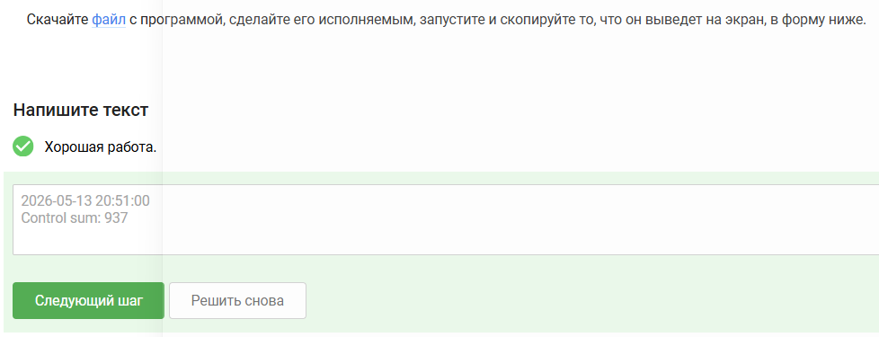{#fig-020 width=70%}

**Пояснения:** Просто выполнила, о чём просили, скопировала и вставила вывод программы.

# Раздел 1.6

## Задание 1 в 1.6

[рис. @fig-021]

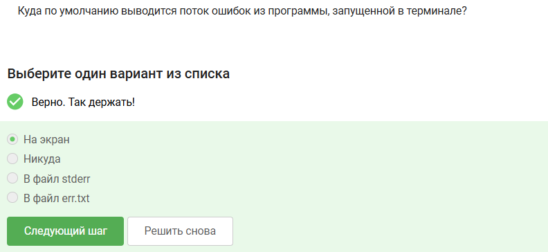{#fig-021 width=70%}

**Пояснения:** По умолчанию и стандартный вывод, и стандартный вывод ошибок направлены в один и тот же терминал. Это сделано, чтобы пользователь сразу видел всю важную информацию о работе программы, включая сообщения об ошибках.

## Задание 2 в 1.6

[рис. @fig-022]

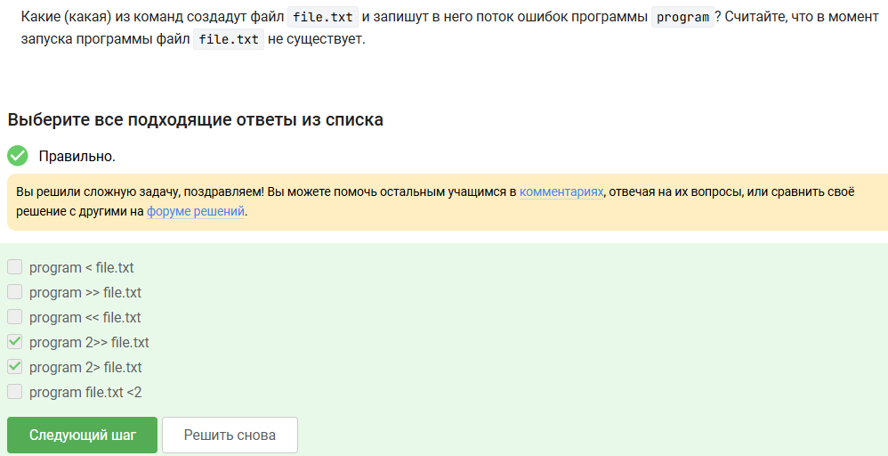{#fig-022 width=70%}

**Пояснения:** program < file.txt - перенаправляет содержимое file.txt как ввод программы. Файл должен существовать, program >> file.txt - перенаправляет stdout в конец file.txt, program << file.txt - синтаксическая ошибка: << используется для "here documents", а не для файлов, файл не создастся, program file.txt <2 - Синтаксическая ошибка. file.txt будет воспринят как аргумент программы, а <2 — неверное перенаправление.

## Задание 3 в 1.6

**Формулировка задания:** [рис. @fig-023]

{#fig-023 width=70%}

**Выполнение задания:** [рис. @fig-024]

{#fig-024 width=70%}

**Пояснения:** По умолчанию сообщения об ошибках не попадают в конвейер, а продолжают выводиться на экран.

# Раздел 1.7

## Задание 1 в 1.7

[рис. @fig-025]

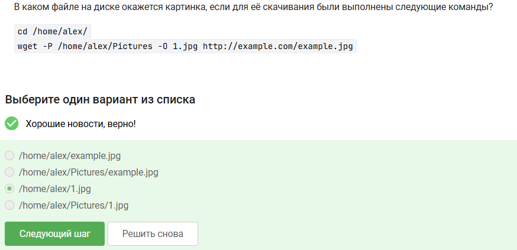{#fig-025 width=70%}

**Пояснения:** Файл сохранится как /home/alex/Pictures/1.jpg, потому что ключ -P задаёт каталог, а -O — имя файла внутри этого каталога, причём команда cd на результат не влияет.

## Задание 2 в 1.7

[рис. @fig-026]

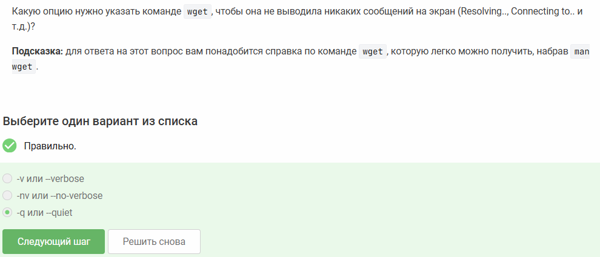{#fig-026 width=70%}

**Пояснения:** В справке программы написано, что для выхода нужно написать :q и нажать enter

## Задание 3 в 1.7

**Формулировка задания:** [рис. @fig-027]

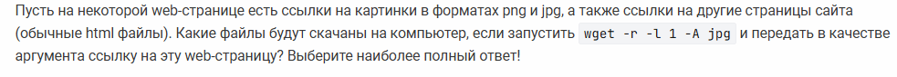{#fig-027 width=70%}

**Выполнение задания:** [рис. @fig-028]

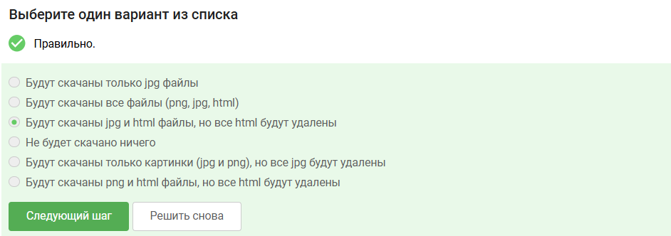{#fig-028 width=70%}

**Пояснения:** Будут скачаны и сохранены только JPG-файлы и исходная HTML-страница, потому что -l 1 ограничивает рекурсию первым уровнем, а другие HTML-файлы, загруженные для анализа ссылок, удаляются фильтром -A jpg, который разрешает сохранять только JPG, при этом исходная страница является исключением и сохраняется всегда.

# Раздел 1.8

## Задание 1 в 1.8

[рис. @fig-029]

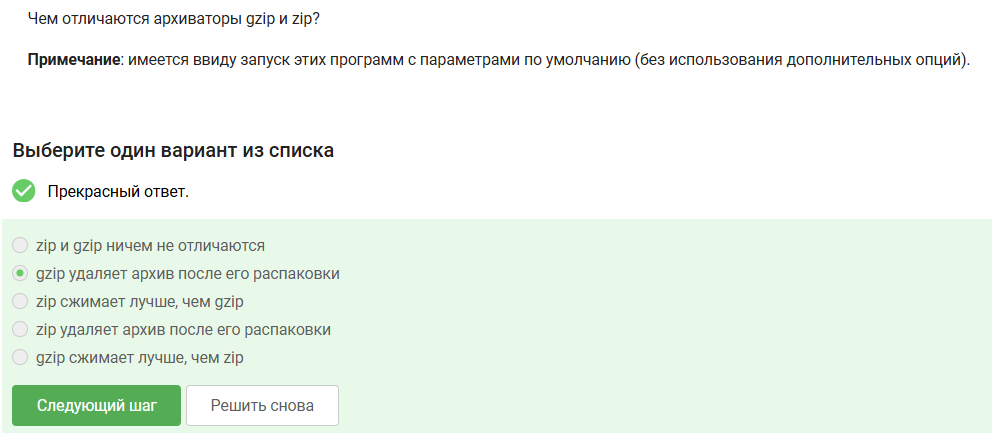{#fig-029 width=70%}

**Пояснения:** gzip сжимает только один файл и не хранит каталоги, в то время как zip является полноценным архиватором, который упаковывает и сжимает множество файлов и папок в один архив.

## Задание 2 в 1.8

[рис. @fig-030]

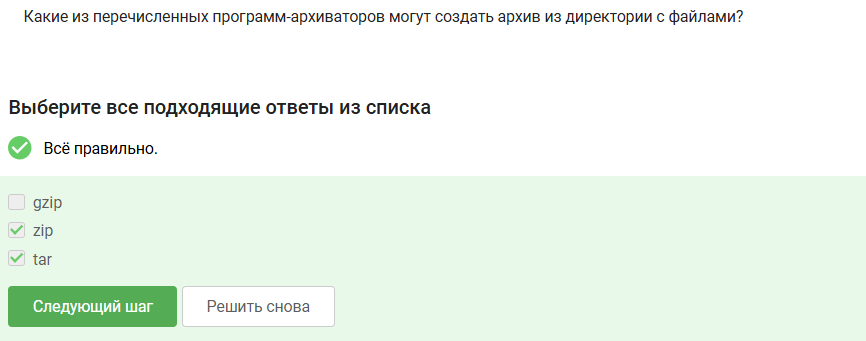{#fig-030 width=70%}

**Пояснения:** zip и tar  могут создать архив из директории с файлами, а gzip по своей конструкции является компрессором потока, а не архиватором файлов.

## Задание 3 в 1.8

[рис. @fig-031]

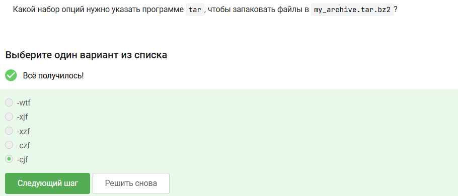{#fig-031 width=70%}

**Пояснения:** -c - создать архив, -j - использовать сжатие bzip2 (вместо gzip), -f - указать имя файла архива.

# Раздел 1.9

## Задание 1 в 1.9

[рис. @fig-032]

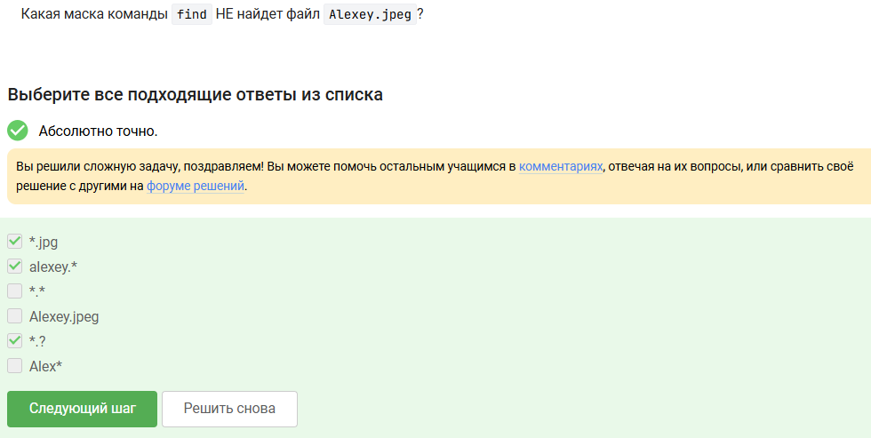{#fig-032 width=70%}

**Пояснения:** 
- *.jpg - не подходит из-за неверного расширения
- alexey.* - не походит из-за регистра первой буквы
- *.? - не подходит, т.к. ? отвечает за один единственный символ, а у нас после точки их четыре.

## Задание 2 в 1.9

[рис. @fig-033]

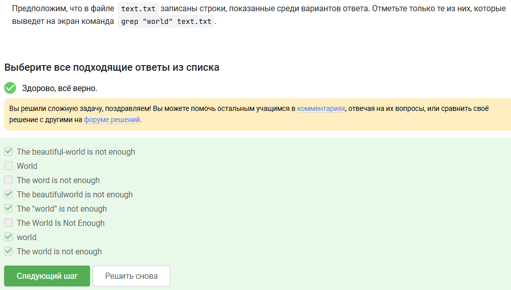{#fig-033 width=70%}

**Пояснения:** grep "world" text.txt будет искать только world в нижнем регистре. 

## Задание 3 в 1.9

[рис. @fig-034]

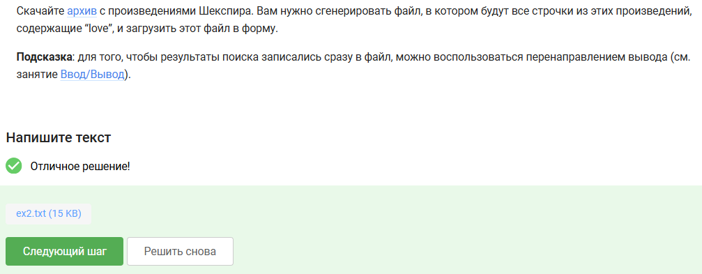{#fig-034 width=70%}

**Пояснения:**
Мой способ решения:
1. Разархивация
       ``` tar -xzvf shakespeare.tar.gz ```
2. Генерация
       ``` grep -Fr "love" Shakespeare/* > ~/Documents/stepik/poisk/rezult.txt ```
