---
# Front matter
title: "Выполнение внешнего курса stepik 'Введение в Linux'. Раздел №2"
subtitle: "Архитектура компьютеров и операционные системы. Раздел: Операционные системы"
author: "Зевакина Екатерина Романовна"

# Generic options
lang: ru-RU
toc-title: "Содержание"

# Bibliography
bibliography: bib/cite.bib
csl: pandoc/csl/gost-r-7-0-5-2008-numeric.csl

# Pdf output format
toc: true
toc-depth: 2
lof: true
lot: true
fontsize: 12pt
linestretch: 1.5
papersize: a4
documentclass: scrreprt

# I18n polyglossia
polyglossia-lang:
  name: russian
  options:
  - spelling=modern
  - babelshorthands=true
polyglossia-otherlangs:
  name: english

# I18n babel
babel-lang: russian
babel-otherlangs: english

# Fonts
mainfont: IBM Plex Serif
romanfont: IBM Plex Serif
sansfont: IBM Plex Sans
monofont: IBM Plex Mono
mathfont: STIX Two Math
mainfontoptions: Ligatures=Common,Ligatures=TeX,Scale=0.94
romanfontoptions: Ligatures=Common,Ligatures=TeX,Scale=0.94
sansfontoptions: Ligatures=Common,Ligatures=TeX,Scale=MatchLowercase,Scale=0.94
monofontoptions: Scale=MatchLowercase,Scale=0.94,FakeStretch=0.9
mathfontoptions:

# Biblatex
biblatex: true
biblio-style: "gost-numeric"
biblatexoptions:
  - parentracker=true
  - backend=biber
  - hyperref=auto
  - language=auto
  - autolang=other*
  - citestyle=gost-numeric

# Pandoc-crossref LaTeX customization
figureTitle: "Рис."
tableTitle: "Таблица"
listingTitle: "Листинг"
lofTitle: "Список иллюстраций"
lotTitle: "Список таблиц"
lolTitle: "Листинги"

# Misc options
indent: true
header-includes:
  - \usepackage{indentfirst}
  - \usepackage{float}
  - \floatplacement{figure}{H}
---

# Раздел 2.1

## Задание 1 в 2.1

[рис. @fig-001]

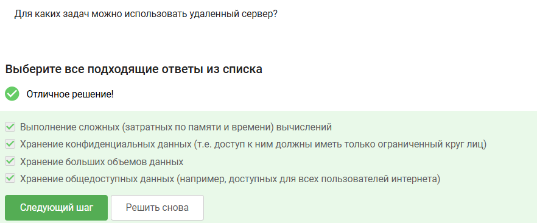{#fig-001 width=70%}

**Пояснения:** Удаленный сервер можно использовать для всех вышеперечисленных задач.

## Задание 2 в 2.1

[рис. @fig-002]

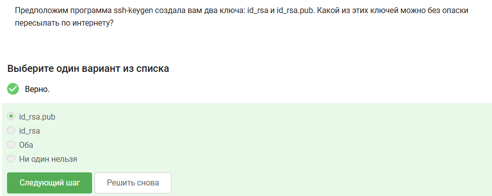{#fig-002 width=70%}

**Пояснения:** id_rsa.pub можно без опаски пересылать по интернету, т.к. этот ключ создается для распространения.

# Раздел 2.2

## Задание 1 в 2.2

[рис. @fig-003]

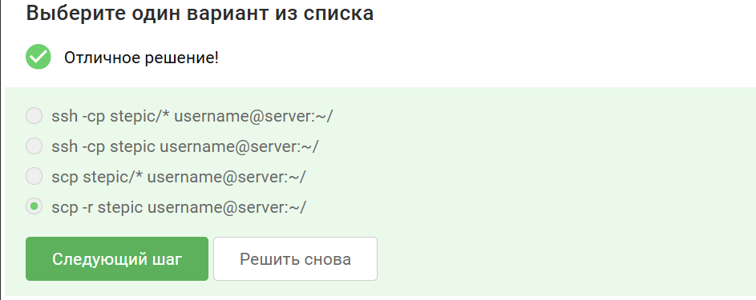{#fig-003 width=70%}

**Пояснения:** scp -r stepic username@server:~/ - рекурсивно копирует локальную папку stepic на удалённый сервер под пользователем username в его домашнюю директорию. Флаг -r обеспечивает копирование всех вложенных поддиректорий и файлов внутри папки stepic

## Задание 2 в 2.2

[рис. @fig-004]

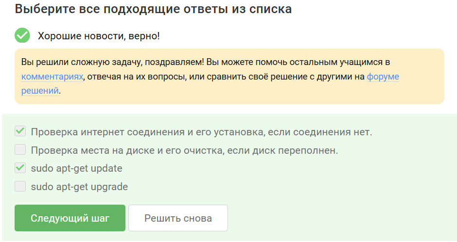{#fig-004 width=70%}

**Пояснения:** Самым верным и первым действием должна быть команда sudo apt-get update, так как она обновляет локальный список доступных пакетов из репозиториев: если этот список устарел, система просто не знает о существовании последних версий программ или изменившихся адресов пакетов. Проверка интернета тоже важна, но именно update напрямую решает типичную причину ошибки «не найден пакет» при работающем соединении.

## Задание 3 в 2.2

[рис. @fig-005]

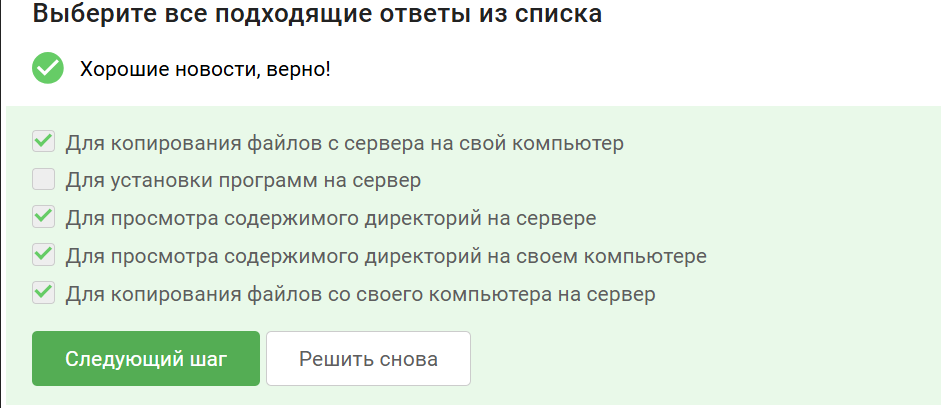{#fig-005 width=70%}

**Пояснения:** FileZilla — это кроссплатформенный FTP-клиент с графическим интерфейсом, предназначенный для передачи файлов по протоколам FTP, FTPS и SFTP.

# Раздел 2.3

## Задание 1 в 2.3

[рис. @fig-006]

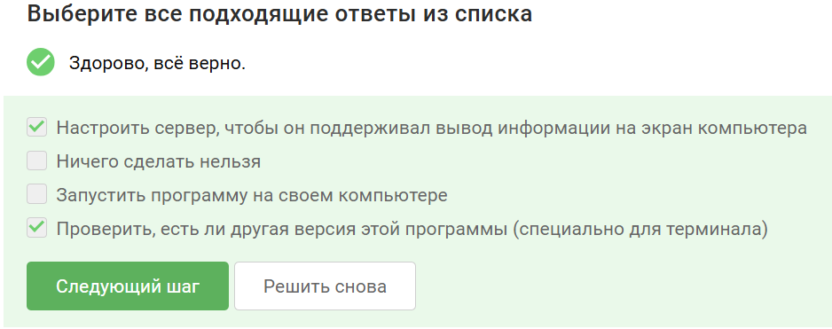{#fig-006 width=70%}

**Пояснения:** Задача подразумевает, что программа должна работать именно на сервере. Если запустить её на своём компьютере, то сервер не будет выполнять нужные функции. Требование «нужен экран» означает, что программе требуется графическая среда, но сама работа должна происходить на сервере. Перенос программы на локальную машину — это отказ от использования сервера, а не решение проблемы.

## Задание 2 в 2.3

[рис. @fig-007]

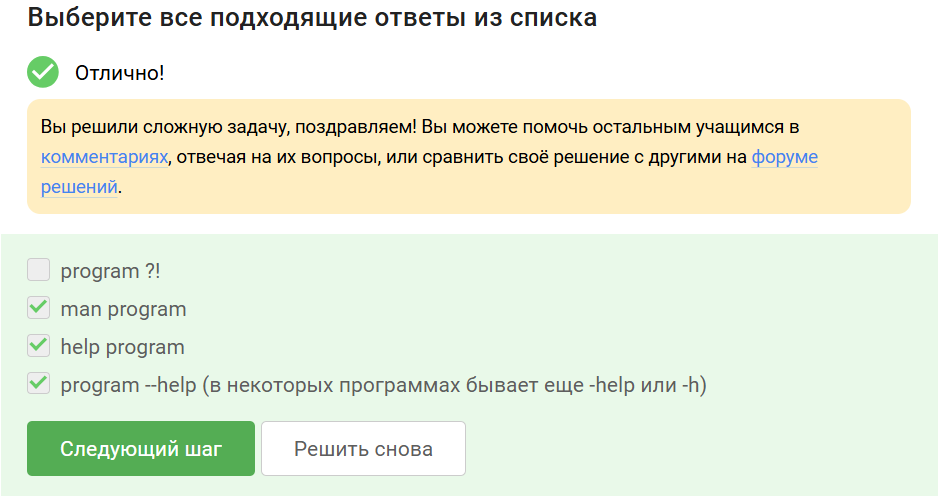{#fig-007 width=70%}

**Пояснения:** program ?! - несуществующий набор команд.

## Задание 3 в 2.3

**Формулировка задания:** [рис. @fig-008]

{#fig-008 width=70%}

**Выполнение задания:** [рис. @fig-009]

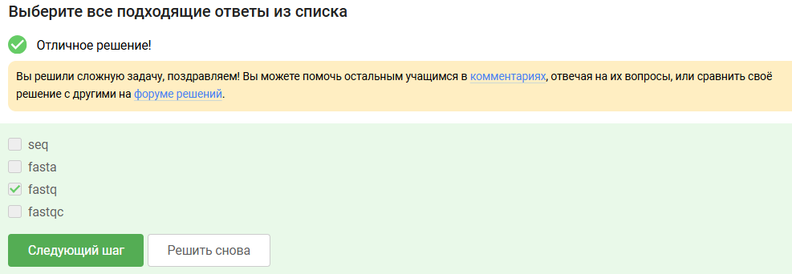{#fig-009 width=70%}

**Пояснения:** Я посмотрела справку по программе FastQC и нашла список форматов данных, которые он может принимать на вход.

## Задание 4 в 2.3

**Формулировка задания:** [рис. @fig-010]

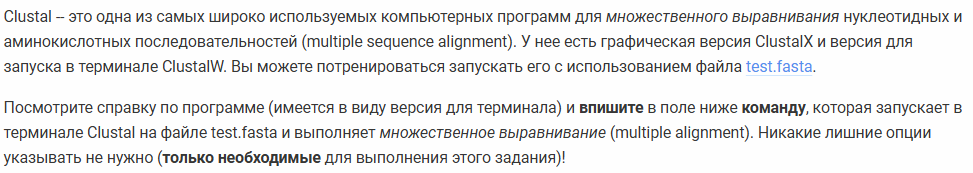{#fig-010 width=70%}

**Выполнение задания:** [рис. @fig-011]

{#fig-011 width=70%}

**Пояснения:** Я посмотрела справку по программе Clustal и нашла информацию о командах, а после использовала те, которые были необходимы для выполнения задания.

# Раздел 2.4

## Задание 1 в 2.4

**Формулировка задания:** [рис. @fig-012]

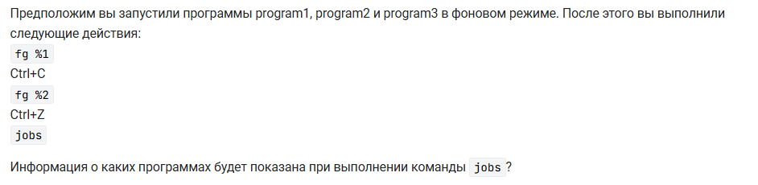{#fig-012 width=70%}

**Выполнение задания:** [рис. @fig-013]

{#fig-013 width=70%}

**Пояснения:** Команда jobs отображает только те задачи, которые либо остановлены (при Ctrl+Z), либо выполняются в фоне. program1 была завершена через Ctrl+C (удалена из списка задач), program2 остановлена Ctrl+Z и ожидает в фоне, program3 продолжает выполняться в фоне.

## Задание 2 в 2.4

[рис. @fig-014]

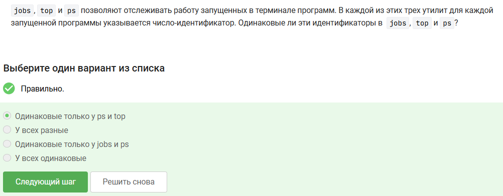{#fig-014 width=70%}

**Пояснения:** PID уникален только в конкретный момент времени, но не в разные моменты или между разными запусками команд.

## Задание 3 в 2.4

[рис. @fig-015]

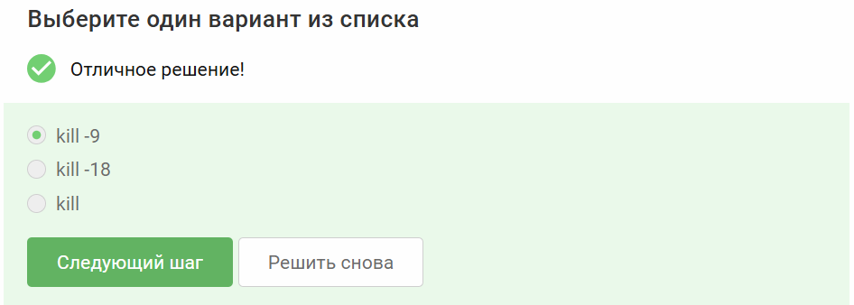{#fig-015 width=70%}

**Пояснения:** kill -18 - продолжает выполнение остановленного процесса. kill - вежливый запрос на завершение: процесс может выполнить очистку и корректно остановиться. Не гарантирует мгновенного прекращения процесса.

## Задание 4 в 2.4

[рис. @fig-016]

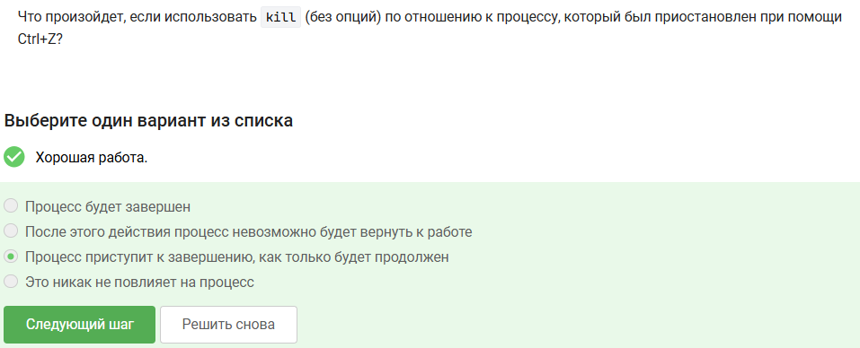{#fig-016 width=70%}

**Пояснения:** Если использовать kill (без опций) по отношению к процессу, который был приостановлен при помощи Ctrl+Z, процесс приступит к завершению, как только будет продолжен.

# Раздел 2.5

## Задание 1 в 2.5

**Формулировка задания:** [рис. @fig-017]

{#fig-017 width=70%}

**Выполнение задания:** [рис. @fig-018]

{#fig-018 width=70%}

**Пояснения:** Выполняя задание, я учитывала, что 100% CPU означает загрузку одного процессора, 200% CPU -- двух процессоров (на многопроцессорных и/или многоядерных компьютерах) и т.д. Например, выполняющееся в 4 потока приложение обычно использует около 400% CPU, однако наш вопрос касается именно момента после остановки такого приложения. По этой логике 0 процессов = 0%

## Задание 2 в 2.5

**Формулировка задания:** [рис. @fig-019]

{#fig-019 width=70%}

**Выполнение задания:** [рис. @fig-020]

{#fig-020 width=70%}

**Пояснения:** Остановленное по Ctrl+Z приложение продолжает занимать в оперативной памяти все те же данные, что и до остановки, поскольку оно не выгружается из ОЗУ, а лишь приостанавливает выполнение своих потоков.

## Задание 3 в 2.5

**Формулировка задания:** [рис. @fig-021]

{#fig-021 width=70%}

**Выполнение задания:** [рис. @fig-022]

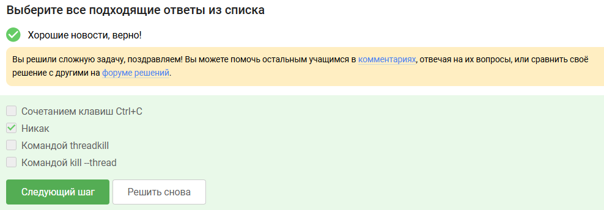{#fig-022 width=70%}

**Пояснения:** Принудительно завершить один поток нельзя, потому что потоки одного процесса разделяют общую память, и остановка одного потока в произвольном месте приведет к утечкам ресурсов и повреждению данных для остальных потоков.

## Задание 4 в 2.5

**Формулировка задания:** [рис. @fig-023]

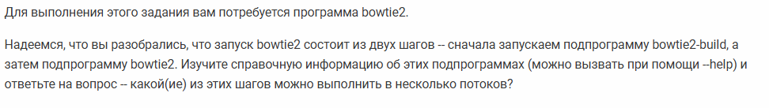{#fig-023 width=70%}

**Выполнение задания:** [рис. @fig-024]

{#fig-024 width=70%}

**Пояснения:** Я изучила справочную информацию об подпрограммах bowtie2 и bowtie2-build и оказалось, что только bowtie2 можно выполнить в несколько потоков.

## Задание 5 в 2.5

**Формулировка задания:** [рис. @fig-025]

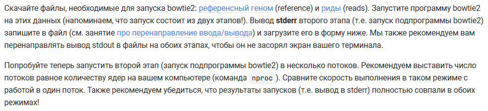{#fig-025 width=70%}

**Выполнение задания:** [рис. @fig-026]

{#fig-026 width=70%}

**Пояснения:** Мой план действий:
1. Скачала архив bowtie2 версия для 64-разрядного Linux из первого слайда
2. Скачала референсный геном и риды с этого слайда.
3. Распаковала архив bowtie2-2.1.0-linux-x86_64.zip с помощью команды unzip.
4. Закинула скаченные файлы reference.fasta и архив reads.fastq.gz в директорию с распакованным bowtie2-2.1.0.
5. Распаковала архив reads.fastq.gz с помощью команды gunzip.
6. Запустила программу ./bowtie2-build с нужным файлом и индексом. Можно запустить без ./, но для этого программу нужно установить с помощью sudo apt install bowtie2.
7. Запустила программу ./bowtie2 с индексом и вторым файлом. Лог записала в один файл, ошибки в другой.
8. Добавила файл с ошибками.

# Раздел 2.6

## Задание 1 в 2.6

[рис. @fig-027]

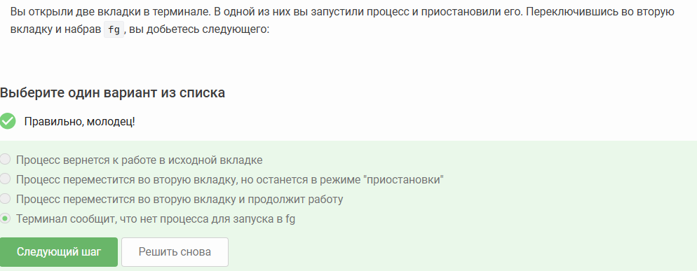{#fig-027 width=70%}

**Пояснения:** Команда fg работает только в рамках той текущей сессии терминала и оболочки (shell), где были запущены фоновые или остановленные процессы, а во второй вкладке - это отдельный экземпляр shell со своим собственным списком заданий (jobs), который ничего не знает о процессах из первой вкладки.

## Задание 2 в 2.6

[рис. @fig-028]

{#fig-028 width=70%}

**Пояснения:** Если ввести в последней открытой вкладкае tmux в командную строку команду exit, то tmux завершит работу.

## Задание 3 в 2.6

[рис. @fig-029]

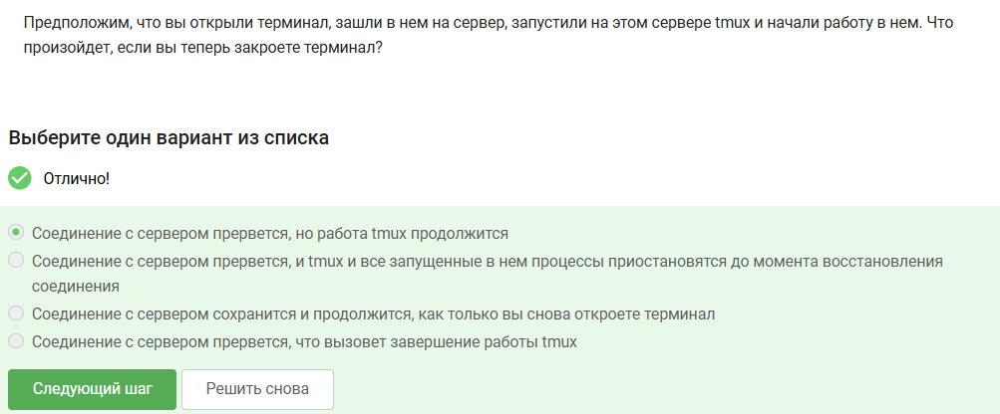{#fig-029 width=70%}

**Пояснения:** Терминал - это лишь точка доступа к сессии tmux, которая продолжает работать независимо на сервере в фоновом режиме, поэтому при обрыве связи (закрытии терминала) завершается только клиентская часть, а сам серверный процесс tmux с вашими программами остаётся невредимым.

## Задание 4 в 2.6

[рис. @fig-030]

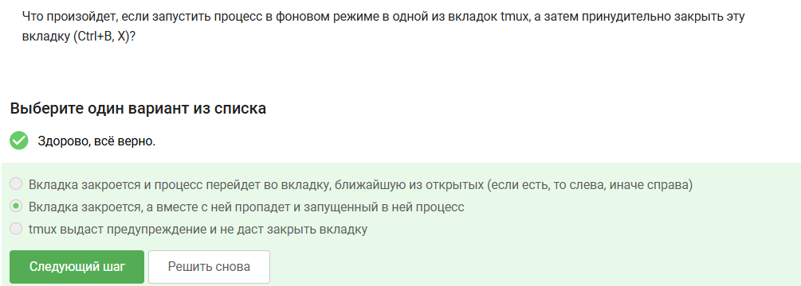{#fig-030 width=70%}

**Пояснения:** Внутри tmux каждая вкладка - это независимая сессия терминала, и при её принудительном закрытии tmux отправляет процессам, запущенным в ней, сигнал SIGHUP (hangup), который по умолчанию завершает эти процессы, поскольку для них больше нет связанного терминального устройства.

## Задание 5 в 2.6

[рис. @fig-031]

{#fig-031 width=70%}

**Пояснения:** Я изучила справку по tmux и выяснила, что Ctrl+B и , (запятая) отвечает за переименование текущей вкладки. 

## Задание 6 в 2.6

[рис. @fig-032]

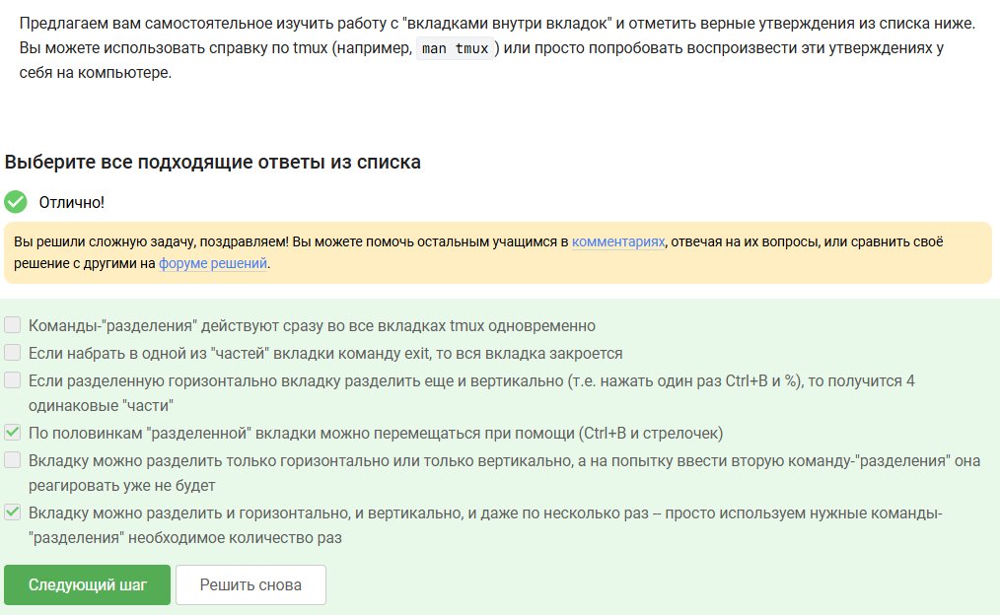{#fig-032 width=70%}

**Пояснения:** Я самостоятельно изучила работу с "вкладками внутри вкладок"(выполняла в одной из Лабораторных работ по Архитектуре компьютеров, разде "Операционные системы") и отметила верные утверждения из списка.

# Раздел 2.7

## Раздел 2.7

Раздел 2.7 состоял только из теории

