---
# Front matter
lang: ru-RU
title: "Выполнение внешнего курса stepik 'Введение в Linux'. Раздел №3"
subtitle: "Архитектура компьютеров и операционные системы. Раздел: Операционные системы"
author:
  - Зевакина Екатерина Романовна
institute:
  - Российский университет дружбы народов, Москва, Россия
date: 16 мая 2026

# i18n babel
babel-lang: russian
babel-otherlangs: english

# Formatting pdf
toc: false
toc-title: Содержание
slide_level: 2
aspectratio: 169
section-titles: true
theme: metropolis
header-includes:
 - \metroset{progressbar=frametitle,sectionpage=progressbar,numbering=fraction}
---

# Раздел 3.1

## Задание 1 в 3.1

[рис. @fig-001]

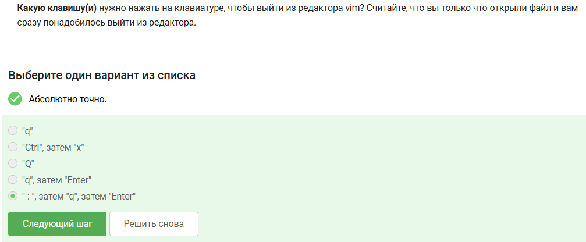{#fig-001 width=70%}

**Пояснения:** Чтобы выйти из редактора vim, необходимо нажать комбтнацию ":", затем "q", затем "Еnter". Это прописано в справочнике по редактору.

## Задание 2 в 3.1

**Формулировка задания:** [рис. @fig-002]

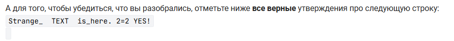{#fig-002 width=70%}

**Выполнение задания:** [рис. @fig-003]

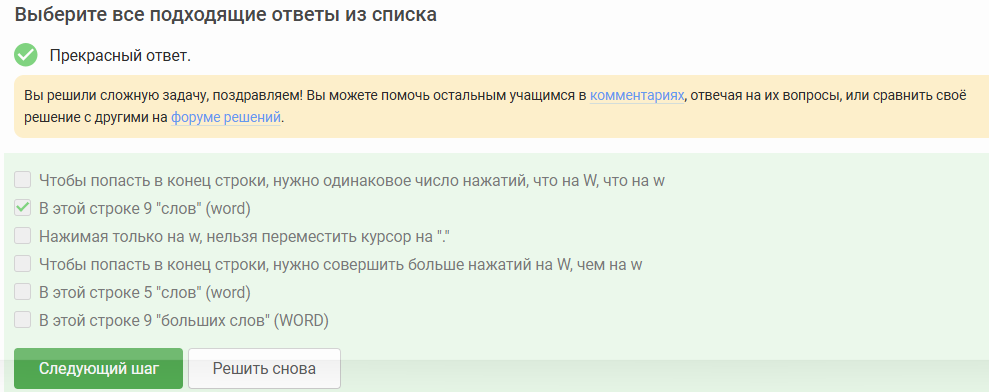{#fig-003 width=70%}

## Пояснения к Задание 2 в 3.1

**Пояснения:** Чтобы выполнить данное задание, я открыла редактор vim, ввела строку: Strange_  TEXT  is_here. 2=2 YES! и на практике проверяла каждое утверждение.

## Задание 3 в 3.1

**Формулировка задания:** [рис. @fig-004]

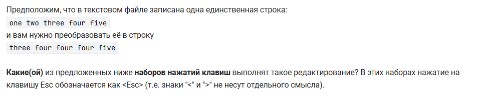{#fig-004 width=70%}

**Выполнение задания:** [рис. @fig-005]

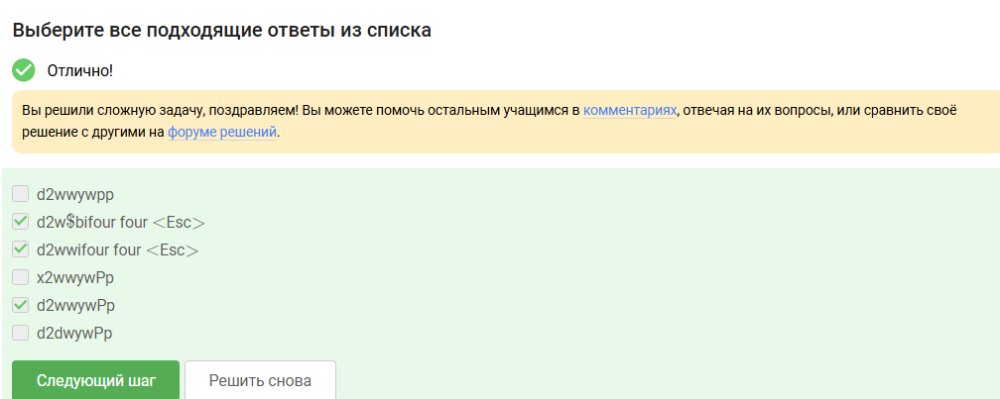{#fig-005 width=70%}

## Пояснения к Задание 3 в 3.1

**Пояснения:** Чтобы выполнить данное задание, я открыла редактор vim, ввела 6 строк: one two three four five и на практике проверяла каждое утверждение.

## Задание 4 в 3.1

[рис. @fig-006]

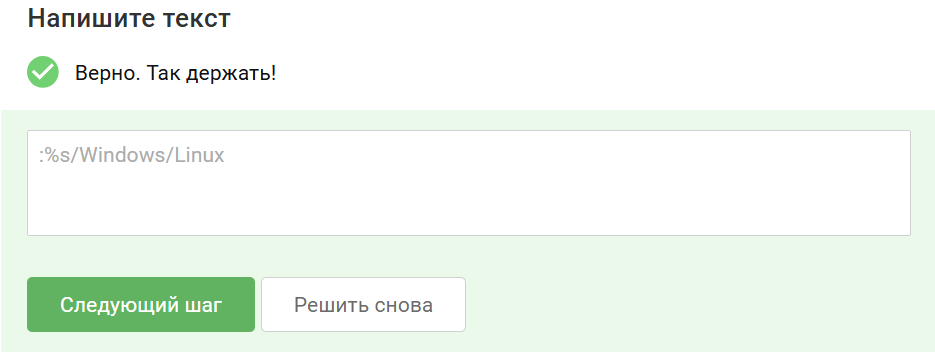{#fig-006 width=70%}

**Пояснения:** :%s/Windows/Linux находит каждую строку, содержащую «Windows», и заменяет в ней только первое вхождение «Windows» на «Linux»

## Задание 5 в 3.1

**Формулировка задания:** [рис. @fig-007]

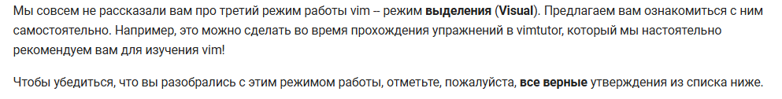{#fig-007 width=70%}

**Выполнение задания:** [рис. @fig-008]

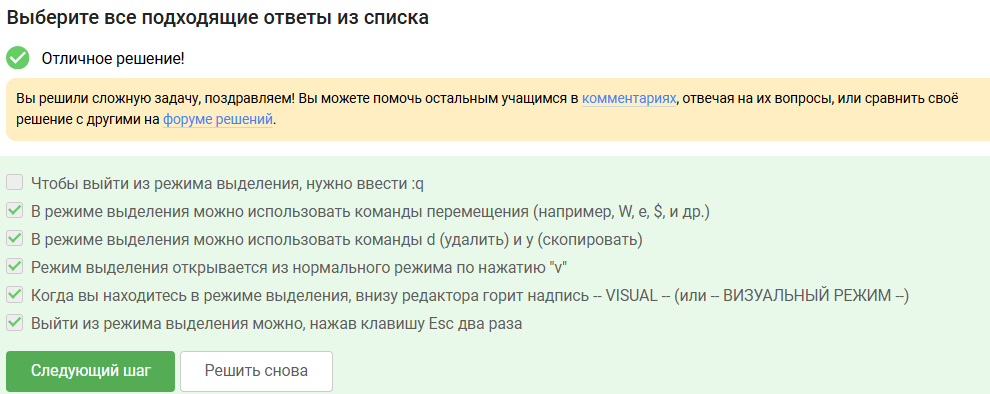{#fig-008 width=70%}

## Пояснения к Задание 5 в 3.1

**Пояснения:** Чтобы выполнить данное задание, я открыла редактор vim, вошла в режим visial и на практике проверяла каждое утверждение.

# Раздел 3.2

## Задание 1 в 3.2

[рис. @fig-009]

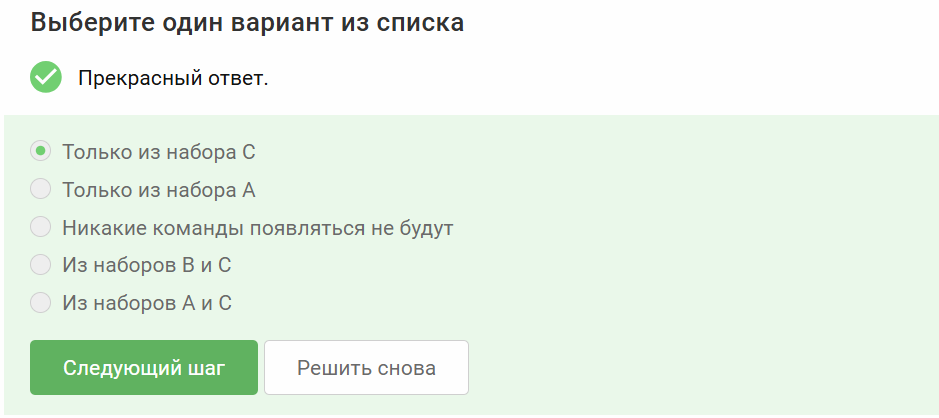{#fig-009 width=70%}

**Пояснения:** Каждая оболочка имеет собственную изолированную историю команд, хранящуюся в памяти процесса.

## Задание 2 в 3.2

**Формулировка задания:** [рис. @fig-010]

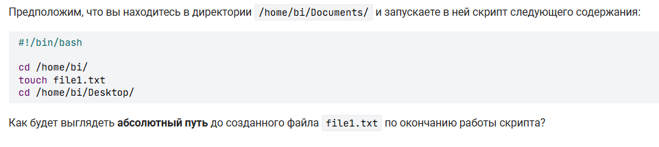{#fig-010 width=70%}

**Выполнение задания:** [рис. @fig-011]

{#fig-011 width=70%}

## Пояснения к Задание 2 в 3.2

**Пояснения:** cd /home/bi/- переходим в папку /home/bi/; touch file1.txt - создаем файл file1.txt; cd /home/bi/Desktop/ - переходим в папку /home/bi/Desktop/, но не перемещаем file1.txt в эту папку. За это отвечает комнада mv.

## Задание 3 в 3.2

**Формулировка задания:** [рис. @fig-012]

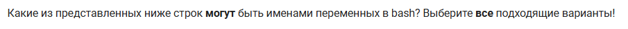{#fig-012 width=70%}

**Выполнение задания:** [рис. @fig-013]

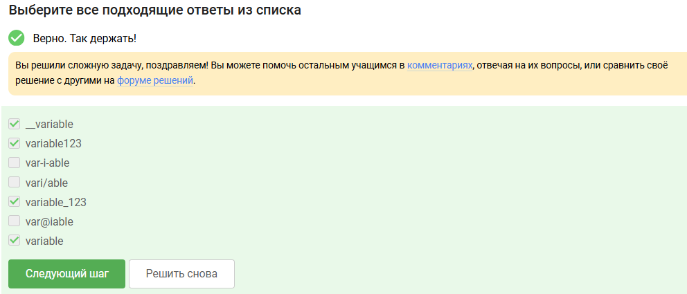{#fig-013 width=70%}

## Пояснения к Задание 3 в 3.2

**Пояснения:** Я следовала правилам, что имя переменной может содержать - цифры, буквы, _  и начинаться с - буквы или _

## Задание 4 в 3.2

**Формулировка задания:** [рис. @fig-014]

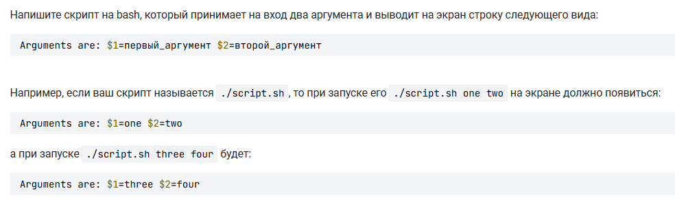{#fig-014 width=70%}

**Выполнение задания:** [рис. @fig-015]

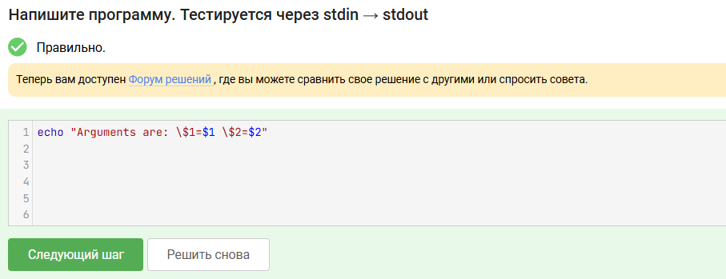{#fig-015 width=70%}

## Пояснения к Задание 4 в 3.2

**Пояснения:** echo "Arguments are: \$1=$1 \$2=$2" выводит строку Arguments are: $1=первый_аргумент $2=второй_аргумент, где экранирование \$1 и \$2 предотвращает подстановку позиционных параметров в самой команде echo, поэтому значения $1 и $2 будут подставлены из аргументов, переданных скрипту (или текущей оболочке), а не самой команде echo.

# Раздел 3.3

## Задание 1 в 3.3

**Формулировка задания:** [рис. @fig-016]

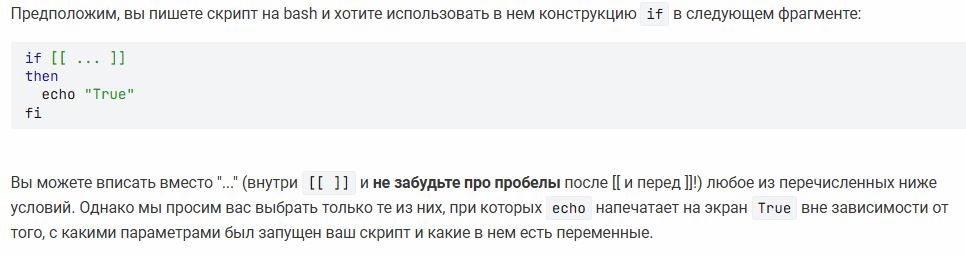{#fig-016 width=70%}

**Выполнение задания:** [рис. @fig-017]

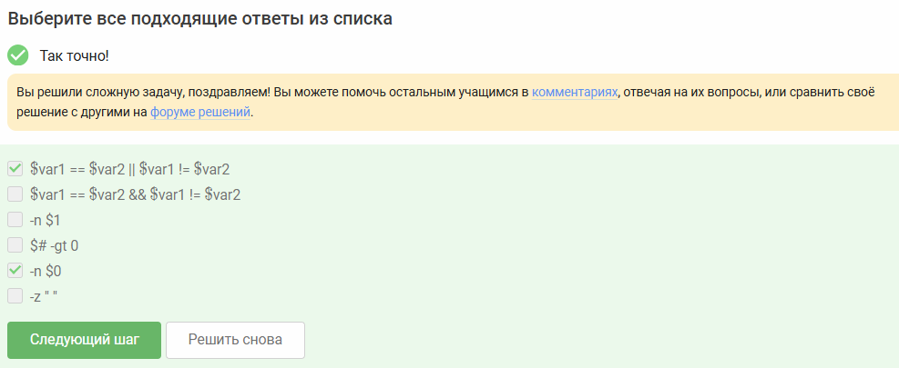{#fig-017 width=70%}

## Пояснения к Задание 1 в 3.3

**Пояснения:** var1 == var2 && var1 != var2 - всегда ложь, т.к. условия друг друга исключающие, # -gt 0 - не всегда истинно, потому что скрипт или функция могут быть вызваны без аргументов, n 1 - ложно, если не передан аргумент, z " " - всегда ложь, т.к. строка не пуста.

## Задание 2 в 3.3

**Формулировка задания:** [рис. @fig-018]

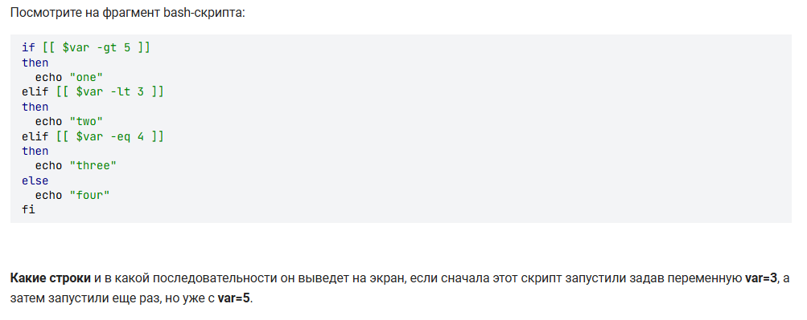{#fig-018 width=70%}

**Выполнение задания:** [рис. @fig-019]

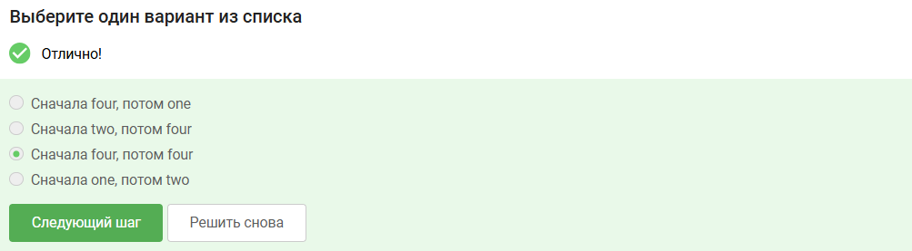{#fig-019 width=70%}

## Пояснения к Задание 2 в 3.3

**Пояснения:** Эту задачу я решила ручной трассировкой.

## Задание 3 в 3.3

**Формулировка задания:** [рис. @fig-020]

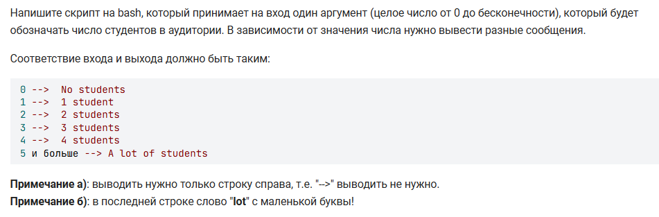{#fig-020 width=70%}

**Выполнение задания:** [рис. @fig-021]

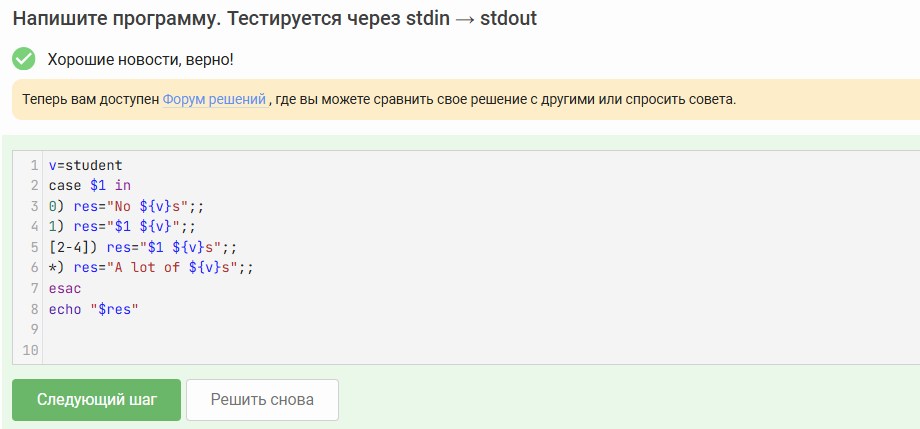{#fig-021 width=70%}

## Пояснения к Задание 3 в 3.3

**Пояснения:** Я написала скрипт на bash, который принимает на вход один аргумент (целое число от 0 до бесконечности), который будет обозначать число студентов в аудитории. В зависимости от значения числа нужно вывести разные сообщения.

## Задание 4 в 3.3

**Формулировка задания:** [рис. @fig-022]

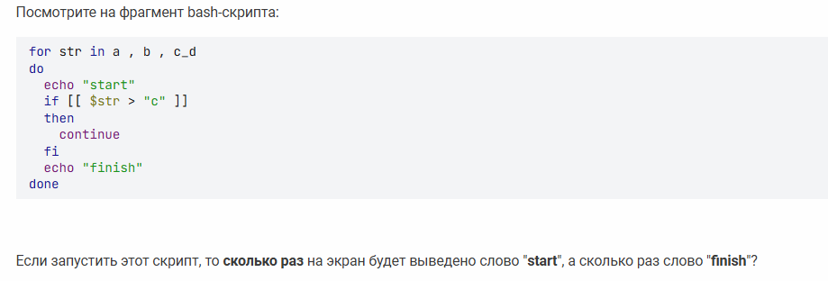{#fig-022 width=70%}

**Выполнение задания:** [рис. @fig-023]

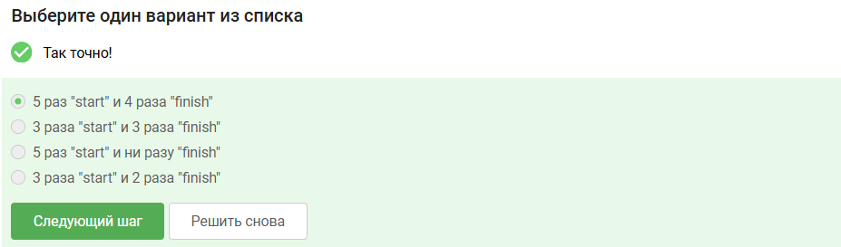{#fig-023 width=70%}

## Пояснения к Задание 4 в 3.3

**Пояснения:** Эту задачу я решила ручной трассировкой.

## Задание 5 в 3.3

**Формулировка задания:** [рис. @fig-024]

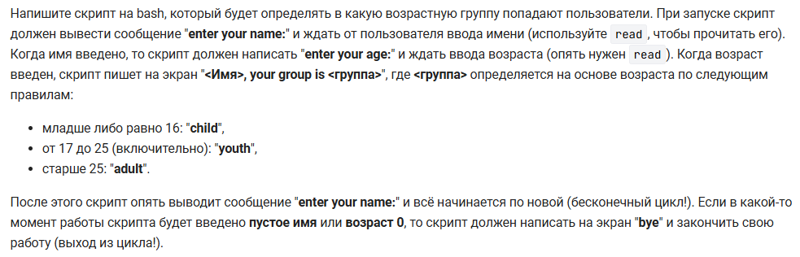{#fig-024 width=70%}

**Выполнение задания:** [рис. @fig-025]

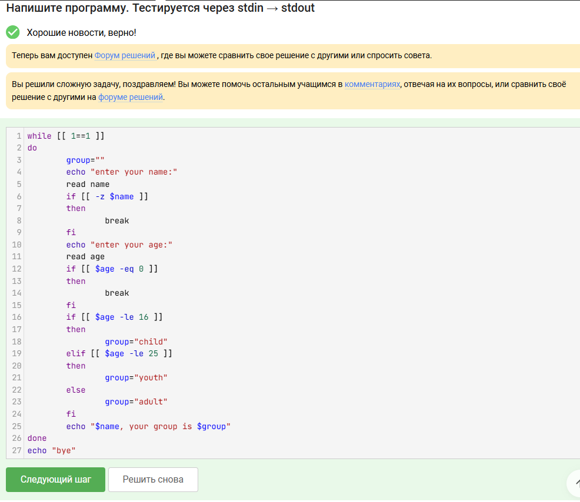{#fig-025 width=70%}

## Пояснения к Задание 5 в 3.3

**Пояснения:** Я написала скрипт на bash, который будет определять в какую возрастную группу попадают пользователи. При запуске скрипт выводит сообщение "enter your name:" и ждать от пользователя ввода имени (используйте read, чтобы прочитать его). Когда имя введено, то скрипт пишет "enter your age:" и ждать ввода возраста (опять нужен read). Когда возраст введен, скрипт пишет на экран "<Имя>, your group is <группа>", где <группа> определяется на основе возраста по следующим правилам.

# Раздел 3.4

## Задание 1 в 3.4

**Формулировка задания:** [рис. @fig-026]

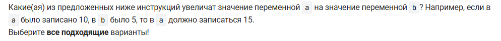{#fig-026 width=70%}

**Выполнение задания:** [рис. @fig-027]

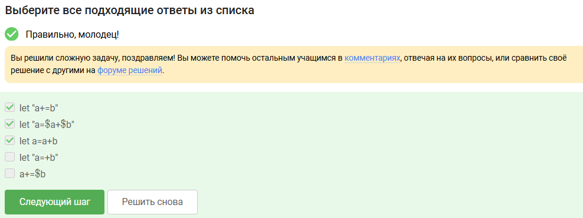{#fig-027 width=70%}

## Пояснения к Задание 1 в 3.4

**Пояснения:** let "a=+b" не увеличит a на b, а просто присвоит a значение b; a+=$d оператор += для целочисленных переменных работает как конкатенация строк, а не как сложение.

## Задание 2 в 3.4

**Формулировка задания:** [рис. @fig-028]

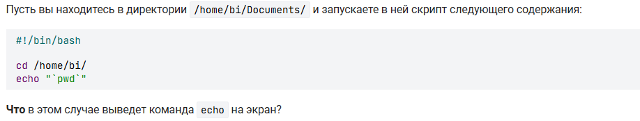{#fig-028 width=70%}

**Выполнение задания:** [рис. @fig-029]

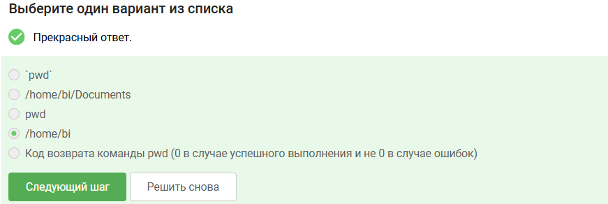{#fig-029 width=70%}

## Пояснения к Задание 2 в 3.4

**Пояснения:** Строка `pwd` (в обратных кавычках) выполняет подстановку команды: сначала запускается команда pwd.

## Задание 3 в 3.4

**Формулировка задания:** [рис. @fig-030]

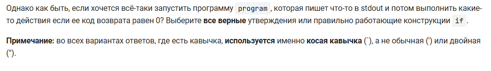{#fig-030 width=70%}

**Выполнение задания:** [рис. @fig-031]

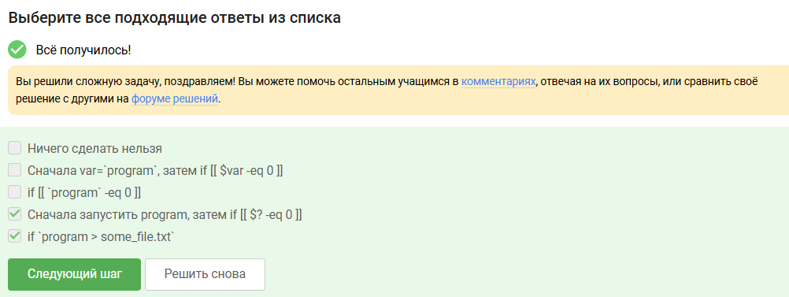{#fig-031 width=70%}

## Пояснения к Задание 3 в 3.4

**Пояснения:** if [[ \program` -eq 0 ]]— подстановка вывода программы, и еслиprogramвыводит не число0`, условие ложно или выдает ошибку; if \program > some_file.txt`— перенаправление вывода в файл, но проверяется код возврата>(который всегда 0) или самой командыprogram, но синтаксис некорректен для проверки черезif` с подстановкой.

## Задание 4 в 3.4

**Формулировка задания:** [рис. @fig-032]

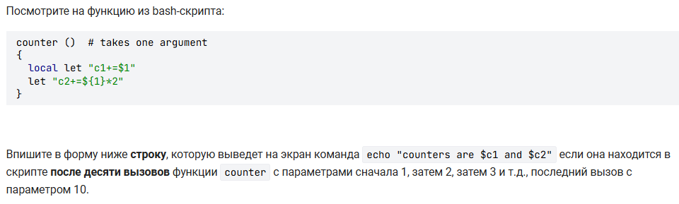{#fig-032 width=70%}

**Выполнение задания:** [рис. @fig-033]

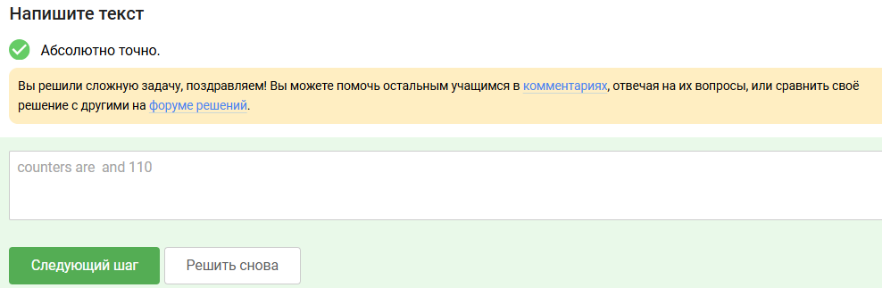{#fig-033 width=70%}

## Пояснения к Задание 4 в 3.4

**Пояснения:** Функция counter увеличивает глобальную (или локальную, если они объявлены выше) переменную c1 на значение переданного аргумента $1, а переменную c2 — на удвоенное значение этого аргумента

## Задание 5 в 3.4

**Формулировка задания:** [рис. @fig-034]

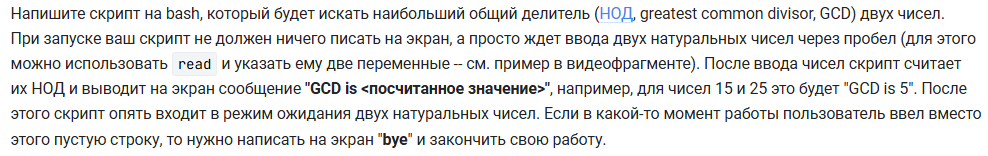{#fig-034 width=70%}

**Выполнение задания:** [рис. @fig-035]

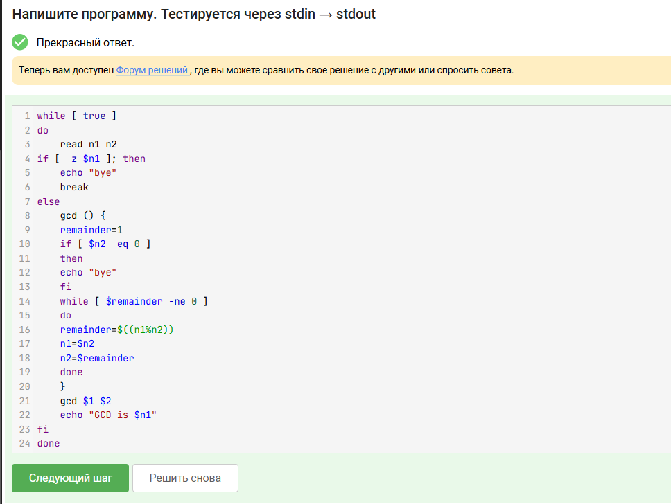{#fig-035 width=70%}

## Пояснения к Задание 5 в 3.4

**Пояснения:** Я написала скрипт на bash, который будет искать наибольший общий делитель двух чисел. При запуске скрипт ничего не пишет на экран, а просто ждет ввода двух натуральных чисел через пробел. После ввода чисел скрипт считает их НОД и выводит на экран сообщение "GCD is <посчитанное значение>".

## Задание 6 в 3.4

**Формулировка задания:** [рис. @fig-036]

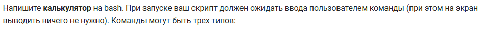{#fig-036 width=70%}

**Выполнение задания:** [рис. @fig-037]

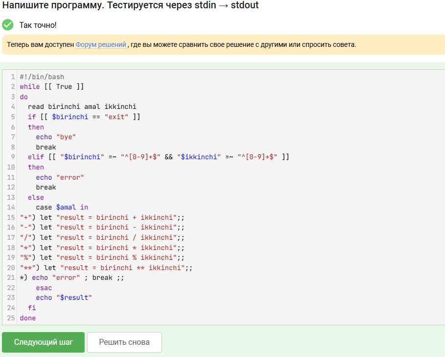{#fig-037 width=70%}

## Пояснения к Задание 6 в 3.4

**Пояснения:** Я написала программу калькулятор на bash.

# Раздел 3.5

## Задание 1 в 3.5

[рис. @fig-038]

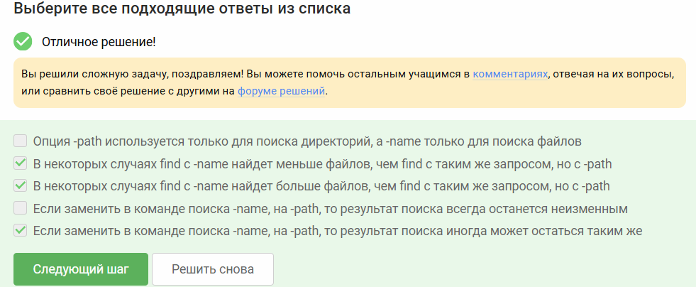{#fig-038 width=70%}

**Пояснения:** star_trek_OST.mp3 - будет найден "star*"; Eddard_Stark_biography.txt - не подходит из-за регистра; stardust.mpeg - будет найден "star*".

## Задание 2 в 3.5

[рис. @fig-039]

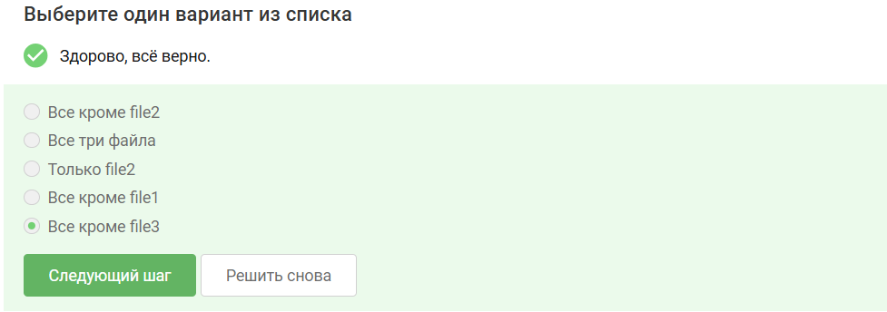{#fig-039 width=70%}

## Пояснения к Задание 2 в 3.5

**Пояснения:** Опция -path используется только для поиска директорий, а -name только для поиска файлов. - неверно, -path используется для сопоставления полного пути (включая имя файла или директории), а не только директорий; Если заменить в команде поиска -name, на -path, то результат поиска всегда останется неизменным - неверно, -name применяется только к последнему компоненту имени (имени файла или директории), а -path — ко всему пути, поэтому замена -name на -path изменит критерий поиска и почти всегда даст другой результат.

## Задание 3 в 3.5

**Формулировка задания:** [рис. @fig-040]

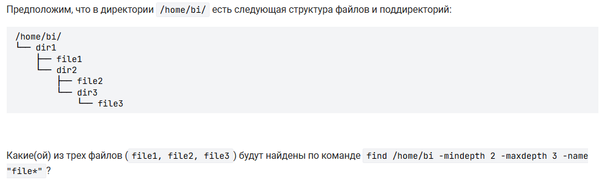{#fig-040 width=70%}

**Выполнение задания:** [рис. @fig-041]

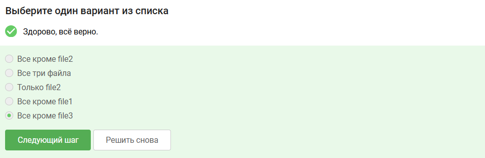{#fig-041 width=70%}

## Пояснения к Задание 3 в 3.5

**Пояснения:** по команде find /home/bi -mindepth 2 -maxdepth 3 -name "file*" будет найден file3.

## Задание 4 в 3.5

**Формулировка задания:** [рис. @fig-042]

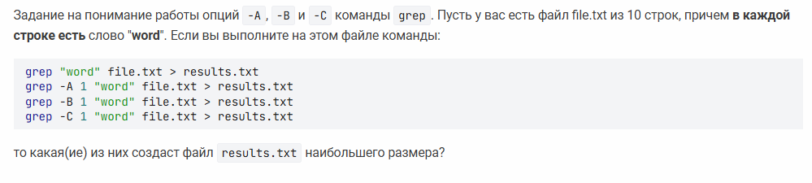{#fig-042 width=70%}

**Выполнение задания:** [рис. @fig-043]

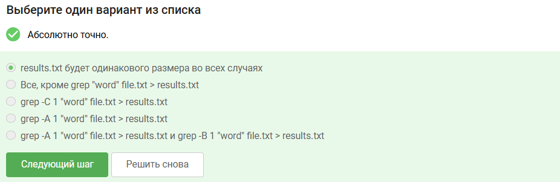{#fig-043 width=70%}

## Пояснения к Задание 4 в 3.5

**Пояснения:** results.txt будет одинакового размера во всех четырёх случаях, только если в файле file.txt каждая строка, содержащая word, не имеет соседних строк (ни сверху, ни снизу), либо если файл состоит ровно из одной строки с word и эта строка является одновременно первой, последней и единственной.

## Задание 5 в 3.5

[рис. @fig-044]

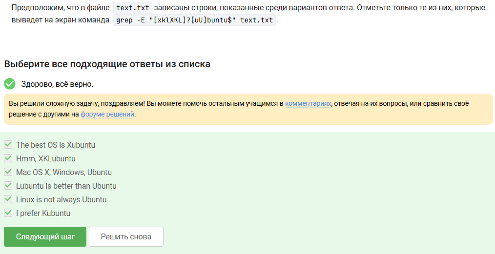{#fig-044 width=70%}

**Пояснения:** Все вышеперечисленные строки подходят под маску [xklXKL]?[uU]buntu$.

## Задание 6 в 3.5

[рис. @fig-045]

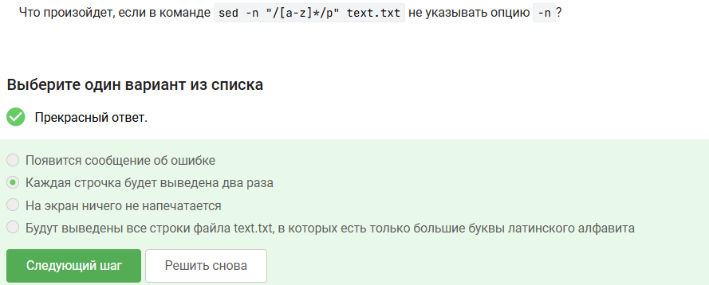{#fig-045 width=70%}

**Пояснения:** Каждая строчка будет выведена два раза, если в команде sed -n "/[a-z]*/p" text.txt не указывать опцию -n.

## Задание 7 в 3.5

**Формулировка задания:** [рис. @fig-046]

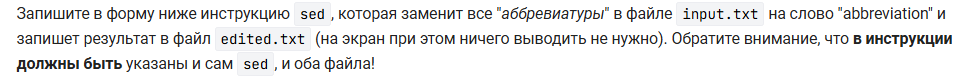{#fig-046 width=70%}

**Выполнение задания:** [рис. @fig-047]

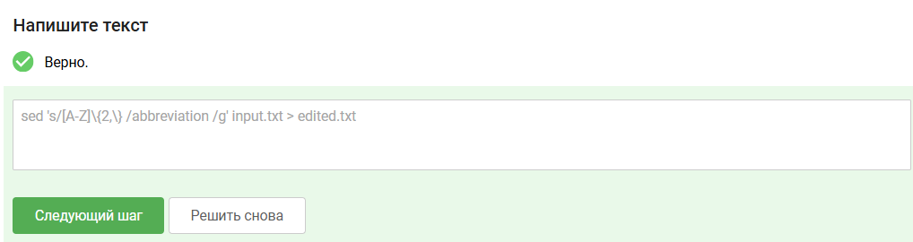{#fig-047 width=70%}

## Пояснения к Задание 7 в 3.5

**Пояснения:** sed 's/[A-Z]\{2,\} /abbreviation /g' input.txt > edited.txt заменит все "аббревиатуры" в файле input.txt на слово "abbreviation" и запишет результат в файл edited.txt.

# Раздел 3.6

## Задание 1 в 3.6

[рис. @fig-048]

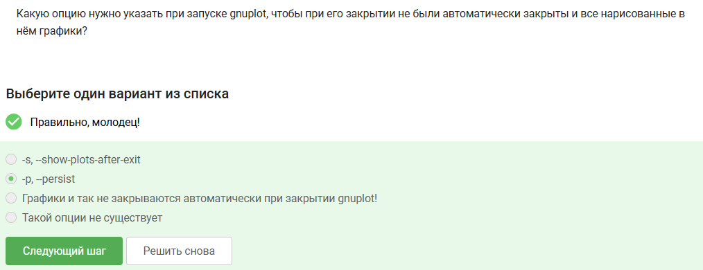{#fig-048 width=70%}

**Пояснения:** Флаг -p или --persist означает «сохранить изменения после перезагрузки» или «не завершать процесс после отключения».

## Задание 2 в 3.6

**Формулировка задания:** [рис. @fig-049]

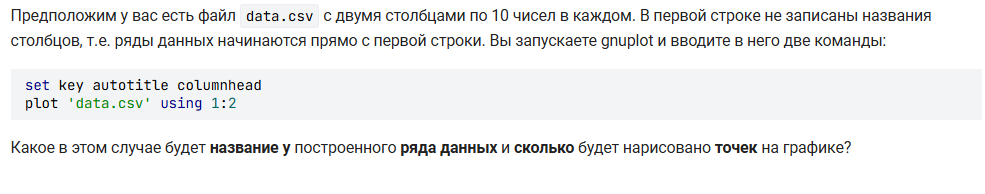{#fig-049 width=70%}

**Выполнение задания:** [рис. @fig-050]

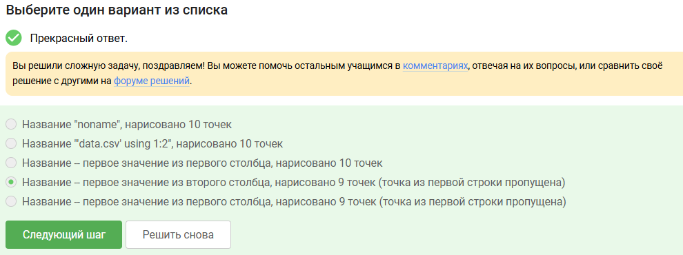{#fig-051 width=70%}

## Пояснения к Задание 2 в 3.6

**Пояснения:** Количество точек на графике: будет 9 точек, так как первая строка каждого столбца использована под заголовок, а остальные 9 строк (со 2-й по 10-ю) — как числовые данные.

## Задание 3 в 3.6

**Формулировка задания:** [рис. @fig-052]

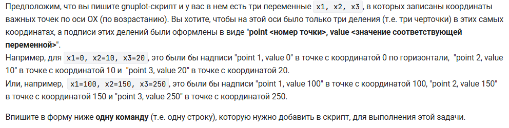{#fig-052 width=70%}

**Выполнение задания:** [рис. @fig-053]

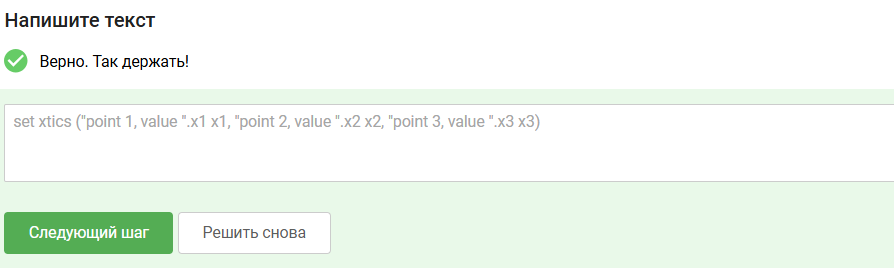{#fig-053 width=70%}

## Пояснения к Задание 3 в 3.6

**Пояснения:** set xtics ("point 1, value ".x1 x1, "point 2, value ".x2 x2, "point 3, value ".x3 x3) задаёт пользовательские метки (подписи) на оси X в позициях с координатами x1, x2, x3.

## Задание 4 в 3.6

**Формулировка задания:** [рис. @fig-054]

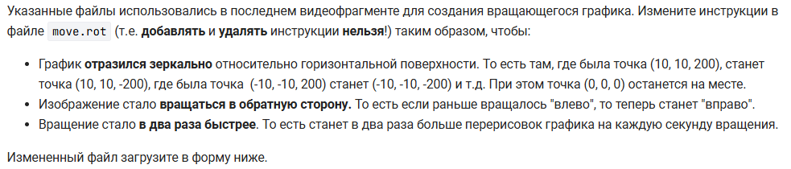{#fig-054 width=70%}

**Выполнение задания:** [рис. @fig-055]

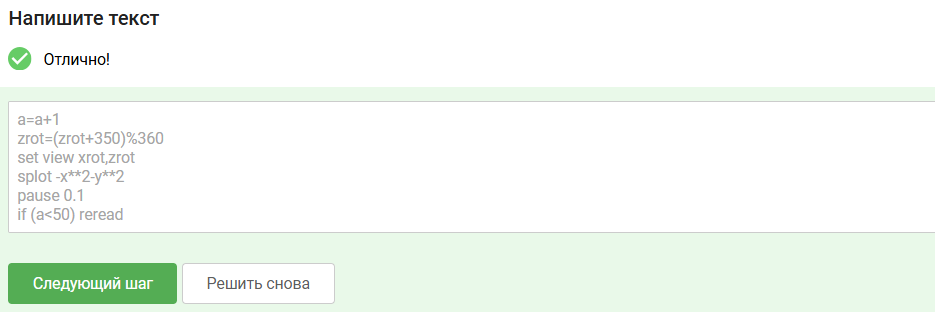{#fig-055 width=70%}

## Пояснения к Задание 4 в 3.6

**Пояснения:** Я изменила инструкции в файле move.rot, чтобы они подходили под условия задачи.

# Раздел 3.7

## Задание 1 в 3.7

[рис. @fig-056]

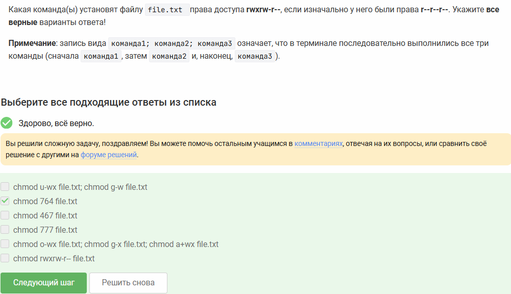{#fig-056 width=70%}

## Пояснения к Задание 1 в 3.7

**Пояснения:** chmod u-wx file.txt - снимает у владельца права на запись и выполнение, у группы право на запись; chmod 467 file.txt, chmod 777 file.txt - не подходят под условие задачи, chmod o-wx file.txt; chmod g-x file.txt; chmod a+wx file.txt -  у других снимаются права на запись и выполнение, у группы снимается право на выполнение, Всем добавляются права на запись и выполнение, chmod rwxrw-r-- file.txt - неправильный синтаксис.

## Задание 2 в 3.7

**Формулировка задания:** [рис. @fig-057]

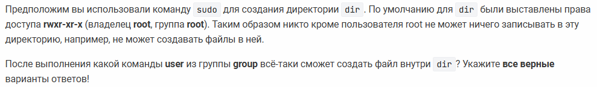{#fig-057 width=70%}

**Выполнение задания:** [рис. @fig-058]

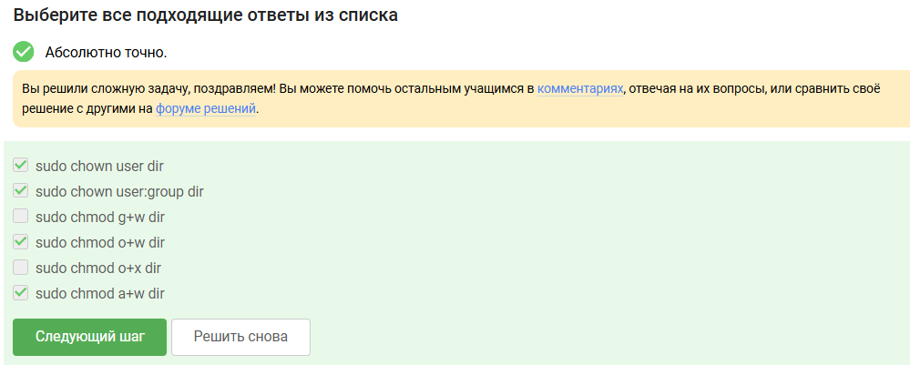{#fig-058 width=70%}

## Пояснения к Задание 2 в 3.7

**Пояснения:** sudo chmod g+w dir добавляет группе право на запись в директорию dir; sudo chmod o+x dir добавляет остальным пользователям право на выполнение для dir.

## Задание 3 в 3.7

[рис. @fig-059]

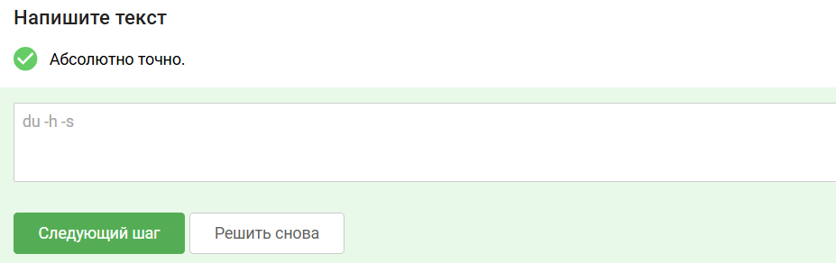{#fig-059 width=70%}

**Пояснения:** wc не может посчитать количество предложений и количество определенных букв.

## Задание 4 в 3.7

**Формулировка задания:** [рис. @fig-060]

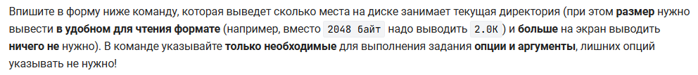{#fig-060 width=70%}

**Выполнение задания:** [рис. @fig-061]

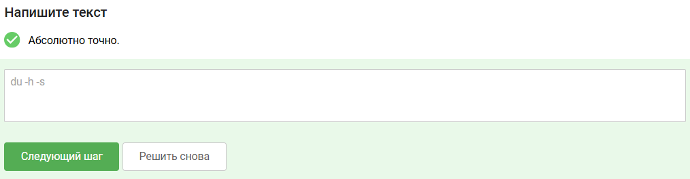{#fig-061 width=70%}

## Пояснения к Задание 4 в 3.7

**Пояснения:** Команда du -h -s выводит общий размер (-s, summary) указанного файла или директории в «человекочитаемом» формате (-h, human-readable)

## Задание 5 в 3.7

[рис. @fig-062]

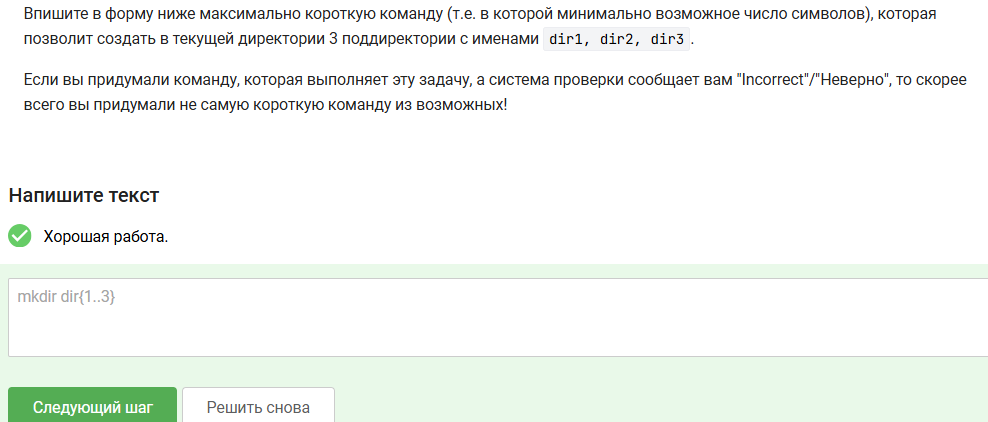{#fig-062 width=70%}

**Пояснения:** mkdir dir{1..3} - максимально короткая команда, которая позволяет создать в текущей директории 3 поддиректории с именами dir1, dir2, dir3
